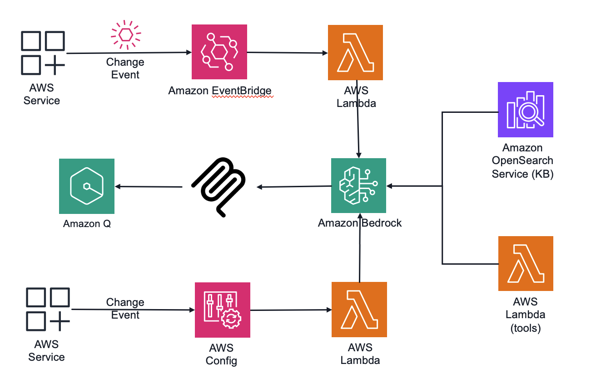
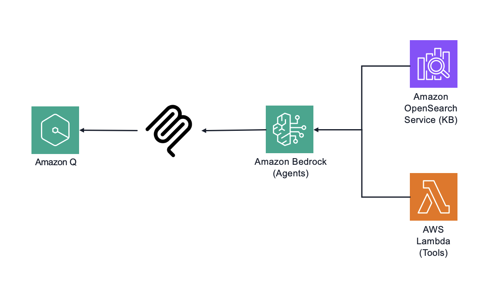

# Developer experience customization and centralized guidance using AI agents and Amazon Bedrock

This sample solution provides an intelligent, AI-powered assistant that delivers real-time guidance for development and governance on AWS. 

**Note: This sample focuses on API development, however, you can use any AWS service (or set of services).**

By integrating AI agents with customizable knowledge bases, this sample bridges the gap between AWS best practices and your organization's specific governance requirements - creating a seamless, frictionless developer experience. The centralized knowledge base can be consumed by various services, including through a Model Context Protocol (MCP) server that enables developers to access this guidance directly within their existing development tools and IDEs.

Key Benefits
 - Developer Acceleration: Provides immediate, contextual advice during development, reducing cycle times and preventing costly rework by ensuring designs align with both AWS and company standards from the outset.
 - Governance as Code: Transforms static documentation and governance frameworks into interactive, real-time guidance embedded within development workflows, increasing compliance without adding friction.
 - Operational Excellence: Automatically reviews deployed API configurations, proactively identifies improvement opportunities, and delivers recommendations to stakeholders, enhancing security posture and performance.
 - Knowledge Centralization: Consolidates organizational wisdom, AWS documentation, and best practices into a unified advisory system that grows smarter with every interaction.

This solution doesn't replace existing governance structures - it amplifies their effectiveness by making them accessible exactly when developers and operators need them most, enabling your organization to implement "golden path" strategies that balance innovation speed with operational stability.

## Overview
Developers use AI enabled development environments daily. As tooling evolves, organizations face the need for centralization of the guidance provided. It does not replace existing governance, rather augmenting it with friendly tooling options that allow organizations to enable "golden path" with less friction, implementing organizational design and development guidelines, internal standards as part of the development process instead of the corrective actions.

This sample focuses on developing a set of AI agents, tools, knowledge bases for RAG that focus on APIs and integration services. Implementation should be tailored to follow your internal best practices, guidance, and governance requirements. You should add your organization specific content to the knowledge bases, modify agent prompts and their configurations to fit your use case, add your organizational logic to the tools' logic, or introduce additional agents and tools to be used by the agents.

Sample solution provides the following features:

* General advice on API implementation - selecting correct endpoint type, integration patterns, multi-account networking advice, security features, observability settings
* Specific advice on API management and governance topics
* OpenAPI specification generation, enhancing with documentation/descriptions and examples, payload schemas, adding missing operation IDs, OpenAPI extensions for API Gateway
* IaC template generation using AWS SAM
* Amazon API Gateway endpoint inspection and configuration review
* Event-driven (or AWS Config based) API improvements recommender - deployment review with improvement suggestions

## Implementation

This set of samples includes three different implementations of the AI agents using various frameworks, SDKs and runtime solutions:
- [Strands framework and Amazon Bedrock AgentCore](./strands-agentcore/) - latest version of this sample using Bedrock AgentCore and Strands, Amazon Bedrock Knowledge Base (Amazon S3 Vectors)
- [Strands framework and AWS Lambda](./strands-lambda/) - set of the sample agents that use AWS Lambda for hosting
- [Amazon Bedrock Agents](./bedrock-agents/README.md) - initial implementation of the sample using Amazon Bedrock Agents, Flow, Knowledge Base (Amazon OpenSearch)

All implementations follow the same core architecture and implement similar components.

### Kiro Power

In addition to the agents, sample includes sample custom [Kiro Power](./kiro-power/POWER.md) which allows organizations to provide centralized guidance in [Kiro](https://kiro.dev/) - agentic AI with an IDE and CLI. 

The power uses Knowledge Base and MCP server implemented in the [Strands framework and Amazon Bedrock AgentCore](./strands-agentcore/) example.

### Knowledge base

Knowledge base focuses on covering information that is changing, need to be curated, and may include sources that aren't available publicly (or need processing, such as re:Invent video transcriptions)
* Amazon API Gateway documentation and related whitepapers
* API management and governance on AWS
* API operations on AWS
* API development best practices

Knowledge Base, along with the agents and tools described in the next session, can be integrated into AI enabled developer environments:

Note that AWS service used for the Knowledge Base may differ in various implementations of the samples. 

### Agents and tools for specific actions

Samples have the following features implemented as a AI agent based solution and using tools:
* Provide API management and governance advice 
* Retrieve service capabilities and quotas information
* Inspect and validate existing or proposed of an endpoint, provide improvement recommendations
* Generate OpenAPI, related code samples, and IaC optimized for Amazon API Gateway
* OpenAPI spec linting and evaluation, based on open-source solutions such as https://github.com/stoplightio/spectral, https://www.npmjs.com/package/@ibm-cloud/openapi-ruleset, https://github.com/daveshanley/vacuum

### Data

To see the initial list of the recommended content available publicly, refer to the [data-sources.md](./data-sources.md) file.
You should add your organization specific content for agents and tools to provide guidance that aligns with your organization governance goals.

### Limits/Safeguards
MCP servers include warnings in their responses, stating that information provided may include security advice and should be reviewed by a human. You may need to add similar warnings/reminders to the prompts and agent implementations to make clear that the user is responsible for seeking additional review of their implementation. 

For additional safeguards, consider [Amazon Bedrock Guardrails](https://aws.amazon.com/bedrock/guardrails/).

Note that all agents use their own dedicated AWS IAM roles, so you can track their actions using [AWS CloudTrail](https://aws.amazon.com/cloudtrail/).

