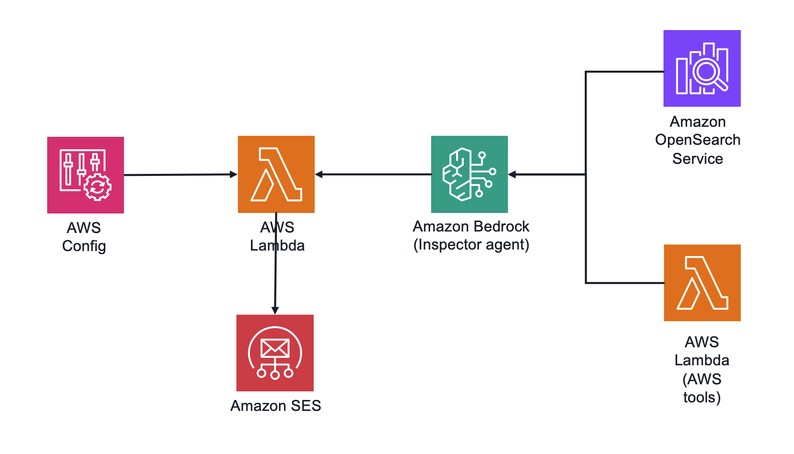

# EKS Inspector - AWS Config Driven Workflow

This project implements an automated Amazon EKS cluster inspection system using AWS Config, Amazon Bedrock Agent, Knowledge Base, and AWS Lambda. The system automatically analyzes EKS cluster configuration and provides improvement recommendations.
It includes an EKS configuration retrieval tool that is used by a Bedrock agent to get detailed cluster configuration for review and analysis.

This sample uses Amazon Elastic Kubernetes Service (Amazon EKS) as the resource to be monitored for configuration changes.

Sample can be extended by adding Amazon Bedrock Agent integration with a custom knowledge base. This way internal best practices and guidelines can be incorporated into configuration assessment process.


## Architecture Overview



The solution consists of:

1. **AWS Config Driven Lambda Function**: Triggered by AWS Config rules when EKS cluster configuration changes
2. **Amazon Bedrock Agent Integration**: Agent uses tools to analyze EKS cluster configuration and provides recommendations if necessary
3. **EKS Configuration Retrieval Tool**: Lambda function that retrieves detailed EKS cluster configuration
4. **Serverless Architecture**: Deployed using AWS SAM (Serverless Application Model)

## How It Works

### AWS Config Driven Workflow

1. AWS Config continuously monitors EKS cluster configurations for changes
2. When a configuration change is detected, AWS Config triggers evaluation using custom rule implemented as a Lambda function
3. The Lambda function extracts the cluster ID from the AWS Config rule evaluation
4. The function invokes an Amazon Bedrock Agent with the cluster ID
5. The Bedrock Agent retrieves and analyzes the cluster configuration, then returns improvement recommendations
6. Recommendations are sent to the cluster owner using Amazon SES
7. AWS Config compliance status is determined by the presence/absence of critical and high priority items in the recommendations 
8. Compliance status returned to AWS Config

## Prerequisites

- AWS CLI installed and configured
- AWS SAM CLI installed
- Python 3.13
- AWS Config enabled in your account
- An existing Amazon Bedrock Agent deployment with the EKS Inspector agent (referenced in the template parameters, see [IaC deployment instructions](../iac/README.md))
- An existing EKS Configuration Retrieval tool (Lambda function) deployed (see [tools deployment instructions](../tools/README.md))
- Amazon SES with verified address or domain

## Setup Instructions

### 1. Deploy the Amazon Bedrock Agent

Before deploying this component, you need to deploy the EKS Inspector Agent in Amazon Bedrock. You can use [instructions in the IaC directory](../iac/README.md)

Note the Agent ID and Agent Alias ID from the CloudFormation outputs as they will be needed for the next deployment step.

### 2. Build and Deploy

```bash
# Build the application
sam build

# Deploy the application with interactive parameter configuration
sam deploy --guided
```

During the guided deployment, you'll be prompted to provide the following parameters:

- `EksInspectorAgentStackName`: Name of the stack that exports the EKS Inspector Agent ID and Alias ID
- `AwsRegionForModelAccess`: AWS region where the EKS Inspector agent was deployed
- `SesEmailForNotifications`: e-mail "From" address to be used in SES sending recommendation to the owner
- `ConfigRuleName`: Name for the AWS Config rule that will trigger the workflow


