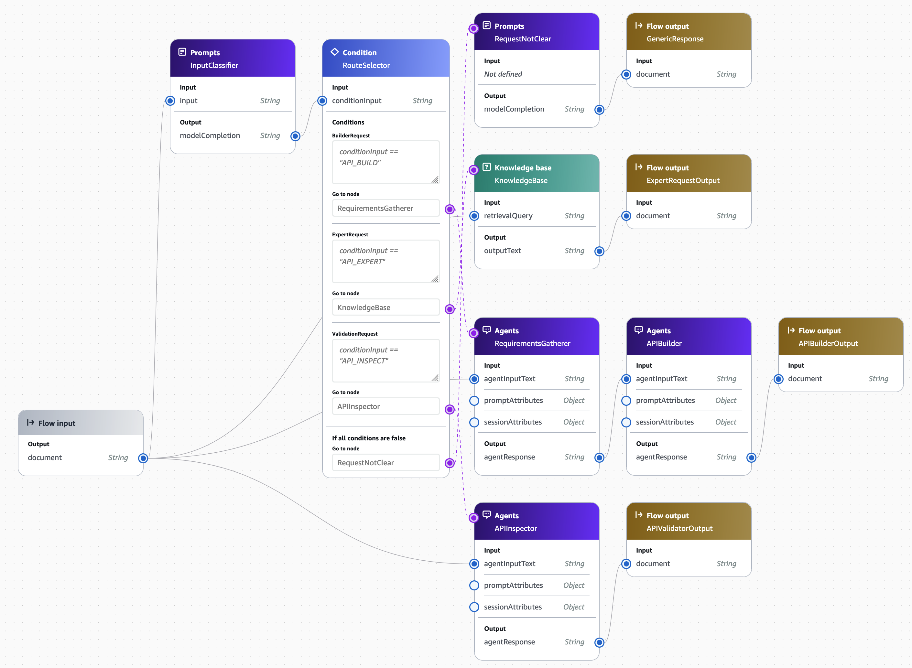
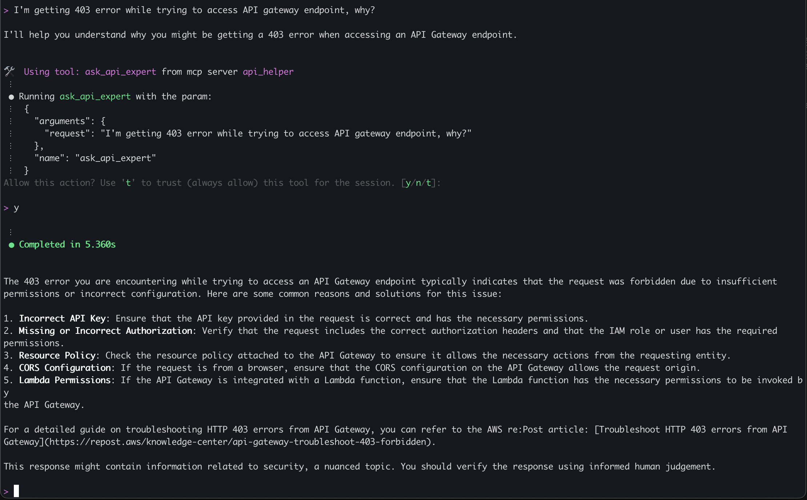
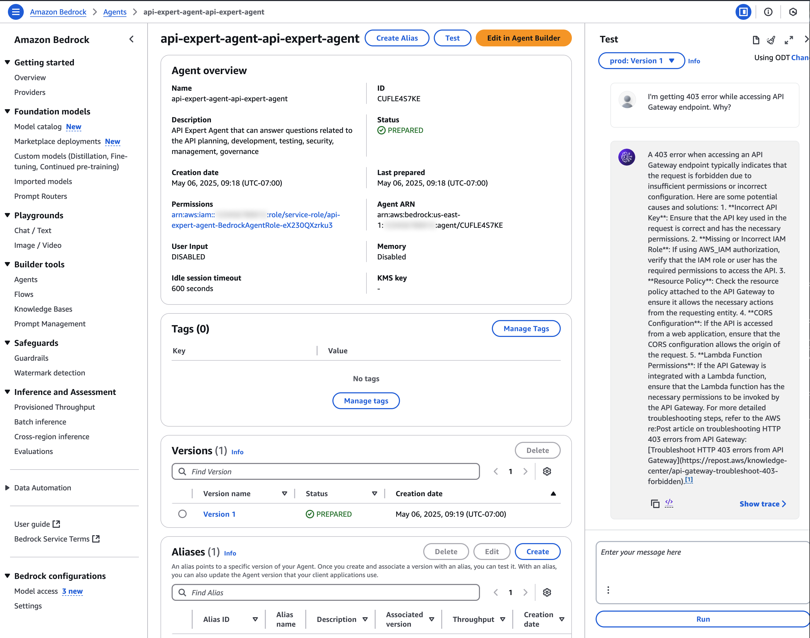
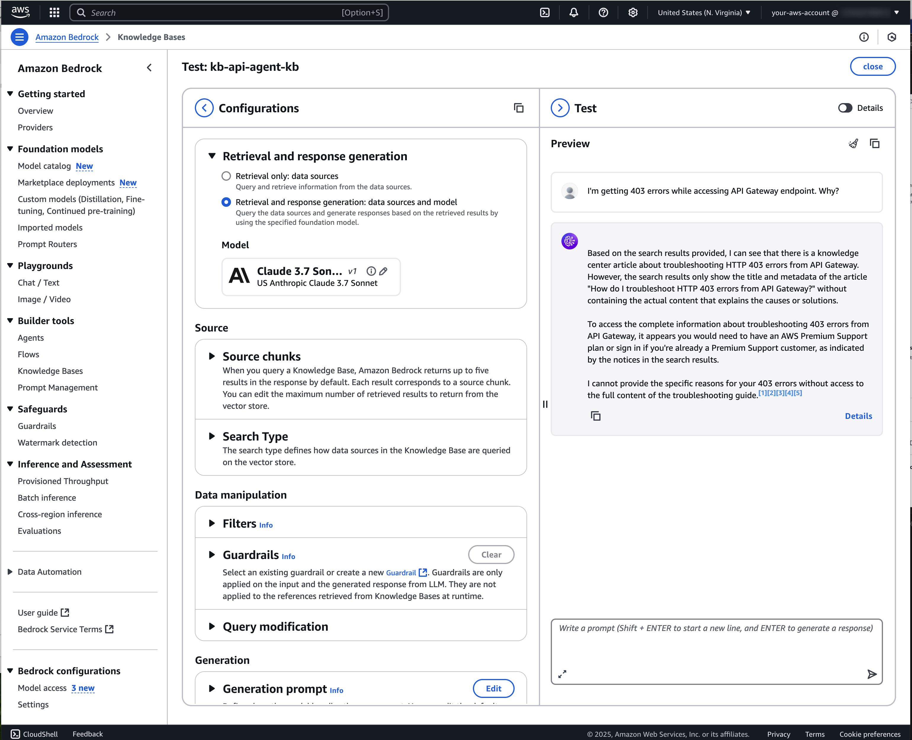

# Developer experience customization and centralized guidance using Amazon Bedrock Agents

This sample implementation uses Amazon Bedrock Agents and OpenSearch based Knowledge Base.

### Agents and tools for specific actions

API Gateway agents have the following features implemented as a multi-agent solution and using tools:
* Provide API management and governance advice 
* Retrieve service capabilities and quotas information
* Inspect and validate existing or proposed of an endpoint, provide improvement recommendations
* Generate OpenAPI, related code samples, and IaC optimized for Amazon API Gateway
* OpenAPI spec linting and evaluation, based on open-source solutions such as https://github.com/stoplightio/spectral, https://www.npmjs.com/package/@ibm-cloud/openapi-ruleset, https://github.com/daveshanley/vacuum

### Amazon Bedrock Flow
The Amazon. Bedrock Flow combines multiple agents with an input classifier, providing a single communications channel for an interactive user experience. It can be used by a chatbot that converses with the flow. See [documentation](https://docs.aws.amazon.com/bedrock/latest/userguide/flows-multi-turn-invocation.html) for examples.


Following diagram illustrates Amazon Bedrock Flow for the API agent:



Note that this is example implementation. Depending on your needs you may switch to a multi-agent or multi-tool based solution that fits your requirements better.

Components:
- InputClassifier. Prompt that identifies user request intent and marks it accordingly. Used for request routing.
- Route selection condition. Selects next step based on input classifier output.
- RequestNotClear prompt. Used when proper routing cannot be identified.
- KnowledgeBase. Uses public data Bedrock Knowledge Base and Nova Pro model to generate answer for API development/management related requests.
- APIInspector. Uses information provided in the request (API ID) to retrieve API Gateway endpoint configuration and OPenAPI definition for the first stage listed, then reviews and provides feedback for the resource.
- RequirementsGatherer. Agent that interacts with the user as needed and collects requirements for the application - API, development preferences, CI/CD tool selection, etc.
- APIBuilder. Agent that generates OpenAPI specification, code artifacts, lints them, identifies and documents the next steps.

### Event-driven API improvements recommender
This feature uses Amazon EventBridge that receives change events whenever you deploy an API Gateway stage. Once EventBridge receives the change event, it will invoke a Lambda function that asks the Bedrock agent to inspect and validate this new configuration. After that, it sends recommendations to the recipient specified in the resource `owner_email` tag using Amazon SES. You may want to modify notification part of the code to match your preferences - use Slack, Amazon SNS, etc.


This feature does not replace need for governance implementation using controls documented in [Amazon API Gateway governance in depth](https://serverlessland.com/content/guides/api-gateway-governance/introduction), rather augmenting it with more opinionated reactive guidance.

See [README.md](./eda/README.md) for more details.

### AWS Config based improvements recommender
This example demonstrates that same approach can be used for various resource types, not necessary just API gateway. It shows how Amazon Elastic Kubernetes Service (Amazon EKS) cluster configuration can be inspected on every change.

This feature uses AWS Config that receives change events whenever you deploy any resource. Once Config receives the change event, it will invoke a Lambda function specified in the custom rule configuration. Function asks Bedrock agent to inspect resource configuration. After that, Lambda function checks if there are any critical or high priority findings in the agent response, marks resource compliance status accordingly, and sends recommendations to the recipient specified in the resource `owner_email` tag using Amazon SES. 


You may want to modify notification part of the code to match your preferences - use Slack, Amazon SNS, etc.

See [README.md](./aws-config/README.md) for more details.


### Limits/Safeguards
Amazon Bedrock flow and MCP servers include warnings in their responses, stating that information provided may include security advice and should be reviewed by a human. You may need to add similar warnings/reminders to the prompts and agent implementations to make clear that the user is responsible for seeking additional review of their implementation. 

For additional safeguards, consider [Amazon Bedrock Guardrails](https://aws.amazon.com/bedrock/guardrails/).


Note that all agents use their own dedicated AWS IAM roles, so you can track their actions using [AWS CloudTrail](https://aws.amazon.com/cloudtrail/).

### Code 
- [iac](./iac/README.md) - Infrastructure as Code templates for Amazon Bedrock knowledge base, agents, and flows.
- [tools](./tools/README.md) - code of the tools used by the Bedrock Agents. They can be refactored and used by any agentic workflow, just modify input/output formats.
- [mcp](./mcp/README.md) - MCP (Model Context Protocol) servers to be used by agents.
- [eda](./eda/README.md) - API improvements recommender: Amazon EventBridge based integration for tracking Amazon API Gateway changes, inspecting it and providing recommendations to the owners
- [aws=config](./aws-config/README.md) - API improvements recommender: AWS Config based integration for tracking Amazon API Gateway changes, inspecting it and providing recommendations to the owners

## Setup

Following sections walk through the steps of setting up individual components. 

Make sure to request access to the Amazon Bedrock models used in the project if you haven't done it yet. See [documentation](https://docs.aws.amazon.com/bedrock/latest/userguide/model-access-modify.html) for more details.

### Knowledge Base
Before deploying Amazon Bedrock Knowledge Base, you will need content in an Amazon S3 bucket that will be indexed during the deployment process. Create S3 bucket, upload data in the [formats supported](https://docs.aws.amazon.com/bedrock/latest/userguide/knowledge-base-ds.html), you will need it during the deployment. Make sure to include content that is specific to your organization - developer guides, API implementation standards, etc. You can use multiple data sources in the same Knowledge Base to make content management easier.

*Note that stack creates two separate data sources - one based on S3 bucket with your documents and one for publicly available documents (API Gateway documentation, whitepapers, etc.). Modify template accordingly to include/exclude public documents that fit your needs.*


To deploy Knowledge Base use following command:
```bash
aws cloudformation deploy --template-file ./iac/bedrock-kb-aos.yaml --stack-name api-agent-kb --capabilities CAPABILITY_IAM --parameter-overrides ExistingS3BucketName=<your-S3-bucket-name>
```
### Tools
Follow steps documented in the tools [README.md](./tools/) file.

### Agents
Follow steps documented in the agents/flow [README.md](./iac/) file.

*Note: Alternative implementation of the agents, built with the [Strands framework](https://github.com/strands-agents), available in [strands](./strands/) directory*

### MCP Server
To install MCP server and configure client, follow instructions in [README.md](./mcp/) file. 

*Note that instructions used guide MCP client to use API Expert for all API related questions and tasks. You may need to adjust them to keep balance between API Expert, other tools, and your development environment built-in capabilities.*

### Flow
Follow steps documented in the agents/flow [README.md](./iac/) file.

### API improvement recommender
Follow steps documented in the API improvements recommender [README.md](./eda/) file.

## Taking it for a spin...

There are few ways to try this out - using your favorite AI-enabled IDE with MCP client support, directly in the AWS management Console [Agents](https://us-east-1.console.aws.amazon.com/bedrock/home?region=us-east-1#/agents), [Flows](https://us-east-1.console.aws.amazon.com/bedrock/home?region=us-east-1#/flows), or [Knowledge Bases](https://us-east-1.console.aws.amazon.com/bedrock/home?region=us-east-1#/knowledge-bases). You can also use [MCP Inspector](https://modelcontextprotocol.io/docs/tools/inspector) to try it out as well.

### AI-enabled development environment
To try it in AI-enabled development environment, configure MCP client using installation [instructions](./mcp/README.md). Next, start development environment and confirm that MCP server started and `api_helper` is listed in the tools available:


Ask an API related question and confirm that development environment is using MCP to get the answer:



### Bedrock Agent - AWS management Console
Navigate to [AWS Management Console](https://us-east-1.console.aws.amazon.com/bedrock/home?region=us-east-1#/agents), select `Amazon Bedrock`, then select `Agents` and pick agent you would like to try. Click on "Test", choose alias, and ask questions:




### Bedrock Knowledge Base - AWS management Console
Navigate to [AWS Management Console](https://us-east-1.console.aws.amazon.com/bedrock/home?region=us-east-1#/knowledge-bases), select `Amazon Bedrock`, then select `Knowledge Bases` and pick knowledge base you'd like to try. You will need to select foundation model to use for the test first, then you can test it by asking questions:



### Bedrock Flow - - AWS management Console

Navigate to [AWS Management Console](https://us-east-1.console.aws.amazon.com/bedrock/home?region=us-east-1#/flows), select `Amazon Bedrock`, then select `Flows` and pick flow to try. Click on "Edit in flow builder" button and ask question in the "Test flow" panel:


