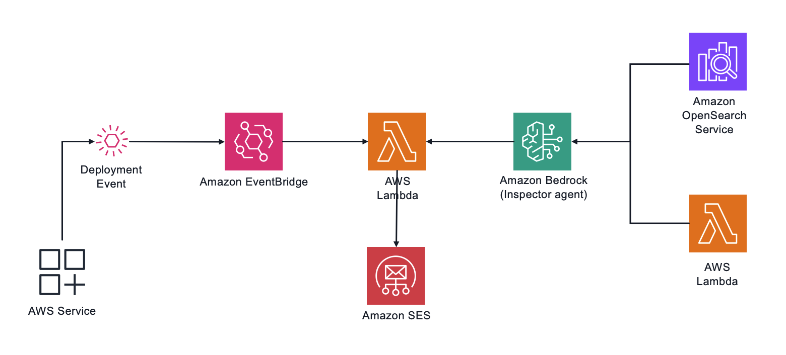

# API Inspector - Event-Driven Architecture

This project implements an automated API inspection system using Amazon Bedrock Agent and AWS Lambda in an event-driven architecture. The system automatically analyzes Amazon API Gateway deployments and provides improvement recommendations.

## Architecture Overview



The solution consists of:

1. **Event-Driven Lambda Function**: Triggered by EventBridge when API Gateway deployments or stage updates occur
2. **Amazon Bedrock Agent Integration**: Analyzes API configurations and provides recommendations
3. **Serverless Architecture**: Deployed using AWS SAM (Serverless Application Model)

## How It Works

1. When an API Gateway deployment or stage update occurs, EventBridge captures the event
2. The Lambda function extracts the API ID from the event
3. The function invokes an Amazon Bedrock Agent with the API ID
4. The Bedrock Agent analyzes the API configuration and returns improvement recommendations
5. Results are sent to the owner of the API using Amazon SES

## Prerequisites

- AWS CLI installed and configured
- AWS SAM CLI installed
- Python 3.13
- An existing Amazon Bedrock Agent deployment with the API Inspector agent (referenced in the template parameters)
- Amazon SES with verified address or domain

## Setup Instructions

### 1. Deploy the Amazon Bedrock Agent

Before deploying this component, ensure you have deployed the API Inspector Agent in Amazon Bedrock. Note the Agent ID and Agent Alias ID as they will be needed for this deployment.

### 2. Build and Deploy

```bash
# Build the application
sam build

# Deploy the application with interactive parameter configuration
sam deploy --guided
```

During the guided deployment, you'll be prompted to provide the following parameters:

- `APIInspectorAgentStackName`: Name of the stack that exports the API Inspector Agent ID and Alias ID
- `AwsRegionForModelAccess`: AWS region where the API Inspector agent was deployed
- `SesEmailForNotifications`: e-mail "From" address to be used in SES sending recommendation to the owner

Follow the prompts to complete the deployment process.


