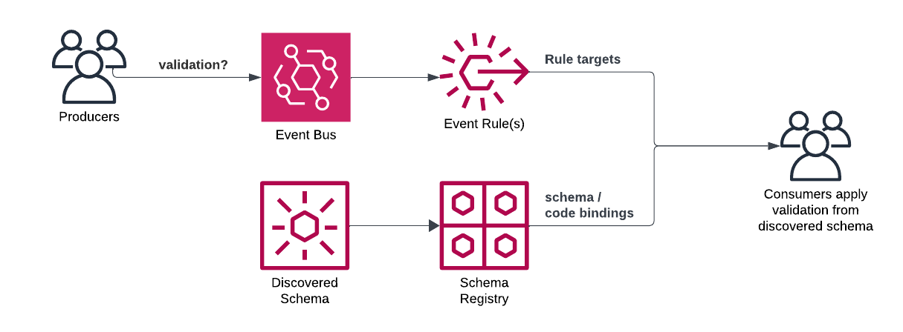
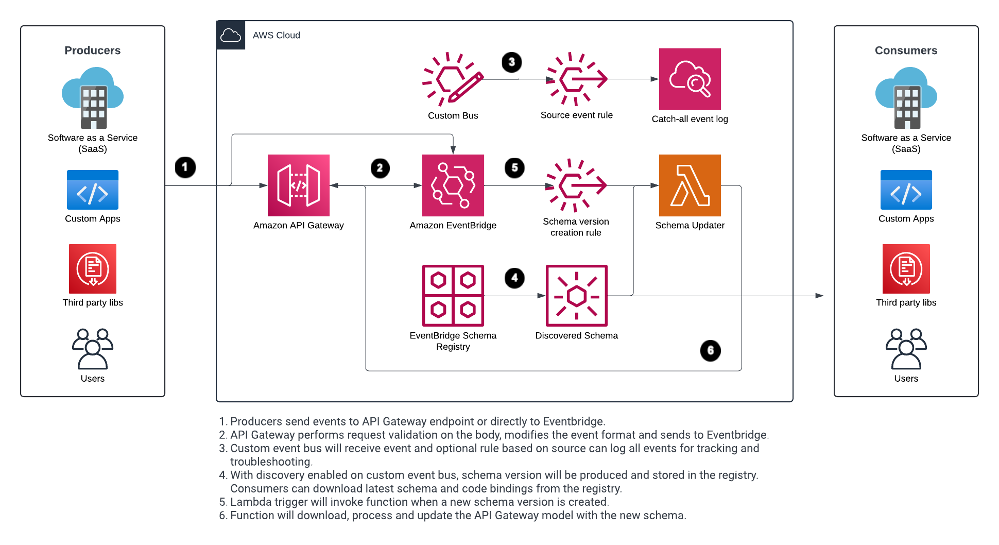
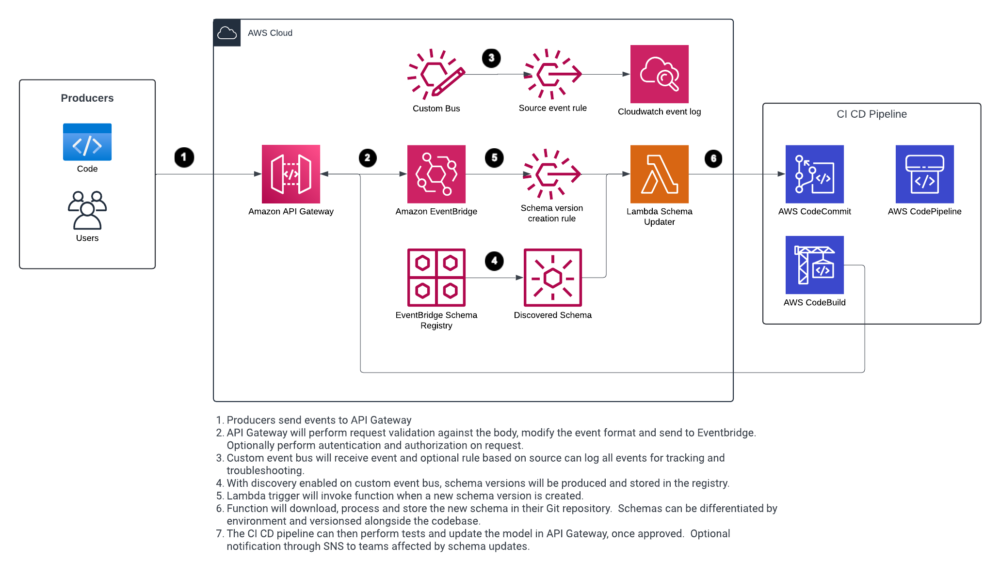

# Automating Event Validation Through Schema Discovery

In event driven architectures, validation of events can be challenging to put into practice.  There are often multiple teams with unique domains and event structures.  Events might be sent from different sources with varying formats, frequency and levels of governance.  Finally, events are constantly evolving and teams need right-sized mechanisms to balance speed with governance.  In this solution, you'll learn how to apply consumer and producer event validation using AWS services to reduce custom code and operational overhead.  You'll also learn about three stages of event evolution and how you can apply different patterns of validation at each stage.

## Consumer and Producer Event Validation

Events should be validated by both the producer and consumer, as illustrated in Figure 1 below.  The producers job is to create and send valid events before they are routed to consumers.  On the consumer side, even if you trust the source of events, you should validate them before processing.  A common way to manage and route events is through an event bus.  [Amazon EventBridge](https://aws.amazon.com/eventbridge/) is a serverless event bus that can perform discovery, versioning and consumption of event schemas.  Schema discovery provides the freedom for developers to simply put events on the bus and have schemas created and versioned within a registry.  These schemas can be used to perform validation on events.  

EventBridgeConsumers can download [schemas in OpenAPI or JSON Schema formats](https://docs.aws.amazon.com/eventbridge/latest/userguide/eb-schema.html) and [code bindings](https://docs.aws.amazon.com/eventbridge/latest/userguide/eb-schema-code-bindings.html) in popular programming languages for strongly typed event parsing and validation.  If your programming language is not supported for code bindings or you would rather use JSON or Open API schemas, you can download versions from the console or APIs.  You'll see later in this solution how to automate the schema update process.  Once the schema is downloaded you can use third party libraries to perform validation.  For example, [Ajv](https://ajv.js.org/) for JavaScript or the [jsonschema library](https://python-jsonschema.readthedocs.io/en/stable/) for Python.  You can then validate payloads against schemas during development and in your CI pipelines.  If using code bindings, you can download them using the console, API, or within a supported IDE using the AWS Toolkit.  Code bindings can be used like other code artifacts.  For instance, if using Lambda, the binding can be used as a [layer](https://docs.aws.amazon.com/lambda/latest/dg/chapter-layers.html) dependency.  Bindings are not automatically synced to any artifact repositories, such as [AWS CodeArtifact](https://aws.amazon.com/codeartifact/); however, the Lambda code in this solution could be extended to automate binding uploads to your artifact repository on schema updates.   

Producers may send events through a central service, such as Amazon API Gateway, or directly to the event bus.  When going directly to the event bus, you can use third party libraries to validate during development and within CI pipelines.  Another option is to use [Amazon API Gateway](https://aws.amazon.com/api-gateway/) as a front door to your event bus.  This is commonly used for external services sending events that need authorization.  API Gateway can also perform request validation using a schema.  Many schemas can be applied as different models, and applied to different resources and methods.  Events can also be transformed and sent directly to EventBridge without additional glue code.  Since the default EventBridge bus receives events when new schemas are created from events, you can automate the download, processing and uploading of new schemas to API Gateway from EventBridge.  This keeps the model and request validation in API Gateway in sync with event structure changes. 


<p style="text-align:center; font-style: italic"> Figure 1: Producers and consumers with schema discovery using EventBridge </p>


## Solutions 
The following solutions use API Gateway to perform request validation and EventBridge schema discovery to automatically generate up-to-date schema versions.  Both can be extended or modified to fit unique use cases and download schemas or code bindings for consumer side validation.   

### Lambda Driven Schema Updater
The following architecture uses Eventbridge schema discovery to generate new schema versions, download, process and post the schema to an API Gateway model for request validation.  The Lambda schema updater function will trigger on schema version changes.  The function trigger can be toggled on/off by enabling/disabling the rule in EventBridge.  This is covered in the Testing section.  This solution is a good fit for quick updates with minimal processing.  If complex testing and validation is required before updating a new schema to a model in API Gateway, see the CI CD Driven Schema Updater solution.  The rule in this solution triggers off any new schema version.  To filter further, the rule can be modified or additional processing can be applied to the function.  This provides flexibility in handling multiple domains or event types.   


<p style="text-align:center; font-style: italic"> Figure 2: Architecture that uses Lambda to update API Gateway model when a new schema is detected in EventBridge </p>

### CI CD Driven Schema Updater
Another automated option is to control these changes through your CI CD pipeline.  In this solution, the Lambda function does not apply the new schema directly to an API Gateway model.  It only downloads, processes and stores the new schema to a repository (i.e. Git, S3, artifact repository) where the CI CD pipeline can reference it.  This allows for additional testing and checks before schemas are promoted and enforced.  This approach provides more control to the schema update process in exchange for some complexity.   

<p style="text-align:center; font-style: italic"> Figure 3: Architecture that uses a CI CD pipeline to update API Gateway model when a new schema is detected in EventBridge </p>

## Stages of Event Evolution

To apply the right level of validation, it's helpful to understand how events evolve.  You can think of events going through three major stages of refinement.  You can find a reference to these stages in a talk by Sam Dengler during the [:goto conference](https://youtu.be/-Pv_kYflEEg?si=a7CDRdnGPtSH1agk&t=808)

In the first stage, events start as raw information, a skeleton of what the event will eventually look like.  This allows developers to rapidly build, test and refine event structures without dependence on the event.  In the second stage, events are exposed to consumers within the bounded context.  This enables consumers to test events within a limited scope, ensuring they meet requirements within their context.  Finally, the third stage is where events are expanded to include other business and technical related metadata.  This may involve adding required fields and any additional refinement required by consumers to effectively process the event.

Let's use a fictitious example of a Healthcare scheduling system.  In this example, the producer's job is to create a surgical scheduled event.  In the first phase, we put together the skeleton of the event.  This might include the date, time, location, type of surgery and surgeon.

### Stage 1

```json
{
   ...
   "detail": {
         "schedule": {
            "date": "5/15/2024",
            "time": "10:00 AM",
            "location": "Building 6"
         },
         "surgery": {
           "surgeon": "John Thomas",
           "type": "Orthopedic"
         }
   }
}

```

In the next stage, you start to refine the event and work within the bounded context, namely the surgical team.  At this stage, we may get feedback to include requirements for whether anesthesia is required and further details about the type of surgery (ACL), medication, etc.

### Stage 2

```json
{
   ...
   "detail": {
         "surgery": {
            "schedule": {
               "date": "5/15/2024",
               "time": "10:00 AM",
               "location": "Building 6",
               "duration": "120 mins"
            },
            "medication": "Oxycodone 5 mg every 4 hours.",
            "team": {
               "surgeon": "Jane Someone", 
               "assistant": "John Person"
            },
            "procedure": {
               "type": "Anterior Cruciate Ligament",
               "location": "left knee"
               ...
            }
         }
   }
}

```

Finally, in the last stage, we bring other bounded contexts and consumers.  Here we might need to know if and what types of therapy are required and where those will occur.  We may have follow-up appointments and reminders details.

### Stage 3

```json
{
   ...
   "detail": {
         "surgery": {
            "schedule": {
               "date": "5/15/2024",
               "time": "10:00 AM",
               "location": "Building 6",
               "duration": "120 mins"
            },
            "therapy": {
               "OT": "yes",
               "PT": "yes"
            },
            "medication": "Oxycodone 5 mg every 4 hours.",
            "team": {
               "surgeon": "Jane Someone", 
               "assistant": "John Person"
            },
            "follow-ups": [
               "5/25/2024", "6/10/2024", "9/10/2024"
            ],
            "procedure": {
               "type": "Anterior Cruciate Ligament",
               "location": "left knee"
               ...
            }
         }
   }
}

```

### Implementation  Through Stages 
Let's take a look at how event validation might be applied to each stage.  You may have unique requirements that dictate modifications.  

#### Stage 1
This is the stage where raw events are being produced and no consumers are dependent on the events.  Here, the development team is producing events at will through EventBridge with limited model validation applied.  The schema updater is toggled off to allow for frequent changes without affecting development.  Schemas are still discovered, but not automatically processed or applied.    

#### Stage 2
This is where events are starting to build a solid domain structure and are tested within a bounded context.  Your have the option of applying request validation when it's appropriate.  Since there are consumers within the same bounded context, you may want to start enforcing validation of events.  The decision to enforce request validation should be based on testing and feedback from the consumers in this stage.  This is where the CI CD approach can provide additional safeguards and oversight because it can base your schema updates on successful iterations of test runs in your pipeline.   

#### Stage 3
This is the final stage where events grow into the full business context required to process them downstream.  Here we also have additional consumers that rely on our events providing the necessary structure and information.  Request validation is highly encouraged at this stage to ensure valid events are produced and routed downstream.  Events that don't follow schema requirements will be rejected before any downstream routing or processing is applied. 

## Deployment

The following solution uses the Lambda based schema updater architecture referenced above.  This is intended to be deployed to non-production environments.  You'll deploy the solution and test the three stages covered.  You can modify the SAM template and Lambda function to also use this approach for CI CD driven updates or other unique needs your application requires.

### Pre-Requisites

* [Create an AWS account](https://portal.aws.amazon.com/gp/aws/developer/registration/index.html) if you do not already have one and log in. The IAM user that you use must have sufficient permissions to make necessary AWS service calls and manage AWS resources.
* [AWS CLI](https://docs.aws.amazon.com/cli/latest/userguide/install-cliv2.html) installed and configured
* [Git Installed](https://git-scm.com/book/en/v2/Getting-Started-Installing-Git)
* [AWS Serverless Application Model](https://docs.aws.amazon.com/serverless-application-model/latest/developerguide/serverless-sam-cli-install.html) (AWS SAM) installed
* [NPM](https://docs.npmjs.com/downloading-and-installing-node-js-and-npm) installed

Important: this application uses various AWS services and there are costs associated with these services after the Free Tier usage - please see the [AWS Pricing page](https://aws.amazon.com/pricing/) for details. You are responsible for any AWS costs incurred. No warranty is implied in this example.

### Deployment Steps

1. Create a new directory, navigate to that directory in a terminal and clone the GitHub repository:
    ``` 
    git clone https://github.com/aws-samples/serverless-patterns
    ```
1. Change directory to the pattern directory:
    ```
    cd serverless-patterns/apigw-eventbridge-schema-validation
    ```
1. From the command line, use NPM to install dependencies and AWS SAM to deploy the AWS resources for the pattern as specified in the template.yml file:
    ```
    npm install --prefix lambda 
    sam build && sam deploy --guided
    ```
1. During the prompts:
    * Enter a stack name
    * Enter the desired AWS Region
    * For the parameters, you can accept the defaults. 
   *  Allow SAM CLI to create IAM roles with the required permissions.

Once you have run `sam deploy --guided` mode once and saved arguments to a configuration file (samconfig.toml), you can use `sam deploy` in future to use these defaults.  

Copy the API URL from the output for later use in the testing section.

## Testing

This first test will emulate the first stage of our event evolution.  A schema will be created in EventBridge, but won't be enforced in API Gateway until you enable the rule to trigger the Lambda function.  This will be done in the second test.

Run this command multiple times to send events to the custom event bus. Replace API URL with your API endpoint. 

```
curl --location --request POST '<YOUR API URL>' \
--header 'Content-Type: application/json' \
--data-raw '{
  "detail-type": "surgical",
  "source": "scheduling.event",
  "detail": {
      "schedule": {
        "date": "5/15/2024",
        "time": "10:00 AM",
        "location": "Building 6"
      },
      "team": {
          "surgeon": "Jane Someone",
          "assistant": "John Person"
      }
  }
}'
```
You can validate this event was processed by the Event Bus by viewing the Cloudwatch scheduling-events-source-catch-all log group for events.  The SAM template contains a catch-all rule for any source match.

Schema generation can take up to 5 minutes.  You can view status of discovered schemas by running the following AWS CLI command.  If you receive an error stating it doesn't exist, wait and try again.
```
aws schemas list-schema-versions --schema-name scheduling.event@Surgical --registry-name discovered-schemas
```

Here's an example output, if successful:
```
{
    "SchemaVersions": [
        {
            "SchemaArn": "arn:aws:schemas:us-west-2:294626376751:schema/discovered-schemas/scheduling.event@Surgical",
            "SchemaName": "scheduling.event@Surgical",
            "SchemaVersion": "1",
            "Type": "OpenApi3"
        }
    ]
}
```

Once the first schema version is created, you can move on to the next step.  To test the second stage, first turn on the rule to trigger the Lambda function on schema creation by running this command to enable the EventBridge rule and accept ('y') deployment of the changeset: 
```
sam deploy --parameter-overrides SchemaEnforcementEnabledOrDisabled=ENABLED
```
<p id="stage2-cmd"> </p> With the rule enabled, run the following command to send another event to the custom event bus. 

```
curl --location --request POST '<YOUR API URL>' \
--header 'Content-Type: application/json' \
--data-raw '{
  "detail-type": "surgical",
  "source": "scheduling.event",
  "detail": {
        "schedule": {
          "date": "5/15/2024",
          "time": "10:00 AM",
          "location": "Building 6",
          "duration": "120 mins"
        },
        "medication": "Oxycodone 5 mg every 4 hours.",
        "team": {
          "surgeon": "Jane Someone",
          "assistant": "John Person"
        },
        "procedure": {
          "type": "Anterior Cruciate Ligament",
          "location": "left knee"
        }
  }
}'
```
EventBridge will generate a new schema version, which could take several minutes to complete.  Request validation will not be set until after the schema version is created.  You can run the same AWS CLI command from the first test to view schema versions.  You should see a second schema version created.  With the rule now enabled to trigger on schema version creation, the Lambda function will download, process and apply the schema to the API Gateway model.  

Run the following command again and wait until a second schema version exists.
```
aws schemas list-schema-versions --schema-name scheduling.event@Surgical --registry-name discovered-schemas
```

Here's an example output with version 2 now available: 
```
{
    "SchemaVersions": [
        {
            "SchemaArn": "arn:aws:schemas:us-west-2:294626376751:schema/discovered-schemas/scheduling.event@Surgical",
            "SchemaName": "scheduling.event@Surgical",
            "SchemaVersion": "2",
            "Type": "OpenApi3"
        },
        {
            "SchemaArn": "arn:aws:schemas:us-west-2:294626376751:schema/discovered-schemas/scheduling.event@Surgical",
            "SchemaName": "scheduling.event@Surgical",
            "SchemaVersion": "1",
            "Type": "OpenApi3"
        }
    ]
}

```


With the Lambda trigger now enabled, the latest schema is downloaded, processed and uploaded to API Gateway replacing the current request validator.  You can view the output from the Lambda function by viewing its Cloudwatch logs.

Future requests will now use the latest schema generated from EventBridge. You can test this by sending in an event that does not have all the required fields from the latest event. 

```
curl --location --request POST '<YOUR API URL>' \
--header 'Content-Type: application/json' \
--data-raw '{
  "detail-type": "surgical",
  "source": "scheduling.event",
  "detail": {
      "surgery": {
        "schedule": {
          "date": "5/15/2024",
          "time": "10:00 AM",
          "location": "Building 6",
          "duration": "120 mins"
        }
      }
  }
}'
```
Required objects and properties have been removed, which will be caught by the request validator and rejected.  Note: if your event is passed through successfully, you may need to wait for the new schema version to be created and processed.

```
{ "message": "[object has missing required properties ([\"medication\",\"procedure\",\"schedule\",\"team\"])]"}% 
```

Run the [first request from stage two](#stage2-cmd) again with all required fields and the validator will pass the event through to EventBridge.  With the trigger enabled, any new schema versions created will trigger an update to the API Gateway model.  If you want to disable schema updates at any point, run the command below; however, you'll leave this enabled for the next step.  The command disables the rule in EventBridge that triggers the Lambda function to update the API Gateway model with a new schema.   

```
sam deploy --parameter-overrides SchemaEnforcementEnabledOrDisabled=DISABLED
```

To test the third stage, send the event with a broader business context below, which will generate another schema version.  With the schema update rule and trigger still enabled, the API Gateway model will be updated with the latest schema from this event.

```
curl --location --request POST '<YOUR API URL>' \
--header 'Content-Type: application/json' \
--data-raw '{
  "detail-type": "surgical",
  "source": "scheduling.event",
  "detail": {
        "schedule": {
          "date": "5/15/2024",
          "time": "10:00 AM",
          "location": "Building 6",
          "duration": "120 mins"
        },
        "therapy": {
          "OT": "yes",
          "PT": "yes"
        },
        "follow-ups": [
          "5/25/2024", "6/10/2024", "9/10/2024"
        ],
        "medication": "Oxycodone 5 mg every 4 hours.",
        "team": {
          "surgeon": "Jane Someone",
          "assistant": "John Person"
        },
        "procedure": {
          "type": "Anterior Cruciate Ligament",
          "location": "left knee"
        }
  }
}'
```

You've successfully tested all three stages and learned how to automate validation of requests through existing events.   

## Cleanup
 
1. Delete the stack
    ```
    sam delete
    ```

## Next steps

1. Review the [Best-Practices When Working with Events, Schema Registry and Amazon EventBridge](https://community.aws/content/2dhVUFPH16jZbhZfUB73aRVJ5uD/eventbridge-schema-registry-best-practices?lang=en) community post.  
2. Check out our resources on [event driven architectures](https://aws-samples.github.io/eda-on-aws/) and additional guides and samples on [Serverlessland.com](https://www.serverlessland.com)

Copyright 2024 Amazon.com, Inc. or its affiliates. All Rights Reserved.

SPDX-License-Identifier: MIT-0
