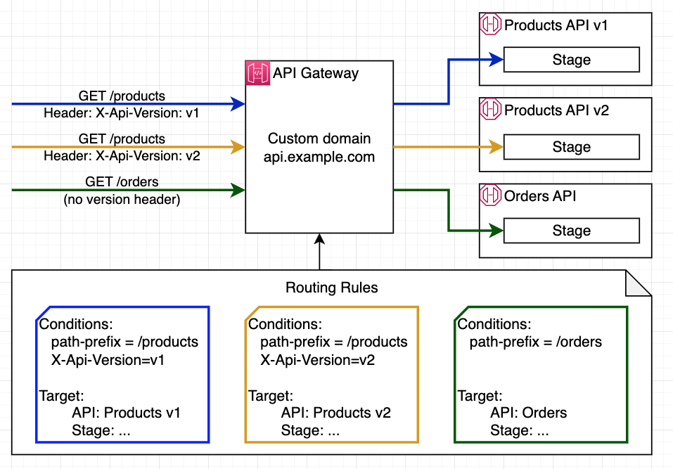

# api-gateway-header-based-routing

This is example implementation of the Amazon API Gateway routing rules based on a resource path or header value. 

## Overview
Consider a real-world scenario where a team needs to gradually migrate users to a new API version, such as an e-commerce platform updating its checkout API from v1 to v2. First, the team creates two API deployments in API Gateway - one for each version. Then, they set up a Routing Rule with priority 1 that checks for the header 'X-API-Version: v2' and routes matching requests to the v2 API. They also create another rule with priority 2 that routes all requests with paths starting with '/checkout' to the v1 API as a fallback



In the application code they add the 'X-API-Version' header for a small percentage of users. They monitor the performance and error rates using API Gateway's telemetry capabilities by tracking the access and execution logs, along with emitted metrics. As their confidence grows, they gradually increase the percentage of users sending the v2 header. This approach ensures a controlled migration with minimal risk and the ability to quickly rollback by simply removing the header from requests.

## Prerequisites
- [AWS CLI](https://docs.aws.amazon.com/cli/latest/userguide/cli-chap-getting-started.html)
- [AWS SAM](https://aws.amazon.com/serverless/sam/) 
## Setup
### AWS SAM
This project includes two SAM templates:
- `template-path-based-routing.yaml` - application with the API gateway path based routing example, initial state of the application
- `template-header-based-routing.yaml` - application with the API gateway header based routing example, end state of the application

You can deploy either of them following instructions below.

To build and deploy your stack for the first time, run the following in your shell:

```bash
sam build --template <tempate name>
sam deploy --guided --template <tempate name>
```

The first command will build the source of your application. The second command will package and deploy your application to AWS, with a series of prompts:
* **Stack Name**: The name of the stack to deploy to CloudFormation. This should be unique to your account and region, and a good starting point would be something matching your project name.
* **AWS Region**: The AWS region you want to deploy your app to.
* **Parameter DomainName**: Name of the domain you want to use for the application 
* **Parameter HostedZoneID**: ID of the existing Route53 hosted zone (e.g., Z23ABC4XYZL05B)
* **Parameter LambdaRuntime**: Node.js runtime version to be used by the AWS Lambda functions, you can accept default value
* **Parameter CerificateArn**: ARN of the public certificate in Amazon Certificate Manager that shall be used by the application custom domain configuration
* **Confirm changes before deploy**: If set to yes, any change sets will be shown to you before execution for manual review. If set to no, the AWS SAM CLI will automatically deploy application changes.
* **Allow SAM CLI IAM role creation**: Many AWS SAM templates, including this example, create AWS IAM roles required for the AWS Lambda function(s) included to access AWS services. By default, these are scoped down to minimum required permissions. To deploy an AWS CloudFormation stack which creates or modifies IAM roles, the `CAPABILITY_IAM` value for `capabilities` must be provided. If permission isn't provided through this prompt, to deploy this example you must explicitly pass `--capabilities CAPABILITY_IAM` to the `sam deploy` command.
* **Save arguments to samconfig.toml**: If set to yes, your choices will be saved to a configuration file inside the project, so that in the future you can just re-run `sam deploy` without parameters to deploy changes to your application.

The API Gateway custom domain URL will be displayed in the outputs when the deployment is complete.

## Cleanup
### AWS SAM
To delete the sample application that you created, use the AWS SAM:
```bash
sam delete
```
