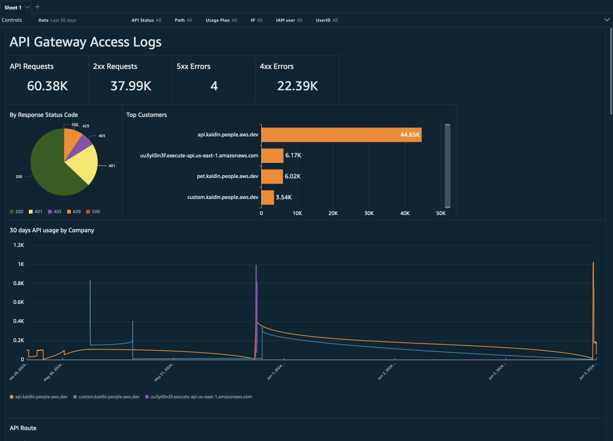
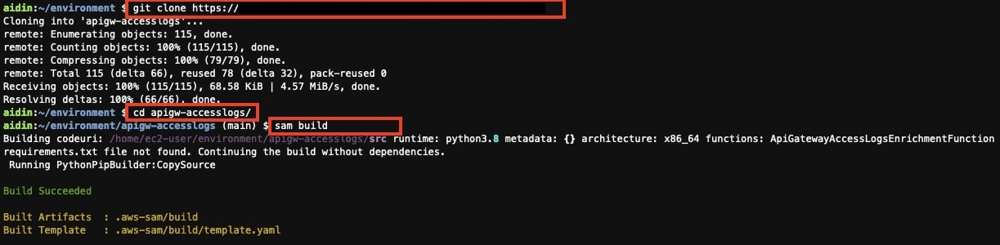
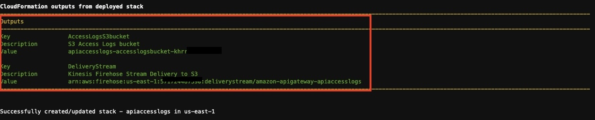
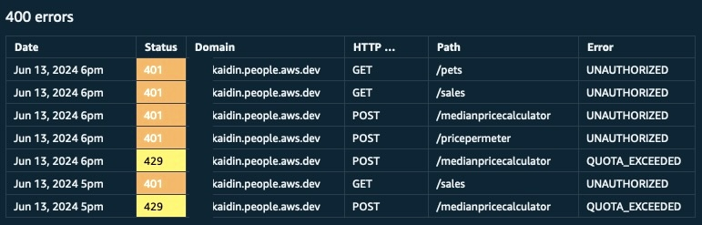
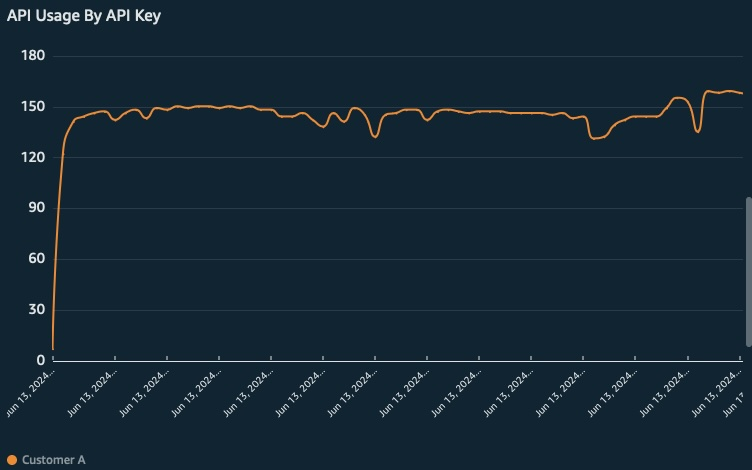
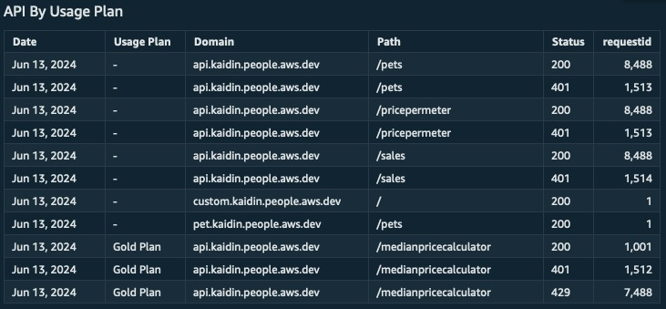
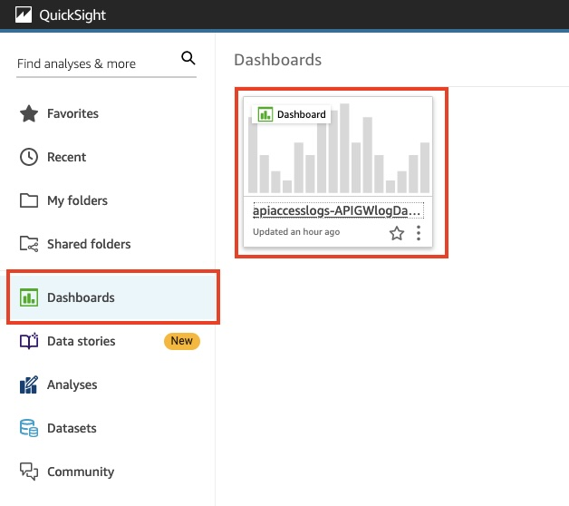

# Logging API Gateway access logs, analyzing and visualizing them using Amazon QuickSight

[Amazon API Gateway](https://aws.amazon.com/api-gateway/) is a fully managed service that makes it easy for developers to create, publish, maintain, monitor, and secure APIs at any scale. APIs act as the 'front door' for applications to access data, business logic, or functionality from your backend services. Amazon API Gateway can produce detailed access logs to show who has accessed the API. When using usage plans, a customer identifier is included in the log records. API developers can use these access logs to identify popular routes, errors, authentication methods, users reaching quota limits, and gain deeper insights into API usage.

You can use these logs to populate a business intelligence service, such as [Amazon QuickSight](https://aws.amazon.com/quicksight/), to analyze and report on usage patterns across your APIs and customers.

In this post, we will show how to visualize and analyze API Gateway access logs using [Amazon QuickSight dahboard](https://docs.aws.amazon.com/quicksight/latest/user/example-create-a-dashboard.html). This pre-built dashboard enables you to analyze API usage by visualizing the following components:

* 30 days of API usage by domain
* API routes showing popular API paths
* API breakdown by status code
* 400 errors (quota exceeded, unauthorized, and invalid-signature) requests
* 500 errors
* API usage by usage plan and API key
* Users hitting quota limits
* API calls by user agent
* Authentication methods
* Cognito-based access control
* IAM authorization
* Filter visualizations and reports by date, domain, status, usage plan, IP, and users (IAM or Cognito users)

As we are using Amazon QuickSight for the visualization part, you have the flexibility to customize these tables and graphs based on your business use case. You can also set up [Amazon QuickSight Paginated Reports](https://aws.amazon.com/quicksight/paginated-reports/) and share reports and data exports from a single, fully managed, cloud-based business intelligence (BI) solution. API owners and product managers can receive daily or weekly reports on your API consumption.

**Dashboard overview**



## Solution Overview 

The integration works by forwarding API Gateway access logs from your Amazon API Gateway to S3 via Amazon Data Firehose. This solution uses the following AWS services to provide near real-time logging analytics:

* Amazon S3 bucket ensures durable and secure storage.
* Amazon Data Firehose for delivering logs into an S3 bucket.
* AWS Lambda function for log enrichment.
* AWS Glue crawler to provide fresher data to QuickSight.
* Amazon QuickSight for analytics and visualization.

  

## Streamlining API Access Logs
API access logs are streamed in near real-time from Amazon API Gateway to [Amazon Data Firehose](https://www.google.com/search?client=firefox-b-1-d&q=Amazon+Kinesis+Data+Firehose). Amazon Data Firehose buffers these records, enriching them with information from the API usage plans. It then writes batches of enhanced records to an Amazon S3 bucket, ensuring durable and secure storage. To enrich the access logs, an AWS Lambda function is used. The Lambda function retrieves API Gateway usage plan details and loads them into memory. During each invocation, it processes each access log record from Firehose stream by decoding it from a base64-encoded binary. The record is then enriched with the usage plan name and customer name before being re-encoded to base64 binary and returned to the Firehose stream.

## Indexing Access Logs
Metadata for the API access logs is stored in an [AWS Glue Data Catalog](https://docs.aws.amazon.com/glue/latest/dg/catalog-and-crawler.html), which Amazon QuickSight uses for querying. An AWS Glue crawler identifies and indexes newly written access logs. You can adjust the frequency of the Glue crawler to ensure fresher data is available in Amazon QuickSight by updating the DataRefreshFrequency parameter of the SAM template when deploying the solution. The default data refresh frequency is every 10 minutes (cron(0/10 * * * ? *)).

## Visualizing Data
Amazon QuickSight is configured to use the S3 location of the access logs as a data source, enabling comprehensive analysis and visualization.

## Pre-requisites 

If you have not activated Amazon QuickSight in your AWS account, follow the steps below. Otherwise, you can skip to step 2.

1. Create a QuickSight Account.
    1. Navigate to Amazon QuickSight service from the AWS Management console.
    2. Click **Sign up for QuickSight**.
    3. Enter Email and account name.

  

2. Once Amazon QuickSight account setup is complete, from the Amazon QuickSight console, select your username to open the menu. Select “Manage QuickSight”.
3. On the left menu, select “Manage Groups”.
4. Select the “NEW GROUP” button and name the group in the format “<projectName>-Admins” (It is case sensitive). Select “CREATE.” For example, apiaccesslogs-Admins.
5. Add yourself as an administrator to the dashboard by selecting the newly created group name, then click “ADD USER.”
6. Copy the project name without '-Admins' as this is required for the project name parameters in the SAM template. It needs to be the exact same name for deployment.

 

## Implementation

Note: This solution supports only the [REST API Gateway](https://docs.aws.amazon.com/apigateway/latest/developerguide/apigateway-rest-api.html).

This solution won’t create an API Gateway in your AWS account and assumes you already have an API endpoint. If you do not, follow [this tutorial](https://docs.aws.amazon.com/apigateway/latest/developerguide/api-gateway-create-api-from-example.html) to create one.

Deploy an AWS SAM template into your account. This template creates all components of the analytics pipeline, including an Amazon S3 bucket, Amazon Data Firehose, AWS Lambda functions, AWS Glue, and Amazon QuickSight dashboards and visuals, using Infrastructure as Code (IaC).

Once deployment is complete, we will configure our existing API Gateway to deliver access logs to the deployed Firehose stream.

## Launch the AWS SAM Template

From your local terminal, run the following commands:

```
git clone https://github.com/aws-samples/apigw-log-analytic.git
cd apigw-log-analytic
sam build
sam deploy -g 
```

Enter the following parameters for deployment:

- Stack Name: Use if for stack name. For example apgwaccesslogs.
- ProjectName: Use the project name without '-Admins'. Ensure it matches the one created in the Prerequisites section 6.
- DataRefreshFrequency: You can leave as default (every 10 minutes) or customize it based on your requirement.


 


Wait a few minutes for the deployment to complete. Once the stack has been successfully created, copy the Amazon Resource Names (ARNs) of the Firehose stream and S3 bucket from the output. These resource ARNs are required for the next steps in configuring API Gateway access logging.



## Authorize Amazon QuickSight to access your Amazon S3 bucket

1. Followthe instructions to authorize Amazon QuickSight to access API Gateway S3 access logs.
2. Select the S3 access logs bucket created and Finish and Save.


## Configure API Gateway to stream access logs to this Data Firehose stream

1. You can now configure API Gateway to stream access logs to this Firehose delivery stream. Follow these instructions to enable access logging on your API stages using the ARN of the Firehose delivery stream created via SAM template.
2. Under Log Format, choose the fields to include in the access logs in JSON format. Find examples in the API Gateway documentation as well as the full set of available fields in the $context variable. The below fields and mapped names are required for the analysis.

```
{"requestId":"$context.requestId","ip":"$context.identity.sourceIp","requestTime":"$context.requestTime","httpMethod":"$context.httpMethod","routeKey":"$context.routeKey","status":"$context.status","protocol":"$context.protocol","responseLength":"$context.responseLength","extendedRequestId":"$context.extendedRequestId","accountId":"$context.accountId","apiId":"$context.apiId","authorizerClaimsProperty":"$context.authorizer.claims.property","authorizerPrincipalId":"$context.authorizer.principalId","authorizerProperty":"$context.authorizer.property","awsEndpointRequestId":"$context.awsEndpointRequestId","deploymentId":"$context.deploymentId","domainName":"$context.domainName","domainPrefix":"$context.domainPrefix","errorMessage":"$context.error.message","errorResponseType":"$context.error.responseType","errorValidationErrorString":"$context.error.validationErrorString","identityAccountId":"$context.identity.accountId","identityApiKeyId":"$context.identity.apiKeyId","identityCaller":"$context.identity.caller","identityCognitoAuthenticationProvider":"$context.identity.cognitoAuthenticationProvider","identityCognitoAuthenticationType":"$context.identity.cognitoAuthenticationType","identityCognitoIdentityId":"$context.identity.cognitoIdentityId","identityCognitoIdentityPoolId":"$context.identity.cognitoIdentityPoolId","identityPrincipalOrgId":"$context.identity.principalOrgId","identityVpcId":"$context.identity.vpcId","identityVpceId":"$context.identity.vpceId","identityUser":"$context.identity.user","identityUserAgent":"$context.identity.userAgent","identityUserArn":"$context.identity.userArn","path":"$context.path","requestOverrideHeader":"$context.requestOverride.header.header_name","requestOverridePath":"$context.requestOverride.path.path_name","requestOverrideQueryString":"$context.requestOverride.querystring.querystring_name","responseOverrideHeader":"$context.responseOverride.header.header_name","responseOverrideStatus":"$context.responseOverride.status","requestTimeEpoch":"$context.requestTimeEpoch","resourcePath":"$context.resourcePath","stage":"$context.stage","wafResponseCode":"$context.wafResponseCode","webaclArn":"$context.webaclArn","sub":"$context.authorizer.claims.sub","clientId":"$context.authorizer.claims.iss","aud":"$context.authorizer.claims.aud"}
```

## Data Visualization

Once you configure API Gateway access logs, it takes a few minutes for the logs to appear in the QuickSight dashboard. This pre-built dashboard allows you to analyze API usage by visualizing components such as 30 days of API usage by domain, popular API paths, 400 errors (quota exceeded, unauthorized, and invalid-signature) requests, users hitting quota limits, and Cognito-based and IAM authorization. Additionally, you can filter visualizations and reports by date, customer, status, usage plan, IP, and users (IAM or Cognito users). You can also customize these visuals or create new ones for your business use case, as we have included additional context fields in the API access logs.

**Dashboard overview**


**Congnito based access control**


**400 errors (quota exceeded, unauthorized, and invalid-signature) requests**


**API by usage plan**



## How to open the dashboard

1. Navigate to the Amazon QuickSight console.
2. Select Dashboard and open the deployed QuickSight dashboard.



## Cleaning Up 

The SAM delete command deletes an AWS SAM application by deleting the AWS CloudFormation stack, the artifacts that were packaged and deployed to Amazon S3 and Amazon ECR, and the AWS SAM template file.

Note - API Gateway access logs will be retained in the S3 bucket for future reference. You may need to manually delete the bucket if necessary.

```
cd apigw-log-analytic
sam delete
```

## Conclusion

In this post, we walked you through how Amazon API Gateway's detailed access logs provide insights into API usage. These logs include customer identifiers with usage plans, helping developers identify popular routes, errors, authentication methods, and users reaching quota limits. By using these logs, you can populate Amazon QuickSight to analyze and report on API usage patterns across domains and customer segments. 

You can customize this dashboard by creating additional visuals and tables based on your business use case. Additionally, you can customize the Lambda enrichment logic, for example, to add geo information for IP addresses and create geographic dashboards within QuickSight to identify geographically separated users.
