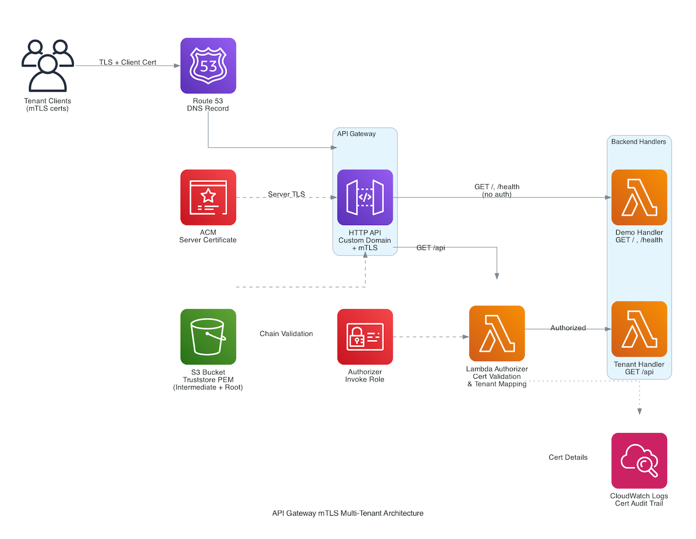

# Operating multi-tenant mTLS on API Gateway at scale

A deployable SAM project for building and operating multi-tenant mTLS on API Gateway. Covers full certificate chain validation, intermediate CA rotation without downtime, expiry enforcement behavior, and tenant routing via Lambda Authorizer.  Includes an interactive demo web app for validating each scenario.

## Background

In standard TLS (what happens when you visit any HTTPS site), only the server proves its identity to the client. Mutual TLS (mTLS) adds the reverse: the client also presents a certificate to prove its identity to the server. Both sides authenticate each other.

Certificates are organized in a chain of trust:

```
┌─────────────────────────────────────────────────────┐
│                    Root CA                          │
│         (Self-signed, ultimate trust anchor)        │
│            Stored offline, rarely used              │
└──────────────────────┬──────────────────────────────┘
                       │ signs
                       ▼
┌─────────────────────────────────────────────────────┐
│               Intermediate CA                       │
│       (Signed by Root, issues leaf certs)           │
│     Operationally active, can be rotated            │
└──────────────────────┬──────────────────────────────┘
                       │ signs
                       ▼
┌─────────────────────────────────────────────────────┐
│             Leaf (Client) Certificate               │
│    (Presented by the client during TLS handshake)   │
│    Contains: subject CN, issuer, validity dates     │
└─────────────────────────────────────────────────────┘
```

Each certificate is signed by the one above it. To verify a leaf certificate, the server needs to walk up this chain and confirm every link. The truststore is the file that tells the server which CAs to trust — in API Gateway's case, a PEM file in S3 containing the intermediate and root CA certificates.
For a deeper introduction to PKI and certificate chains, see the [AWS documentation on mutual TLS authentication](https://docs.aws.amazon.com/apigateway/latest/developerguide/http-api-mutual-tls.html).

API Gateway mTLS requires the **full chain of trust** in the truststore — it does not auto-discover intermediate CAs from a root-only truststore. This creates operational considerations around how you build and maintain the truststore over time.

### This project addresses three areas:

**Building** — Setting up mTLS with a multi-tenant architecture where tenant identity is determined by client certificate, not URL path.

**Validating** — Proving the chain validation behavior: what works, what doesn't, and where the documented limits are.

**Operating** — Demonstrating certificate lifecycle operations: intermediate CA rotation with zero downtime, expiry enforcement behavior, truststore update propagation, and where to integrate revocation checks.

Reference: [Configuring your truststore](https://docs.aws.amazon.com/apigateway/latest/developerguide/rest-api-mutual-tls.html) — *"You must include the complete chain of trust, starting from the issuing CA certificate, up to the root CA certificate, in your truststore."*


## Test Scenarios

| # | Scenario | Expected | Area |
|---|----------|----------|------|
| 1 | Full-chain truststore (intermediate + root) | ✅ 200 | Validation |
| 2 | Root-only truststore | ❌ 403 | Validation |
| 3 | Expired leaf cert | ❌ 403 | Operations (expiry) |
| 4 | Intermediate CA rotation (both in truststore) | ✅ 200 | Operations (rotation) |
| 5 | No client cert | ❌ Rejected | Validation |
| 6 | Untrusted self-signed cert | ❌ 403 | Validation |
| 7 | Max chain depth (root + 3 intermediates) | ✅ 200 | Limits |

## Prerequisites

- AWS CLI v2 with permissions for API Gateway, Lambda, S3, Route 53, CloudWatch Logs, IAM
- [SAM CLI](https://docs.aws.amazon.com/serverless-application-model/latest/developerguide/install-sam-cli.html) installed
- `openssl` and `curl` available locally
- Python 3.12+ (for SAM build and the demo web app)
- A custom domain with:
  - A Route 53 hosted zone
  - An ACM certificate (publicly trusted) covering the domain name

## Getting Started

> **Security Note:** Running the test scenarios will generate private keys (`*.key` files) in the certs/ directory that can issue trusted certificates against this projects truststore. Do not share, commit, or display these files.  You can cleanup by deleting these files after completion of tests. 

### 1. Configure

```bash
cp config.env.example config.env
```

Edit `config.env` with your values:

| Variable | Description |
|----------|-------------|
| `DOMAIN_NAME` | Custom domain for the API (e.g., `mtls-demo.example.com`) |
| `HOSTED_ZONE_ID` | Route 53 hosted zone ID for the domain |
| `CERTIFICATE_ARN` | ACM certificate ARN for server-side TLS |
| `TRUSTSTORE_BUCKET` | S3 bucket name for the truststore (will be created) |
| `STACK_NAME` | CloudFormation stack name (default: `mtls-demo`) |
| `AWS_REGION` | Deployment region (default: `us-east-1`) |

### 2. Deploy

```bash
scripts/deploy.sh
```

This will:
1. Generate a 3-tier PKI (Root → Intermediate → Leaf) plus tenant certs in `./certs/`
2. Create an S3 bucket and upload the truststore (intermediate + root)
3. Build and deploy the SAM stack

### 3. Wait for the domain

The custom domain takes 1-2 minutes to become available after deployment:

```bash
source config.env
aws apigatewayv2 get-domain-name --domain-name ${DOMAIN_NAME} --region ${AWS_REGION} \
  --query 'DomainNameConfigurations[0].DomainNameStatus' --output text
```

Wait for `AVAILABLE` before testing.

### 4. Run tests

You have two options for running tests: 
1. Automated script via CLI
2. Visual web app run locally 

**CLI test suite (7 automated tests):**

```bash
scripts/test-mtls.sh
```

**Visual demo web app:**

```bash
scripts/run-demo.sh
# Open http://localhost:5001
```

### 5. Cleanup

```bash
scripts/teardown.sh
```

Removes the CloudFormation stack, empties and deletes the S3 bucket. Local certs are not removed.  You will need to perform that step manually when you are ready to delete them.  

## Demo Web App

The web app at `demo/` provides a visual interface for running each test scenario interactively:

- **Left sidebar** — tabbed test scenarios plus multi-tenant demo
- **Certificate panel** — shows truststore contents and client cert being presented (appears immediately when a test starts)
- **Live terminal** — streams real-time output via Server-Sent Events
- **Pass/Fail results** — color-coded badges with summary of what each test proves

### Multi-Tenant Tab

Demonstrates certificate-based tenant routing through a shared endpoint:

- **Tenant A** and **Tenant B** each have unique client certs (both issued by the same intermediate CA)
- Both tenants hit the **same endpoint** (`/api`) — routing is determined by cert identity, not URL path
- The Lambda Authorizer extracts the cert, logs details to CloudWatch, maps the CN to a tenant context
- The backend handler returns tenant-specific data based on the authorizer context
- **Authorizer Logs** button fetches CloudWatch logs showing the full cert processing flow

## Architecture


```
Client (curl)
  │
  │  TLS handshake with client cert
  ▼
API Gateway (Custom Domain + mTLS)
  │
  │  Validates client cert against truststore in S3
  │  (full chain required: intermediate + root)
  │
  ├── GET /           → Handler (no authorizer, returns cert details)
  │
  └── GET /api        → Lambda Authorizer
                          │  Extracts cert (subject, issuer, serial, validity)
                          │  Logs to CloudWatch (revocation check point)
                          │  Maps CN → tenant identity
                          ▼
                        Tenant Handler
                          Returns tenant-specific response
```




## Project Structure

```
.
├── template.yaml            # SAM template (HTTP API, Lambda Authorizer, mTLS)
├── samconfig.toml           # SAM CLI defaults
├── config.env.example       # Configuration template
├── src/
│   ├── handler.py           # Basic handler (returns cert details from mTLS)
│   ├── authorizer.py        # Lambda Authorizer (cert logging + tenant mapping)
│   └── tenant_handler.py    # Tenant-specific response handler
├── scripts/
│   ├── generate-certs.sh    # Generates PKI: root, intermediate, leaf, tenant certs
│   ├── deploy.sh            # Full deployment orchestration
│   ├── test-mtls.sh         # Automated CLI test suite (7 scenarios)
│   ├── run-demo.sh          # Launches the demo web app
│   └── teardown.sh          # Removes all deployed resources
├── demo/
│   ├── app.py               # Flask backend with SSE streaming
│   ├── requirements.txt     # Python dependencies (flask, cryptography)
│   └── static/
│       └── index.html       # Single-page frontend
└── certs/                   # Generated certs (gitignored)
```

## Certificate Chain

```
┌──────────────────────────────────────┐
│ Root CA (self-signed, 10 years)      │
│ CN=Demo Root CA                      │
└──────────────────┬───────────────────┘
                   │ signs
┌──────────────────▼───────────────────┐
│ Intermediate CA (5 years)            │
│ CN=Demo Intermediate CA              │
│ CA:TRUE, pathlen:0                   │
└────┬──────────┬──────────┬───────────┘
     │          │          │
┌────▼────┐ ┌──▼─────┐ ┌──▼─────┐
│  Leaf   │ │Tenant A│ │Tenant B│
│  (1yr)  │ │ (1yr)  │ │ (1yr)  │
└─────────┘ └────────┘ └────────┘
```

**Truststore** = Intermediate CA + Root CA (2 certs). Clients present their leaf cert only.

## Empirical Limits

These limits were tested empirically against the API Gateway service. Understanding them is critical for planning truststore operations at scale:

| Limit | Value | Operational Impact |
|-------|-------|-------------------|
| Max chain depth | 4 (root + 3 intermediates) | Plan PKI hierarchy accordingly |
| Max truststore file size | < 1000 KB | ~500-900 unique CAs depending on key size |
| Max certs tested in truststore | 929 (at 999 KB) | No separate cert-count limit observed |
| Duplicate subject DNs | Not allowed | Each CA must have a unique subject |
| Expired intermediate in truststore | Accepted with warning, leaf rejected | Rotate intermediates before expiry |
| Truststore propagation | 60-90 seconds | Factor into rotation runbooks |
| Typical capacity (4096-bit CAs) | ~500-550 unique CAs | ~1.8 KB per PEM entry |
| Typical capacity (2048-bit CAs) | ~900 unique CAs | ~1.1 KB per PEM entry |

## API Gateway mTLS Validation Behavior

Understanding what API Gateway does and does not check is key to designing your operational procedures:

| Check | Behavior | Operational Note |
|-------|----------|-----------------|
| X.509 syntax | Enforced | — |
| Signature chain integrity | Full chain must be resolvable via truststore | Include all intermediates |
| Leaf certificate expiry | Enforced | Clients must renew before NotAfter |
| Intermediate CA expiry | Enforced (expired intermediate breaks the chain) | Rotate before expiry — hard failure |
| Max chain depth | 4 levels (root + up to 3 intermediates) | Design PKI within this constraint |
| CRL / OCSP revocation | **Not checked natively** — use Lambda Authorizer | See revocation pattern below |
| Auto-walk from root-only truststore | **Not supported** | Must include full chain explicitly |
| Duplicate subjects in truststore | Rejected at import | Use unique CNs per CA |

## Lambda Authorizer — Revocation Check Pattern

API Gateway does not perform CRL or OCSP revocation checking natively. The Lambda Authorizer in this project demonstrates the integration point where these operational checks can be added:

```python
# Production implementation points (see src/authorizer.py):
#   1. Download CRL from CA's distribution point, check serial number
#   2. Send OCSP request to responder URL from cert's AIA extension
#   3. Query internal denylist (DynamoDB/Redis) for revoked serials
#
# if is_revoked(serial, issuer_dn):
#     return {"isAuthorized": False, "context": {"reason": "Certificate revoked"}}
```

For a detailed writeup on client certificate revocation, see [How to implement client certificate revocation list checks at scale with API Gateway blog.](https://aws.amazon.com/blogs/security/how-to-implement-client-certificate-revocation-list-checks-at-scale-with-api-gateway/)

The authorizer logs full cert details (subject, issuer, serial, validity) to CloudWatch on every request, providing an audit trail and the data needed for operational monitoring (e.g., alerting on certs approaching expiry).

## References

- [API Gateway mTLS documentation](https://docs.aws.amazon.com/apigateway/latest/developerguide/rest-api-mutual-tls.html)
- [Using a third-party client certificate with mTLS](https://repost.aws/knowledge-center/api-gateway-tls-certificate)
- [Use ACM Private CA for API Gateway mTLS](https://aws.amazon.com/blogs/security/use-acm-private-ca-for-amazon-api-gateway-mutual-tls/)
- [aws-samples/api-gateway-auth](https://github.com/aws-samples/api-gateway-auth)
- [How to implement client certificate revocation list checks at scale with API Gateway blog.](https://aws.amazon.com/blogs/security/how-to-implement-client-certificate-revocation-list-checks-at-scale-with-api-gateway/)

