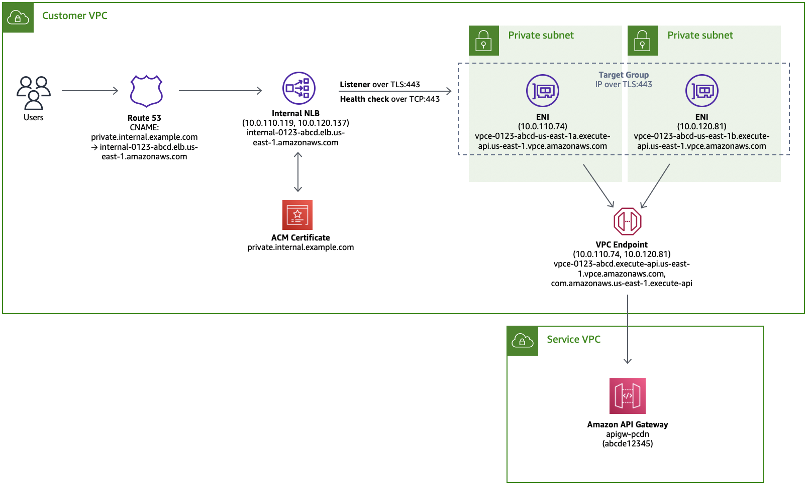

# Custom Domain Names for Private API Gateway Endpoints
This repository implements a workaround solution as described in the [blog post](https://georgemao.medium.com/enabling-private-apis-with-custom-domain-names-aws-api-gateway-df1b62b0ba7c) titled "Enabling Private APIs with Custom Domain Names (AWS API Gateway)" by George Mao. Multiregional implementation of this solution is available [here](https://github.com/aws-samples/serverless-samples/tree/main/multiregional-private-api/README.md).

**Note that [multi-level API mappings](https://docs.aws.amazon.com/apigateway/latest/developerguide/rest-api-mappings.html), that allow you to control which API receives a request according to mappings between an API and any segment of the request path, do not work with this workaround** 

## Services Used
* [AWS Certificate Manager](https://aws.amazon.com/certificate-manager/)
* [AWS Network Load Balancer](https://docs.aws.amazon.com/elasticloadbalancing/latest/network/introduction.html)
* [AWS Application Load Balancer](https://docs.aws.amazon.com/elasticloadbalancing/latest/application/introduction.html)
* [Amazon VPC Endpoints](https://docs.aws.amazon.com/vpc/latest/privatelink/vpc-endpoints.html)
* [Amazon Route 53](https://aws.amazon.com/route53/)
* [Amazon API Gateway](https://aws.amazon.com/api-gateway/)

## Architecture
The architecture diagram below illustrates the interactions between the components in the solution and leverages NLB for routing traffic. An alternate diagram for ALB can be found under `assets/`.


## Traffic Flow
A user or application makes an API request to the fully qualified domain name (FQDN) of the custom domain name, in this example `private.internal.example.com`. We use a private hosted zone in association with the VPC. The CNAME resolves to the FQDN of the private load balancer, in this example `internal-0123-abcd.elb.us-east-1.amazonaws.com`. The load balancer terminates TLS with the ACM certificate for `private.internal.example.com`. For more details, refer to the [documentation](https://docs.aws.amazon.com/Route53/latest/DeveloperGuide/hosted-zone-private-creating.html) on private hosted zones.

The load balancer then re-initiates the TLS connection with a listener for TLS:443 for NLB or alternatively HTTPS:443 for ALB. The listener redirects to the IP addresses of the VPC endpoint for API Gateway, in this example at 10.0.110.74 and 10.0.120.81. The listener also has a TCP:443 health check for NLB and an HTTPS:443 health check for ALB. Note that ALB also requires matcher against HTTP 200 and 403. The load balancers then establishes a TLS connection to the VPC endpoint using the FQDN of the custom domain, allowing it to resolve to the regional custom domain name that we configured.

## Implementation
To create this stack, we will create the components in the following order:
1. VPC endpoint
2. ACM certificate
3. API Gateway endpoint
4. Load balancer (NLB/ALB) with listener and target group
5. Route 53 CNAME

Steps 2-5 will be created using the provided templates and makefile directives. To properly execute the `make` commands, rename `environment.template` to `environment.sh`. Each section below will then describe the changes necessary in the environment file to perform the deployments. Note that these components were intentionally created as separate CloudFormation stacks, as these components are often created and managed by different teams.

### VPC Endpoint
The VPC endpoint to API Gateway only needs to be created once for the VPC. Permissions to create this network resource may also be restricted to a central networking or security team. If you have permissions to create the resource, you can follow the steps outlined in this [guide](https://docs.aws.amazon.com/apigateway/latest/developerguide/apigateway-private-apis.html#apigateway-private-api-create-interface-vpc-endpoint).

### ACM Certificate
To create the ACM certificate, update the following parameters in `environment.sh` and execute `make cert`.

```bash
P_DOMAIN_NAME=your_domain_name
P_HOSTED_ZONE_ID=your_private_hosted_zone_id
```

This will create a CloudFormation stack named `pcdn-certificate`. ACM certificates associated with private custom hosted zones do not support DNS verification and only support email verification. For this reason, be sure to create a certificate with a sub-domain rather than the apex domain.

Login to the registrar inbox to receive the validation request, which will be from "Amazon Certificates" with a subject line "Certificate request for [your_domain_name]". Click the link to approve the request, and the CloudFormation stack will complete. If you did not receive the validation email, navigate to the ACM dashboard, click on the certificate, and click the "Resend validation email" button. Capture the output of the stack and update the following parameter in `environment.sh`. For more details, refer to the [documentation](https://docs.aws.amazon.com/acm/latest/userguide/email-validation.html) for email validation with ACM.

```bash
O_CERT_ARN=output_certificate_arn
```

### API Gateway
To create the API Gateway endpoint and custom domain, update the following parameters in `environment.sh` and execute `make apigw`.

```bash
P_API_STAGE=dev
P_VPC_ENDPOINT_ID=your_vpce_id
P_VPC_ID=your_vpc_id
P_PVERSION=1.0
P_FN_MEMORY=128
P_FN_TIMEOUT=15
```

This will create a CloudFormation stack named `pcdn-apigw`. This stack creates the API Gateway resource, an access log group, a custom domain name, and the base path map to assocate the API Gateway resource with the custom domain name. Note that we default the base path map to `demo` and can optionally be updated per your requirements. This will be used later when accessing the endpoint. Capture the output of the stack and update the following parameters in `environment.sh`.

```bash
O_API=output_api_id
O_FN=output_function_id
```

### Load Balancer
To create the NLB or ALB resource, update the following parameters in `environment.sh` and execute `make nlb` or `make alb`.

```bash
P_VPC_SUBNET_IDS=your_comma_delimited_subnet_ids
P_VPC_ENDPOINT_IPS=your_comma_delimited_endpoint_ip_addresses
```

This will create a CloudFormation stack named either `pcdn-nlb` or `pcdn-alb` depending on which you chose. This will create the load balancer, the listener, and the target group pointing to your VPC endpoint. To get the IP addresses of your VPC endpoint, you can run `nslookup` or `dig` against your VPC endpoint FQDN, e.g. `dig +short vpce-0123-abcde.execute-api.us-east-1.vpce.amazonaws.com`. Capture the output of the stack and update the following parameters in `environment.sh`. Note you only need to update the one that you created.

Note that the subnet ids do not necessarily need to be the ones that contain the VPC endpoint addresses but minimally do need to be routable. That said, they should at least be in the same availability zone to avoid cross-AZ charges. Note that you need to provide a minimum of two subnets for defining a load balancer. Note that when specifying a comma-delimited list, do not include spaces after the comma.


```bash
O_DNS_NAME_NLB=your_nlb_fqdn
O_DNS_NAME_ALB=your_alb_fqdn
```

Note that the NLB and ALB templates assume that 4 VPC endpoint IP addresses will be provided. If this is not correct, update the `Targets` property in the `nlb.yaml` or `alb.yaml` templates to include the proper number of IP addresses.

### Route 53 CNAME
To create the Route 53 CNAME to point to your load balancer, update the following parameters in `environment.sh` and execute `make r53`. Note you choose only one variable assignment based on the load balancer choice that you made.

```bash
P_DNS_NAME=${O_DNS_NAME_NLB}
P_DNS_NAME=${O_DNS_NAME_ALB}
```

### Validation
Test that you can make API requests against your private custom domain name. From a bastion host within the VPC or other device that can route to the VPC, execute `curl -s -XGET https://private.internal.example.com/demo | jq`. The response will include something like the following:

```json
{
  "reqid": "566c17c2-c4b0-40ce-b303-256af1ddae12",
  "domain": "private.internal.example.com",
  "api": "abcde12345",
  "host": "private.internal.example.com",
  "path": "/demo",
  "resource": "/",
  "method": "GET",
  "x-amzn-vpce-id": "vpce-abcdefgh123456789",
  "x-forwarded-for": "10.0.110.119"
}
```

Note that the `x-forwarded-for` header will be an IP address from your load balancer. Also, if you follow the advanced instructions below for deploying a second API Gateway endpoint behind the same load balancer, you will see different api identifiers in the `api` attribute

## Advanced
To have the same load balancer point to multiple backend API Gateway endpoints:
1. Create another ACM certificate with another domain name.
2. Create another API Gateway resource with the associated resources above.
3. Create another Route 53 CNAMEs for the new domain name pointing to the load balancer.
4. Add the additional ACM certificate to the listener of that same load balancer. This will require passing in an additional certificate ARN parameter. An example of this is demonstrated in `nlb_multi.yaml` and `alb_multi.yaml`. Note to skip this step, you could also apply wildcard certificates. 

## Cleanup
To cleanup this implementation, delete the stacks in reverse order of creation:
1. Route 53 CNAME
2. Load balancer (NLB/ALB) with listener and target group
3. API Gateway endpoint
4. ACM certificate

And finally delete the VPC endpoint for API Gateway.
