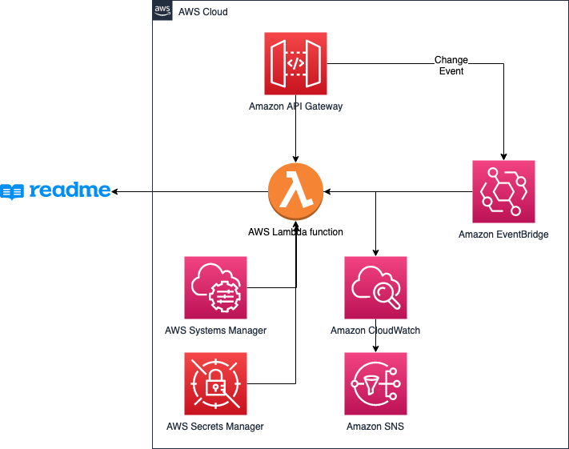
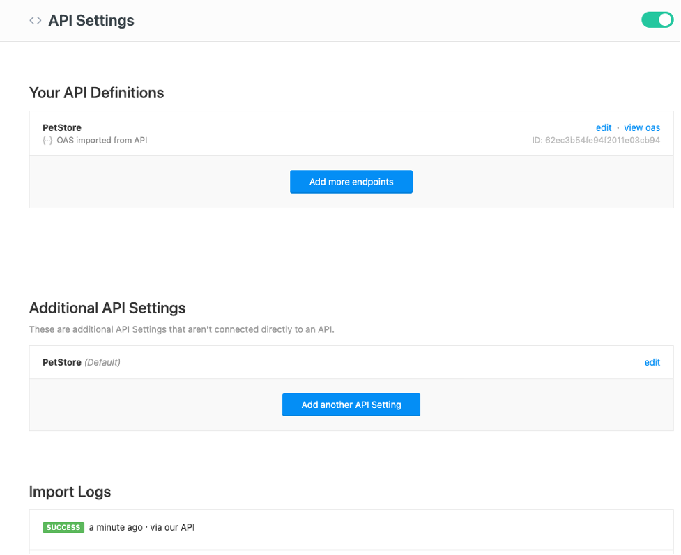

# Amazon API Gateway -> ReadMe synchronizer

The modern API lifecycle does not end once your CI/CD pipeline pushes a deployment to production, and the API becomes available to your clients. They still have to access documentation, try out different parts of the API, get notifications about changes, etc. API developer portals have become standard for any business that's offering APIs to their partners and the end users. They help your clients to consume your APIs the way you designed them and get all the necessary information, guidance and initial support, and help with the troubleshooting tasks.

Amazon API Gateway publishes a regularly updated [Serverless Developer Portal application](https://docs.aws.amazon.com/apigateway/latest/developerguide/apigateway-developer-portal.html) in the [AWS Serverless Application Repository](https://serverlessrepo.aws.amazon.com/applications/arn:aws:serverlessrepo:us-east-1:563878140293:applications~api-gateway-dev-portal) and on [GitHub](https://github.com/awslabs/aws-api-gateway-developer-portal). However, there may be cases when this application is not enough. For example, when you need to integrate APIs across multiple vendor solutions or deployment targets, or when you need more complex API grouping into various products. In such cases, we recommend looking at our partner solutions that may fit your needs.
This example shows how to integrate one of the partner solutions, [ReadMe.com](ReadMe.com), with Amazon API Gateway to make sure that your documentation is up to date and gets changed every time you change the API.

## Solution Overview
This example implementation reacts to the changes to the API Gateway made manually or through a CI/CD pipeline. It will synchronize changes from the API Gateway to the developer portal in ReadMe. It does this by exporting the API Gateway OpenAPI definition and uploading changes to ReadMe. Optionally, it will delete the existing definition when you delete an API Gateway endpoint. Implementation uses the following resources:



 - [Amazon API Gateway](https://aws.amazon.com/api-gateway/) that gets changed manually or by an automated process
 - [Amazon EventBridge](https://aws.amazon.com/eventbridge/) that receives events whenever you deploy API Gateway stage
 - [AWS Lambda](https://aws.amazon.com/lambda/) function that is invoked by the EventBridge and synchronizes definition to ReadMe
 - [AWS Systems Manager Parameter Store](https://docs.aws.amazon.com/systems-manager/latest/userguide/systems-manager-parameter-store.html) to store Lambda configuration parameters
 - [AWS Secrets Manager](https://aws.amazon.com/secrets-manager/) to store ReadMe API key used for authentication
 - [Amazon CloudWatch](https://aws.amazon.com/cloudwatch/) with alarms used for synchronization error notifications
 - [Amazon Simple Notification Service (SNS)](https://aws.amazon.com/sns/) to deliver error notifications to the subscribed email recipients


## Prerequisites
You will need an existing ReadMe project which you will use as a synchronization target. If you do not have one yet, follow instructions at ReadMe documentation. Note your project version and get an API key for authentication. If you plan to synchronize an API definition that already exists in your project, note that API definition ID as well.

You will also need to have the API Gateway stage deployed. Note its ID, stage name and API Gateway type (REST or HTTP).

CloudWatch metric alerts for Lambda errors will send notifications to an email address you provided at the deployment time. I would recommend using an email alias. This way, you and your team will not miss notifications and leave issues unresolved.

## Deployment
This example uses Python 3 and the [AWS Serverless Application Model (AWS SAM)](https://aws.amazon.com/serverless/sam/) to deploy private APIs with custom domain names. Visit the [documentation](https://docs.aws.amazon.com/serverless-application-model/latest/developerguide/serverless-sam-cli-install.html) to install it in your environment.

To deploy the synchronization application AWS CloudFormation stack:
1.	Clone this sample repository and navigate to the apigw-readme-integration directory. 
2.	Run following commands to deploy the synchronization stack to the us-east-1 Region:
```bash
python3 -m pip install -r requirements.txt
sam build 
sam deploy --guided --stack-name apigw-readme-sync
```
3.	Specify stack name, synchronization source and destination parameters (API gateway ID, stage name, type, ReadMe project version, existing API definition ID if known or “None”, API key, notification email) and accept default values for others:
 
4.	You will receive Amazon SNS subscription confirmation email to the address provided while configuring deployment, click subscription confirmation link in it to receive error alerts.
5.	Once the synchronization stack deployment completes, deploy the API Gateway stage specified as a source, wait for a few minutes, and verify that the application created new or changed existing API definition in the ReadMe project:



## Implementation
Following are steps the application stack executes every time the API Gateway stage gets changed:
1.	EventBridge receives the change event 
2.	EventBridge will invoke Lambda function if the event source, event name, API Gateway ID and stage specified in the event match one of the EventBridge rules created by the stack and if the event does not contain error code.
3.  If it’s the first time the Lambda function environment is starting, it will: 
    - Get configuration parameters from the Systems Manager Parameter Store (API Gateway ID, stage name, API Gateway type, ReadMe project version, API definition ID)
    - Get ReadMe API Key from the Secrets Manager
4.	Lambda function will:
    - Export API Gateway definition as OpenAPI 3.0.1 
    - Override API version in the metadata to match the ReadMe project
    - If API definition ID is specified in the parameters, update the API definition in ReadMe. If ID does not exist yet–upload definition as a new one, note ID in the response and update Systems Manager Parameter Store parameter with the new value.
    - In case of error while uploading to the ReadMe–log response status and rise error, so CloudWatch updates error metric, rises alert, and Amazon SNS sends notification.


## Additional notes, or tips and tricks
 - For the HTTP APIs stage name is $default if you haven’t changed it
 - The EventBridge rules will also trigger the same Lambda function in case of the DeleteRestApi, DeleteApi, DeleteStage events. I commented out in Lambda a call to the code that deletes API definition in ReadMe to avoid mistakes, as APIs do not get deleted that often. Enable it if desired, otherwise delete APIs in ReadMe manually. Keep in mind that you should delete your synchronization stack in CloudFormation after it deletes the API definition or re-deploy with a new configuration.
 - Create a custom domain name in the API Gateway to make sure that API base URL in the developer portal does not show up as a default (https://{restapi_id}.execute-api.{region}.amazonaws.com/{stage_name}/). Developer portal will use API Gateway custom domain name and base path mappings in the exported definition. 
 - When API gateway custom domain name is not configured path in imported API definition includes double leading slash and stage name: //prod/pets
 - Synchronization will not be triggered if API Gateway modification raised an error. While troubleshooting why expected synchronization event did not update API definition, check if modification event included an error code or message.
 - If error occurred during execution (for example, synchronization endpoint wasn’t reachable) Lambda will retry automatically 2 more times. You can switch off this behavior by uncommenting EventInvokeConfig property of the synchronization function in the template.yaml file.
 - After initial synchronization of a new API, it updated ReadMe API definition ID in the Parameter Store. To avoid API definition duplication in the project, update your stack configuration as well if you re-deploy it.

## Limitations
 - API Gateway HTTP APIs use automated deployments that do not send events to the EventBridge and do not trigger this synchronization process. In case you use API Gateway HTTP API type with this synchronization approach, you will need to switch off automated deployment for the stage you are synchronizing, and start your API stage deployment as a part of your CI/CD pipeline.
  - API definition import does not support API Gateway {proxy+} path or any Amazon API Gateway specific extensions

## Next steps and potential modifications
Current deployment approach assumes a single CloudFormation stack per ReadMe project version and API definition combination. You may change and extend this implementation if you plan to manage large numbers of the versions and API definitions. 

You could make it multi-API by storing multiple synchronization source/destination profiles in the Systems Manager Parameter Store. Then make EventBridge rules less specific to invoke synchronization Lambda function for any API and any modification event. Function code will have to decide if this particular API is being tracked, and it needs to trigger the synchronization process, or just ignore it. 

This way, single Lambda function will react to multiple APIs being changed instead of a separate Lambda function deployment per API. As a result, you will have a single CloudFormation stack for all your API synchronization tasks. Keep in mind that operational cost may increase-Lambda function will execute for all API changes, even if some APIs are not part of the ReadMe projects.


## Cleaning Up
To avoid incurring further charges when you do not need this synchronization process anymore, run the following command:
```bash
sam delete --stack-name apigw-readme-sync
```