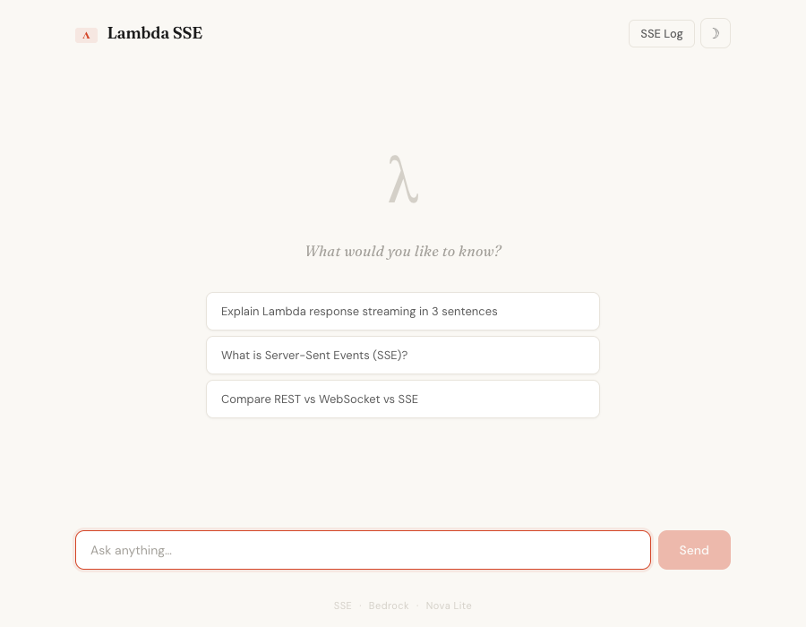
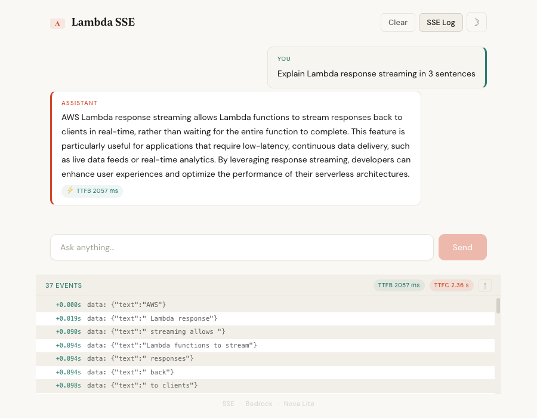

# AWS Lambda Streaming using SSE

A demo showcasing **Server-Sent Events (SSE)** over Lambda response streaming to stream LLM responses chunk by chunk.

A client sends conversation history to API Gateway, which invokes a streaming Lambda that calls Amazon Bedrock's ConverseStream API (Nova Lite model, `amazon.nova-lite-v1:0`) and forwards each text chunk as an SSE event (`data: {"text":"..."}\n\n`).

A React frontend is included to better showcase how SSE streaming works and how the chunks arrive over time.



## Architecture

```
Client
  └── POST /chat  →  API GW (STREAM)  →  Chat Lambda  →  Bedrock ConverseStream
       ← SSE events: data: {"text":"chunk"}\n\n
       ← data: [DONE]\n\n
```

## Project Structure

```
lambda-sse/
├── frontend/          # React frontend (Vite)
│   ├── public/
│   │   └── favicon.svg
│   ├── src/
│   │   ├── hooks/
│   │   │   └── useChat.js   # Chat state, TTFB tracking, retry logic
│   │   ├── lib/
│   │   │   └── sseClient.js # SSE stream consumer with onFirstChunk callback
│   │   ├── App.css           # Theming (light/dark), layout, components
│   │   ├── App.jsx           # Main UI component
│   │   └── main.jsx
│   ├── index.html
│   ├── package.json
│   └── vite.config.js
├── lambda/
│   └── chat/
│       └── index.mjs  # streamifyResponse — SSE-formatted Bedrock chunks
├── terraform/
│   ├── main.tf              # REST API (OpenAPI body), deployment, stage, CORS
│   ├── lambda.tf            # Lambda function, IAM role, permissions, packaging
│   ├── variables.tf         # Input variables (aws_profile, aws_region)
│   ├── outputs.tf           # Chat endpoint URL
│   └── terraform.tfvars.example  # Example variable values — copy to terraform.tfvars
└── README.md
```

## Prerequisites

- **AWS CLI** installed and configured with a named profile
- **Terraform** installed (v1.0+)
- **Node.js** installed (for frontend development)
- **Amazon Bedrock** — the Nova Lite model (`amazon.nova-lite-v1:0`) must be available in your chosen region

## Deploy

First, from the `lambda-sse/terraform/` directory, create your own `terraform.tfvars` from the example:

```bash
cp terraform.tfvars.example terraform.tfvars
```

Edit `terraform.tfvars` with your AWS CLI profile and target region:

```hcl
aws_profile = "your-profile"
aws_region  = "your-region"
```

Then deploy:

```bash
terraform init
terraform apply
```

After a successful apply, Terraform outputs the endpoint URL:

```
chat_endpoint_url = "https://<api-id>.execute-api.<region>.amazonaws.com/demo/chat"
```

## Frontend Development

From the `lambda-sse/frontend/` directory:

```bash
npm install

# Create .env.local with the API URL from Terraform
echo "VITE_API_URL=$(terraform -chdir=../terraform output -raw chat_endpoint_url)" > .env.local

npm run dev
```

This starts the Vite dev server. Open the URL shown in the terminal to use the chatbot.

The frontend uses the Fetch API with `getReader()` to consume SSE from a POST request (native `EventSource` only supports GET). Conversation history is maintained client-side and sent with each request for multi-turn context.

The demo includes a couple of features to help you see how SSE streaming behaves under the hood:

- **TTFB badge** — shows time-to-first-byte on each assistant response, so you can see the latency before the first chunk arrives
- **SSE event log** — collapsible panel showing raw `data: {...}` events with relative timestamps, event count, and TTFB/TTFC badges, useful for inspecting the shape and timing of individual chunks



## Test with curl

```bash
curl -X POST --no-buffer \
  -H "Content-Type: application/json" \
  -d '{"messages":[{"role":"user","content":"Hello!"}]}' \
  "$(terraform -chdir=lambda-sse/terraform output -raw chat_endpoint_url)"
```

You should see SSE events streaming in:

```
data: {"text":"Hi"}

data: {"text":" there!"}

data: [DONE]
```

## Teardown

```bash
terraform -chdir=lambda-sse/terraform destroy
```
