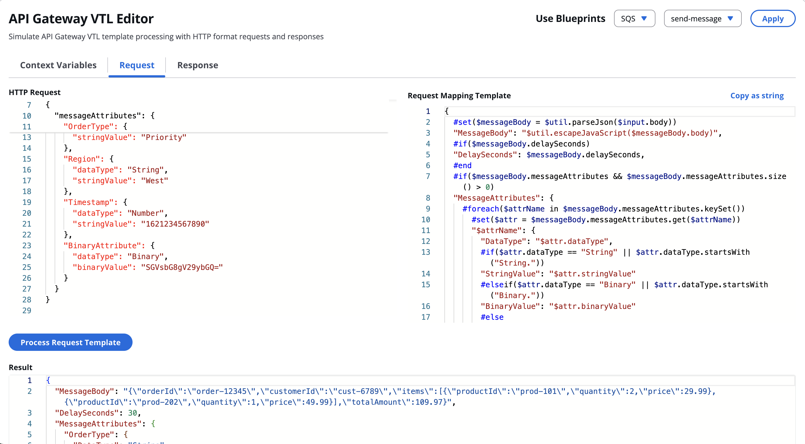
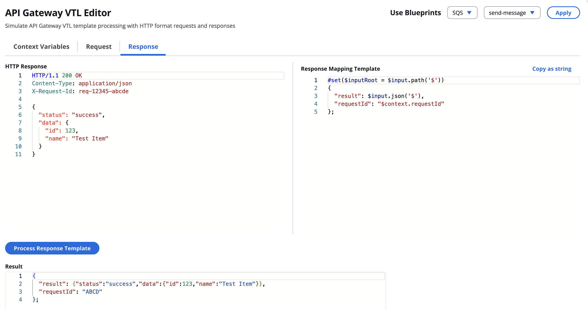
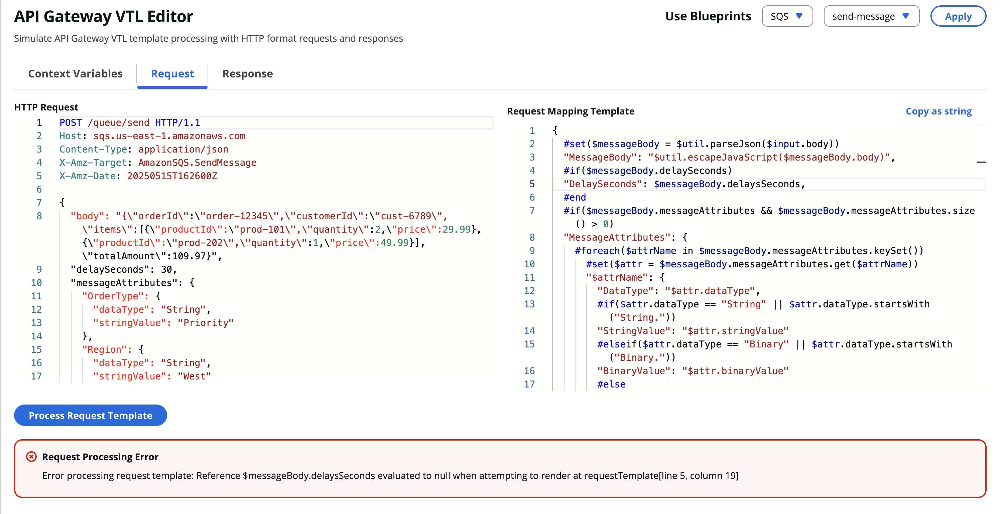
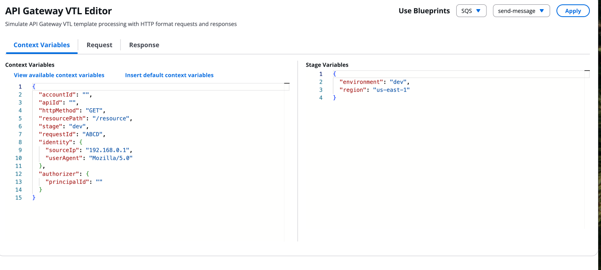
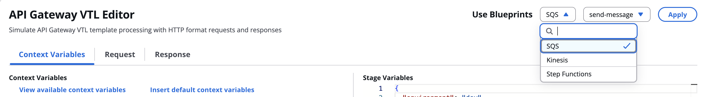

# API Gateway VTL Editor

The API Gateway VTL Editor provides a browser-based environment for testing Apache Velocity Template Language (VTL) transformations used in AWS API Gateway. Instead of deploying templates to AWS and testing them live—which creates slow iteration cycles and complex debugging processes — developers can now locally test test VTL templates with immediate feedback. This tool accelerates API development by enabling rapid template iteration and reducing deployment errors before templates reach production.

This tool allows enables developers to:

- Test API Gateway request and response mapping templates
- Configure context and stage variables
- Validate templates and view errors
- See the processed template output before deployment
- Use AWS service integration templates using pre-configured blueprints
- Copy the template to your favorite IaaC stack 

## Features

- Real-time Apache Velocity template processing
- Error handling and validation
- Serverless Application Backend using SAM CLI and AWS Lambda for VTL processing 
- Pre-configured service integration templates for AWS services
- Cost - $0 - No deployment necessary

## Supported AWS Service Templates

The application includes pre-configured templates for the following AWS service APIs:

- **SQS**: send-message, receive-message, delete-message, purge-queue
- **Kinesis**: put-record
- **Step Functions**: start-execution, start-sync-execution, stop-execution
- **More**: Coming soon

## Screenshots

Request Template parsing


Response Template parsing


Error Indicators


Stage and context variables


AWS Service Integrations via blueprints


## Getting Started

### Prerequisites

- Node.js (v18 or higher)
- npm or yarn
- Java 11 (for Lambda function)
- Maven 3.6.0 or later
- AWS SAM CLI (for local testing)

### Installation

1. Clone this repository
2. Navigate to the vtl-template-browser-testing directory:
3. Install dependencies:

```bash
npm install --legacy-peer-deps
```

4. Start both the backend and frontend with a single command:

```bash
chmod +x start.sh
./start.sh
```

This script will:
- Build the Lambda function with tests
- Start the local API on port 3000
- Start the frontend development server
- Automatically clean up all processes when you press Ctrl+C

5. Open your browser and navigate to the URL shown in the terminal (typically http://localhost:5173)

Alternatively, you can start the components separately:

```bash
# Build and start the backend only
cd vtl-processor
mvn clean package
cd ..
sam local start-api --port 3000

# In a separate terminal, start the frontend only
cd vtl-template-browser-testing
npm run dev
```

## Deployment

This tool does not use any AWS credentials.

This tool is only meant to be tested locally with sam-cli and is not meant to be deployed in cloud environment.

Even though it includes templates for lambda function, that function is only meant to be used within SAM-CLI.

We do not recommend deploying this template as is to your AWS account.

For this reason we dont provide any deployment guidelines for this tool.

## Usage

The application provides a comprehensive API Gateway VTL template editor with the following workflow:

1. **Select a Blueprint (Optional)**
   - Choose from pre-configured service integration templates using the dropdown menus at the top
   - Select a service (SQS, EventBridge, Kinesis, Step Functions, AppConfig)
   - Select an operation (e.g., send-message, receive-message)
   - Click "Apply" to load the template, request, and context variables

2. **Configure Context**
   - Set up context variables that will be available in your VTL templates
   - Configure stage variables if needed
   - Use the "Insert default context variables" button for common API Gateway context

3. **Test Request Templates**
   - Enter an HTTP request in the Request tab
   - Write or modify the Request Mapping Template (VTL)
   - Click "Process Request Template" to execute the template
   - View the processed JSON output and any errors

4. **Test Response Templates**
   - Enter an HTTP response in the Response tab
   - Write or modify the Response Mapping Template (VTL)
   - Click "Process Response Template" to execute the template
   - View the processed JSON output and any errors

5. **Copy Templates**
   - Use the "Copy as string" link to copy templates in a format suitable for infrastructure as code

## Technologies Used

- React 18
- TypeScript
- Vite
- Cloudscape Design Components
- Apache Velocity Engine 2.3 (Java)
- AWS Lambda
- AWS SAM (Serverless Application Model)
- API Gateway

## Contributing
All contributions are welcome. Please create an issue before you submit the contributions.

## Disclaimer

**Important**: The VTL template parsing in this tool is implemented based on the official AWS API Gateway documentation and publicly available information. While we strive for accuracy, this implementation may not perfectly match how API Gateway processes templates internally at a service level, as AWS does not provide complete visibility into their proprietary parsing mechanisms. Results may vary slightly between this tool and actual API Gateway behavior in certain edge cases.

**Important** Sample code, software libraries, command line tools, proofs of concept, templates, or other related technology are provided as AWS Content or Third-Party Content under the AWS Customer Agreement, or the relevant written agreement between you and AWS (whichever applies). You should not use this AWS Content or Third-Party Content in your production accounts, or on production or other critical data. You are responsible for testing, securing, and optimizing the AWS Content or Third-Party Content, such as sample code, as appropriate for production grade use based on your specific quality control practices and standards. Deploying AWS Content or Third-Party Content may incur AWS charges for creating or using AWS chargeable resources, such as running Amazon EC2 instances or using Amazon S3 storage.
