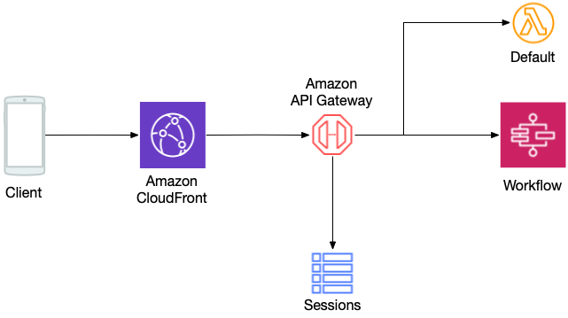
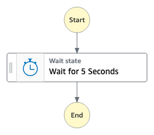
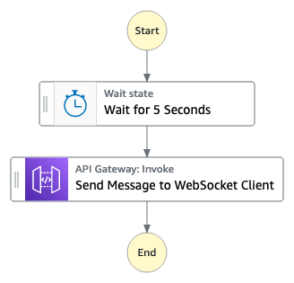

# Amazon API Gateway WebSocket integrations

Modern applications use the WebSocket protocol for bidirectional communications. With Amazon API Gateway [WebSocket APIs](https://docs.aws.amazon.com/apigateway/latest/developerguide/apigateway-websocket-api.html) you can build bidirectional communication applications without having to provision and manage servers. 

Many WebSocket samples use AWS Lambda or HTTP(s) as the integration targets for connect/disconnect routes. This sample implementation uses the AWS service integration type to show how to simplify serverless architectures.

Sometimes developers need to use a URL in their WebSocket based applications. This requirement may be driven by REST API design best practices for resource naming, or by an industry standard requirement such as Open Charge Point Protocal (OCPP) for electric vehicle infrastructure. However, API Gateway WebSocket endpoints do not support URL paths besides stage name.

This solution shows how to implement URL path support for WebSocket APIs in Amazon API Gateway using Amazon CloudFront and CloudFront Functions.

## Solution Overview
This project uses the Amazon API Gateway WebSocket API to handle bidirectional communications. The project shows two patterns for business logic. In the first example, business logic is encapsulated in an AWS Lambda function. A second example shows an alternative implementation using AWS Step Functions. Connection information is tracked in a DynamoDB table. 



This example does not implement authentication or authorization of requests. See [documentation](https://docs.aws.amazon.com/apigateway/latest/developerguide/apigateway-websocket-api-control-access.html) for instructions to implement access control. You may also check the [REST API samples repository](https://github.com/aws-samples/serverless-samples/tree/main/serverless-rest-api) for a Lambda Authorizer sample implementation using the REST API.

### Connection tracking
API Gateway forwards an initial connection request to the \$connect route, along with headers and query string information. This solution uses AWS service integration and data transformation mapping templates to store WebSocket connection IDs in a DynamoDB table. This direct connection to DynamoDB provides an alternate pattern to the more traditional approach of using AWS Lambda as a proxy. Along with the connection ID, the DynamoDB table stores headers, the query string, and the request path. The table specifies a 24 hour Time to Live (TTL) for the stored object to clean up failed connections as needed. 

The $disconnect route also uses the AWS service integration pattern and data transformation mapping templates to delete connection data from DynamoDB when the client or the server disconnects from the API.

### Business logic implementation
To implement application business logic, this solution uses a Lambda function as an integration target of the \$default route. In the example, the [function](./src/default.py) responds with the event data, performing no further actions.

The solution also shows how to use a Step Functions workflow as an alternative example. API Gateway starts an Express workflow execution synchronously or Standard workflow asynchronously, depending on the route. Both workflows are simple examples used only to show the AWS service integration capability. 

The synchronous execution waits for 5 seconds and returns execution details as a response:



The asynchronous execution returns an execution ID immediately, waits for 5 seconds, and then uses the[@connections command](https://docs.aws.amazon.com/apigateway/latest/developerguide/apigateway-how-to-call-websocket-api-connections.html) to send a message to the client:



You can use this AWS service integration approach and the sample code for the Step Functions integration for API Gateway REST endpoints as well.

### URL path support
To support the URL path in an Amazon API Gateway WebSocket API, this solution uses an Amazon CloudFront distribution and CloudFront Functions. It executes the function before the request reaches the API Gateway. It copies the original path to a new header called "ws-uri" and then removes it to avoid an error raised by the WebSocket API if the path is anything other than the stage name.

*Note: Client applications should use the CloudFront distribution URL provided in the stack outputs to connect to the WebSocket API to make use of the path.*

## Project structure
This project contains source code and supporting files for a serverless application that you can deploy with the AWS Serverless Application Model (AWS SAM) command-line interface (CLI). It includes the following files and folders:

- `src\default.py` - Code for the application's Lambda functions.
- `template.yaml` - A template that defines the application's AWS resources.

## Deployment
Set this project up like a standard Python project.  
You may need to manually create a virtualenv:

```
$ python3 -m venv .venv
```

After the init process completes and you created the virtualenv, use the following step to activate it.

```
$ source .venv/bin/activate
```

To build and deploy your application for the first time, run the following in your shell:

```bash
sam build --use-container
sam deploy --guided
```

*Note: The deployment may take several minutes to create the CloudFront distribution. If you do not need to use the URL path in your WebSocket endpoint, comment out the "Edge" section in the template and in corresponding stack outputs to speed up deployment.*
## Verification
To verify that the application works, connect to the API Gateway WebSocket endpoint using [wscat](https://docs.aws.amazon.com/apigateway/latest/developerguide/apigateway-how-to-call-websocket-api-wscat.html). Use the CloudFront distribution URL provided in the stack outputs, for example:

```bash
wscat -c "<CloudFront distribution URL>/this/is/my/custom/path/?my_query=foo"
```
**Session Tracking**
After you have established the connection, check the DynamoDB table specified in the stack outputs to see if a new object was created. It should include the path, headers and query string information along with the TTL value.

**Default Route**
To execute the Lambda function, send a payload (any string) to the API by typing it in to the terminal. The Lambda function will respond with an event string that will include the payload provided, Lambda function execution information, etc. 

**AWS Step Functions Express Synchronous Execution**
To execute a synchronous Express Step Functions workflow, send a payload in JSON format and that includes an "action" field equal to "sync_sfn", and a "data field" that contains the input data for the Step Functions execution, for example:

{"action": "sync_sfn", "data": "123456"}

Step Functions will start the workflow execution synchronously and will respond with execution details in a few seconds.

*Note: Check the [documentation](https://docs.aws.amazon.com/step-functions/latest/apireference/API_StartSyncExecution.html#API_StartSyncExecution_RequestParameters) for correct input parameter format.* 


**AWS Step Functions Standard Asynchronous Execution**
To execute an asynchronous Standard Step Functions workflow, send a payload in JSON format and that includes an "action" field equal to "async_sfn", and a "data field" that contains input data for the Step Functions execution, for example:

{"action": "async_sfn", "data": "123456"}

Step Functions will start the workflow execution asynchronously and respond with the execution ARN immediately. After a few seconds, you will also receive a message from the workflow execution. 

*Note: Check the [documentation](https://docs.aws.amazon.com/step-functions/latest/apireference/API_StartExecution.html#API_StartExecution_RequestParameters) for correct input parameter format.* 


**Session Disconnect**
Disconnect from the API, check the DynamoDB table again, and verify that your session record was deleted.

## Cleanup
To delete the sample application that you created, use the AWS CLI:

```bash
sam delete
```

## Further Steps
This example project contains a limited implementation in order to illustrate sample patterns. To develop this project further, you may consider:
 - Implementing additional business logic in the default route integration target [Lambda code](./src/default.py).
 - Adding customer ID to the DynamoDB partition key or creating an index to query the connection ID by the customer ID if needed.
 - Creating authentication and authorization controls.