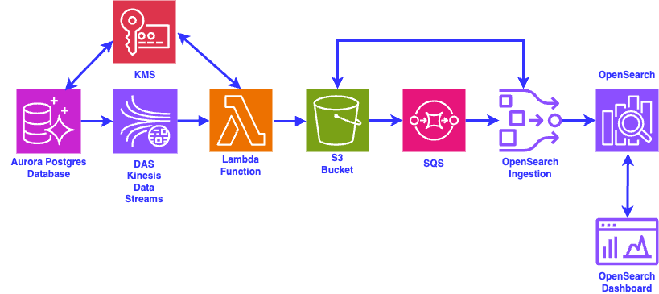
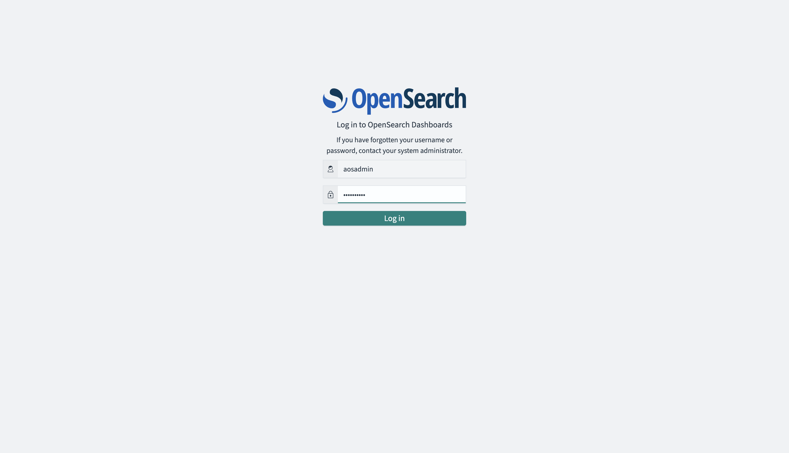
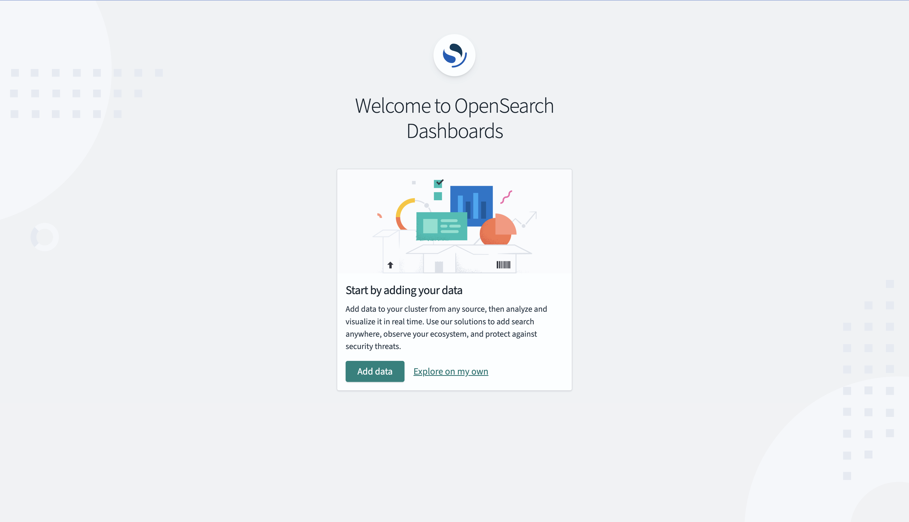
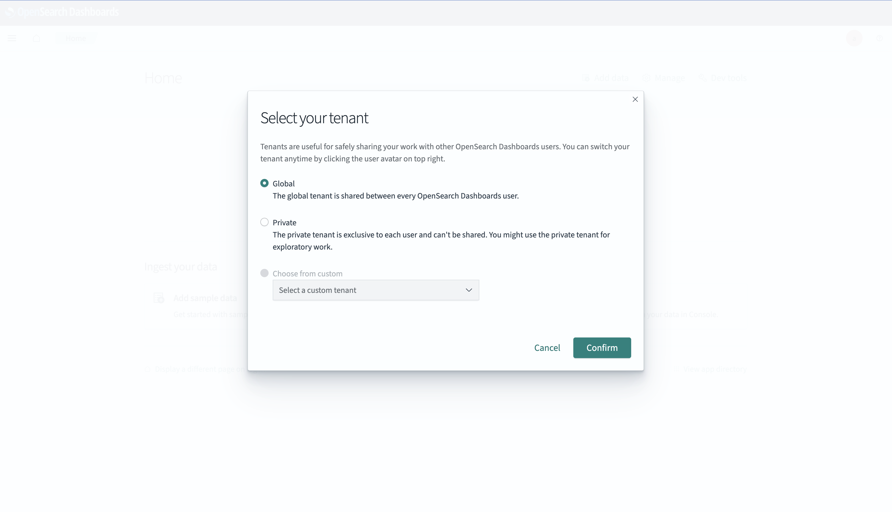
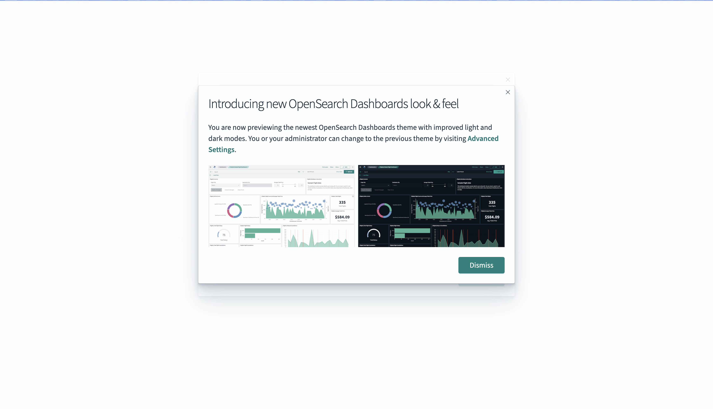
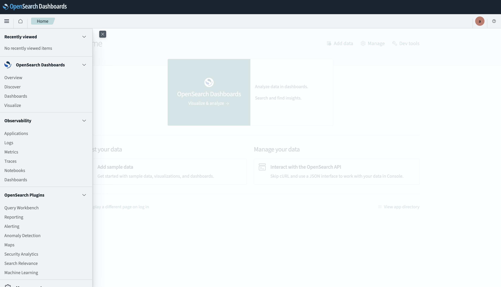
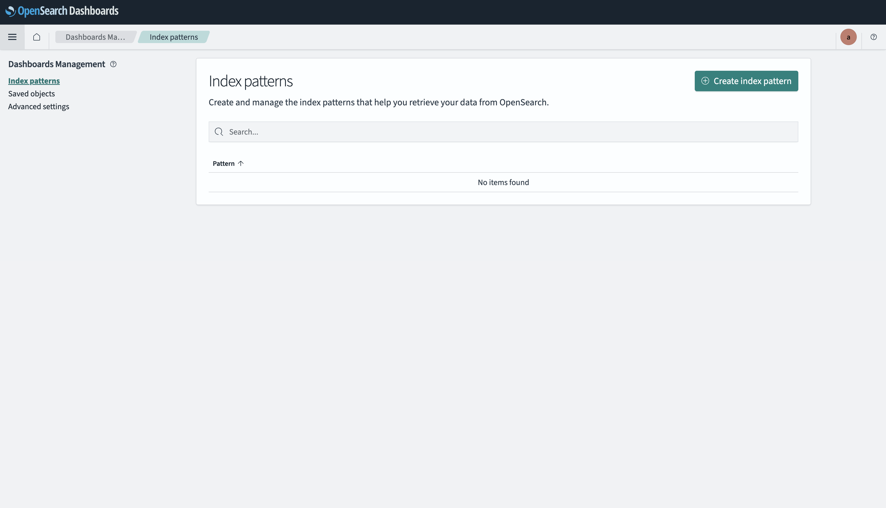
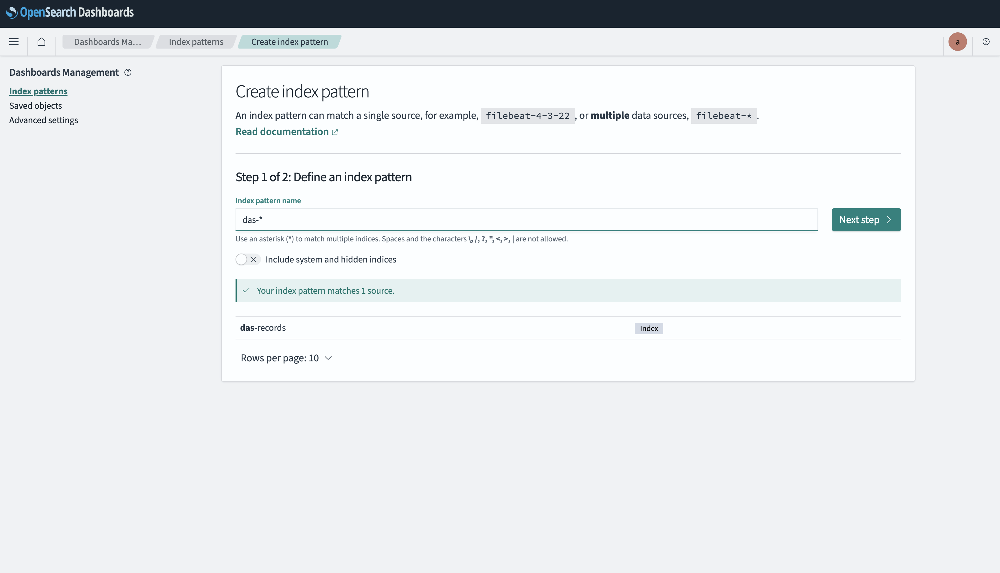
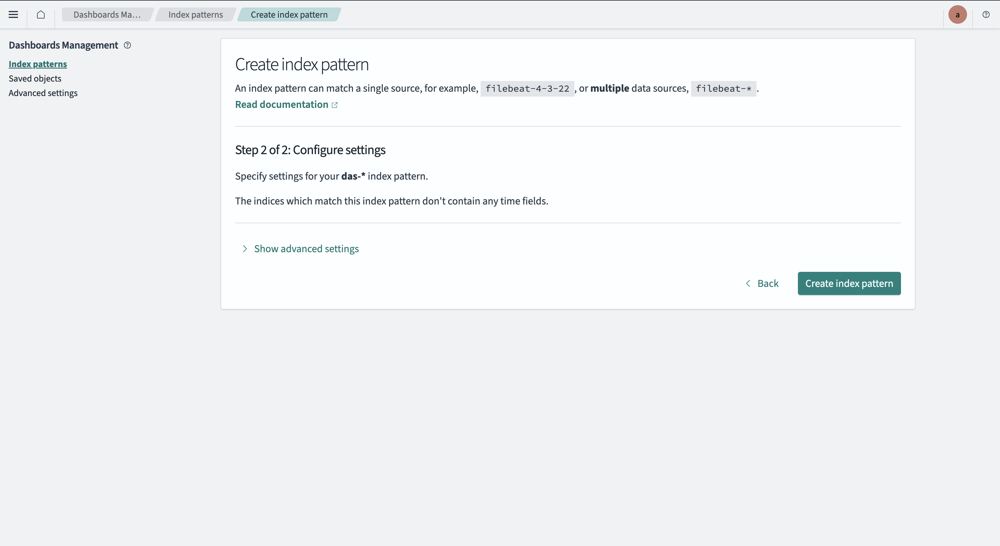
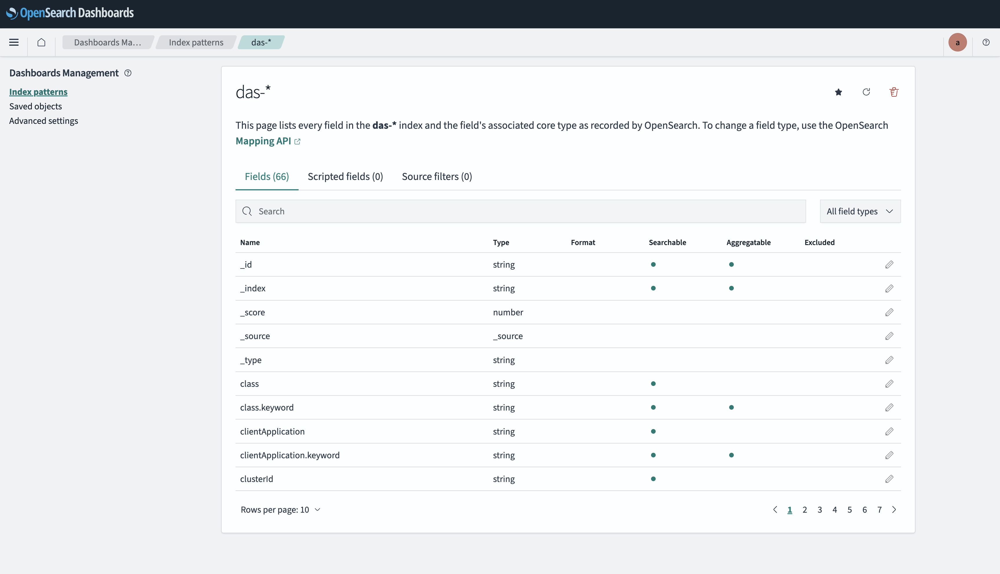

# das-lambda-java-sam
# Java AWS Lambda Database Activity Streams Processing, using AWS SAM

> **This is sample code, for non-production usage.** You should work with
> your security and legal teams to meet your organizational security,
> regulatory and compliance requirements before deployment.

This pattern is an example of a Lambda function that consumes messages from an Amazon Kinesis Data Stream created when Database Activity Streams is enabled on an Amazon Aurora Postgres database. This pattern also demonstrates how the records are decrypted, filtered for heartbeat events and then how an OpenSearch Ingestion Pipeline is set-up to send the Database Activity Stream events to an Amazon OpenSearch domain.

Below is an architecture diagram that depicts the end-to-end flow.



As can be seen in the architecture diagram above, whenever there is any activity on the Aurora Postgres database, the Database Activity Streams (DAS) sends out messages on the Kinesis Data Streams, that is automatically created when DAS is enabled on the database. The messages that are put into the Kinesis Data Stream are encrypted using a KMS key. Apart from user originated database activity, Aurora also sends out heartbeat events and database activity by the RDS administrator. In the Lambda function that has the Kinesis Data Stream as its event source, the messages are decrypted using the same KMS key with which the messages were encrypted by the DAS. All heartbeat events and RDS Admin events are filtered out. The Lambda function formats user originated events into a structured JSON string and writes the JSON string to an S3 bucket as an object. As soon as a new object is written to the S3 bucket, an S3 Event Notification is triggered and puts a message on an SQS queue. An OpenSearch Ingestion pipeline has been set-up that reads messages from the SQS queue, reads the object from the S3 bucket and then writes out the contents of the S3 object to an Amazon OpenSearch index.

This project contains source code and supporting files for a serverless application that you can deploy with the SAM CLI. It includes the following files and folders.

- das_consumer_sam_project/database_activity_streams_event_consumer_function/src/main/java - Code for the application's Lambda function.
- das_consumer_sam_project/database_activity_streams_event_consumer_function/pom.xml - Maven file for building the Lambda function.
- das_consumer_sam_project/template.yaml - SAM template for deploying the Lambda function.
- setup-das-cfn.yaml - A Cloudformation template file that can be used to deploy all the resources needed as part of this project. The CloudFormation template deploys an EC2 instance in a private subnet that builds and deploys the AWS Lambda function and runs configuration scripts via UserData. OpenSearch Dashboards are accessed through a CloudFront distribution backed by an Application Load Balancer.
- BootStrapFromCloudShell.sh - A shell script that needs to be run as an admin user of the AWS account to create a new IAM user that will be used to run the CloudFormation template to create all the resources for the project.
- IngestionPipelineConfig.yaml - A template for the Amazon OpenSearch Ingestion Pipeline that will be executed in the CloudFormation template to create the Amazon OpenSearch Ingestion Pipeline that will send the Database Activity Streams records to an Amazon OpenSearch domain.
- UpdateOSIRole.sh - A shell script that gets called from within the CloudFormation template to add an IAM role as a backend role in the Amazon OpenSearch domain. This will allow the IAM role to index the incoming records in the Amazon OpenSearch domain.
- RestartOSIPipeline.sh - A utility shell script that has been provided in case the Amazon OpenSearch Ingestion Pipeline needs to be restarted.
- cleanup-script.sh - A comprehensive cleanup script that removes all resources created by this project in the correct order.

Important: this application uses various AWS services and there are costs associated with these services after the Free Tier usage - please see the [AWS Pricing page](https://aws.amazon.com/pricing/) for details. You are responsible for any AWS costs incurred. No warranty is implied in this example.

## Security Features

This solution implements AWS security best practices including:

- KMS Customer Managed Keys for encryption of S3 buckets, Secrets Manager secrets, SQS queues, and SNS topics
- Lambda functions configured with Dead Letter Queues, reserved concurrent execution limits, and VPC placement
- RDS Aurora with enhanced monitoring, Multi-AZ deployment, deletion protection, and CloudWatch log exports
- OpenSearch domain with fine-grained access control (FGAC), audit logging, zone awareness, and VPC deployment
- S3 buckets with versioning, Object Lock, access logging, and public access blocked
- Security groups with least-privilege ingress rules and descriptions
- IAM roles with scoped policies (no wildcard resources)
- EC2 instance with IMDSv2 required, detailed monitoring, and no public IP
- CloudFront distribution for secure internet access to OpenSearch Dashboards (no direct EC2 exposure)
- VPC endpoints for S3, Secrets Manager, KMS, and SQS

## Production hardening

This is a sample focused on demonstrating the DAS → Lambda → OpenSearch flow.
The items below were intentionally deferred to keep the sample affordable and
self-contained. Before any production use, work with your security team to
evaluate which apply to your deployment.

| Deferred item | Why it's off in the sample | Suppression rule(s) |
| --- | --- | --- |
| AWS WAF in front of CloudFront / ALB | ~$5/month base + per-request cost | CKV_AWS_68, AwsSolutions-CFR2 |
| VPC Flow Logs | ~$0.50/GB ingested | AwsSolutions-VPC7 |
| KMS encryption on CloudWatch Log Groups | ~$1/key/month + API call costs; logs use AWS-managed encryption by default | CKV_AWS_158 |
| Custom domain + ACM certificate with TLSv1.2 minimum on CloudFront | Sample uses the default CloudFront cert (supports TLSv1) | CKV_AWS_174, AwsSolutions-CFR4 |
| Secrets Manager rotation for OpenSearch and Aurora master passwords | Rotation Lambdas would need to coordinate updates across OpenSearch FGAC, Aurora, and the reverse proxy | AwsSolutions-SMG4 |
| IAM database authentication for Aurora | **Not compatible with Database Activity Streams** — DAS requires native PostgreSQL authentication | CKV_AWS_162, AwsSolutions-RDS6 |
| S3 access logging on data buckets | Adds storage cost; the access-logging bucket itself is excluded by design | CKV_AWS_18 |
| ALB and CloudFront access logging | Adds storage cost; ALB is internal to VPC and only reached via CloudFront | CKV_AWS_91, CKV_AWS_86, AwsSolutions-ELB2, AwsSolutions-CFR3 |
| Explicit EBS encryption on the EC2 reverse proxy | Instance is stateless (nginx); uses default EBS encryption | AwsSolutions-EC26 |
| EC2 termination protection on the reverse proxy | Instance is ephemeral, recreated on stack updates | AwsSolutions-EC29 |
| CloudFront geo restrictions | Not applicable for a public sample | AwsSolutions-CFR1 |

Suppression rationale for each item lives in [.ash.yaml](.ash.yaml).

## Deployment troubleshooting

### Local development overrides (pre-PR / fork testing)

The default deployment clones source from
`https://github.com/aws-samples/serverless-samples/` (the upstream
repository) on the EC2 instance during UserData. For local development
against unpublished code you have two opt-in overrides:

1. **Public Git fork** — set `DAS_GITHUB_LOCATION` to a publicly reachable
   Git URL before running `RunCloudformationStack.sh`:
   ```bash
   export DAS_GITHUB_LOCATION=https://github.com/<your-fork>/serverless-samples/
   ```
   The EC2 will `git clone` from this URL instead of the upstream default.

2. **Local code via S3** (no public Git repo required) — set
   `DAS_LAMBDA_CODE_LOCAL_DIR` to a directory containing a
   `das-lambda-java-sam/` subdirectory. The script tars the local tree,
   uploads it to the deployment S3 bucket, and the EC2 extracts the
   archive instead of cloning:
   ```bash
   export DAS_LAMBDA_CODE_LOCAL_DIR=/path/to/serverless-samples
   sh ./RunCloudformationStack.sh $AWS_USER $STACK_NAME
   ```
   You can also set `DAS_LAMBDA_CODE_S3_URI` directly to point at an
   already-uploaded `s3://bucket/key.tgz`.

Both overrides are dev-only. Production / PR-time deployments leave both
unset and inherit the upstream `aws-samples` default.

### `KMSAccessDeniedException` on first Lambda invocation

The Lambda execution role has IAM permissions for `kms:Decrypt`,
`kms:DescribeKey`, and `kms:GenerateDataKey` constrained by `kms:ViaService`
for Kinesis, S3, and SQS in the same region. KMS access is also gated by the
**resource-based key policy** on each customer-managed KMS key.

If the first invocation after deploy returns `KMSAccessDeniedException`,
verify the parent stack's KMS key policies allow the Lambda execution role.
The simplest fix is the account-root pattern
(`Principal: arn:aws:iam::${AWS::AccountId}:root`), which delegates access
control to IAM. Affected keys for this sample: `LambdaDLQKMSKey` (DLQ
encryption) and `S3KMSKey` (S3 bucket encryption). Both already use the
account-root pattern in `setup-das-cfn.yaml`, so the Lambda role's IAM
permissions are sufficient — no key-policy edit is needed for default
deployments. If you customize the key policies to use specific principals
only, you will need to add the Lambda execution role to each affected key's
policy.

## Requirements

* [Create an AWS account](https://portal.aws.amazon.com/gp/aws/developer/registration/index.html) if you do not already have one and log in as root or a user that has Administrative privileges. We will create a new IAM user for the purpose of setting up the Database Activity Streams end-to-end flow. The IAM user that you will create must have sufficient permissions to make necessary AWS service calls and manage AWS resources.
* AWS CLI installed and configured on your local machine
* `jq` command-line JSON processor installed on your local machine

## Deployment


### Step 1 - Create service linked roles for Amazon OpenSearch and OpenSearch Ingestion from CloudShell in your AWS Account

You need service linked roles for the Amazon OpenSearch service and the OpenSearch Ingestion service to be created in the AWS account.

* [Log in to the AWS Account as Admin User] - You need to log in to the AWS Account as either root or as an user with Admin privileges

* [Open AWS CloudShell] - Once you are inside AWS Cloudshell in the AWS console


In order to create the service linked role for the Amazon OpenSearch service, run the following command from the AWS CloudShell

```
aws iam create-service-linked-role --aws-service-name opensearchservice.amazonaws.com
aws iam create-service-linked-role --aws-service-name osis.amazonaws.com

```

For the above commands, you will either get back a JSON response indicating that the service linked role has been successfully created, or you will get an exception like below:

```
An error occurred (InvalidInput) when calling the CreateServiceLinkedRole operation: Service role name AWSServiceRoleForAmazonOpenSearchService has been taken in this account, please try a different suffix.

```
If you get the above error, it is harmless. Please ignore it and move ahead.


### Step 2 - Checkout files from Github from CloudShell in your AWS Account

* [From AWS CloudShell checkout files from Github] - Once you are inside AWS Cloudshell in the AWS console, type the following commands. In case you are using a fork of the aws-samples github repository, then please replace the github URL with your own fork.

```
git clone -n --depth=1 --filter=tree:0 https://github.com/aws-samples/serverless-samples.git 
cd serverless-samples
git sparse-checkout set --no-cone /das-lambda-java-sam
git checkout
cd das-lambda-java-sam

```

### Step 3 - Run the BootStrapFromCloudShell.sh or the BootStrapFromCloudShellNoConsoleAccess.sh script from CloudShell in your AWS Account

**Note that in the instructions in this step, you will need to run the BootStrapFromCloudShell.sh only if you allow AWS console access for IAM users.**

**If not, then you will need to run the BootStrapFromCloudShellNoConsoleAccess.sh, so please look at the instructions in the relevant section**


### Option 1 - If IAM users are allowed AWS console access

* [Execute the BootStrapFromCloudShell.sh script to create an IAM user and store keys in Secrets Manager] - Once the BootStrapFromCloudShell.sh script has been checked out from Github, execute the following commands in your CloudShell. Substitute the \<username\> with value for the IAM user you want to create. You will be prompted for a password, which needs to be at least 8 characters long, it needs to include minimum of three of the following mix of character types: uppercase, lowercase, numbers, and non-alphanumeric character and it should not be identical to your AWS account name or email address. 

```
sh ./BootStrapFromCloudShell.sh <username>

```

Once the above command is done executing, log out of the AWS account and log in to the AWS console using the new \<username\> and password you just created. You will be asked to change the password upon first login. Once you are logged in as the IAM user, move to the Step 5 - "Run the CloudFormation template to create the AWS resources"

### Option 2 - If IAM users are not allowed AWS console access

**Note: If you do not have AWS console access and would rather run CloudFormation from the command line, do not run the BootStrapFromCloudShell.sh script. Instead run the BootStrapFromCloudShellNoConsoleAccess.sh script as shown below**

**Make sure to run the BootStrapFromCloudShellNoConsoleAccess.sh command from the CloudShell and not from your local machine**

```
sh ./BootStrapFromCloudShellNoConsoleAccess.sh <username>

```

The above script will generate three outputs, the access key, the secret access key and the default AWS region. Note down the above values. These will be needed in Step 4.


### Step 4 - Setup AWS credentials on local machine


### Option 1 - If IAM users are allowed AWS console access

* [Checkout from Github on your local machine] - Type the following commands from any folder on your local machine to get the CloudFormation template from Github

```
git clone -n --depth=1 --filter=tree:0 https://github.com/aws-samples/serverless-samples.git
cd serverless-samples
git sparse-checkout set --no-cone /das-lambda-java-sam
git checkout
cd das-lambda-java-sam

```

Move to Step 5 - "Run the CloudFormation template to create the AWS resources"
    

### Option 2 - If IAM users are not allowed AWS console access

* [Checkout from Github on your local machine] - Type the following commands from any folder on your local machine to get the CloudFormation template from Github

```
git clone -n --depth=1 --filter=tree:0 https://github.com/aws-samples/serverless-samples.git
cd serverless-samples
git sparse-checkout set --no-cone /das-lambda-java-sam
git checkout
cd das-lambda-java-sam

```

* [Set environment variables on your local machine] - To facilitate commands below, we'll create a couple of environment variables.
Substitute the values between the brackets "" below as you like. For \<username\>, use the same value that you had specified in Step 3. For \<region\>, use the same value as that was output in Step 3 (Option 2)

```
export AWS_USER=<username>
export AWS_REGION=<region>
export STACK_NAME=das-lambda-serverless-samples
```

**On your local machine**, run the following:

```
sh ./CreateAWSCLIProfileOnLocalMachine.sh $AWS_USER <access key> <secret access key> $AWS_REGION

```

where the \<access key\> \<secret access key\> need to be replaced with the values of the three outputs from Step 3 (Option 2) above.

**Note: In case you did not note the values of the access key and the secret access key from Step 3 (Option 2), you can log into CloudShell in the same region that you had used earlier and run the following commands. Make sure to replace \<username\> with the value you had user earlier in Step 3**

```
cd serverless-samples/das-lambda-java-sam
sh ./GetAWSCLIProfileDetailsFromCloudshell.sh <username>

```


Executing the CreateAWSCLIProfileOnLocalMachine.sh script will create an AWS profile for $AWS_USER on your local machine.

Once you have configured the AWS profile on your local machine, run the following command to verify the profile has been created correctly

```
aws sts get-caller-identity --no-cli-pager --profile $AWS_USER

```


### Step 5 - Run the CloudFormation template to create the AWS resources

We provide a deployment script (`RunCloudformationStack.sh`) that handles
several deployment-time prerequisites for you (looking up the
region-specific CloudFront managed prefix list ID, packaging the
template into S3, validating credentials, surfacing failed-event details
on rollback). **We strongly recommend using the script regardless of
whether you have AWS console access** — it is the same command for both
options.

### Option 1 - Use the deployment script (recommended for both console and CLI users)

From your local machine:

```
export AWS_USER=<your-iam-user>
export STACK_NAME=<your-stack-name>
sh ./RunCloudformationStack.sh $AWS_USER $STACK_NAME
```

The script:
- Verifies your AWS credentials and region
- Creates a CFT packaging S3 bucket (or reuses one if `CFT_BUCKET` env var is set)
- Looks up the CloudFront managed prefix list ID for your region
- Deploys the parent stack and waits for completion
- On failure, prints recent failed events and exits non-zero so you know to investigate

### Option 2 - Deploy directly from the CloudFormation console (advanced)

If you must deploy from the console UI, you need to manually look up two
parameters that the script normally fills in for you:

1. **CloudFrontPrefixListId** — Region-specific. Look it up first:
   ```
   aws ec2 describe-managed-prefix-lists \
     --filters "Name=prefix-list-name,Values=com.amazonaws.global.cloudfront.origin-facing" \
     --query "PrefixLists[0].PrefixListId" --output text \
     --profile $AWS_USER --region $AWS_REGION
   ```
   Copy the output (e.g. `pl-82a045eb`) into the parameter on the
   CloudFormation console.

2. Accept defaults for all other parameters (or modify them if needed).

Then upload `setup-das-cfn.yaml` and create the stack as you normally would.

### Wait for stack creation

Wait for the CloudFormation stack to reach `CREATE_COMPLETE`. This takes
30-45 minutes for a fresh deploy. Even after the stack shows
`CREATE_COMPLETE`, wait at least another 15 minutes, as the EC2 UserData
script continues running (it enables Database Activity Streams on the
Aurora cluster, creates the OpenSearch Ingestion pipeline, and runs
`sam build` + `sam deploy` for the consumer Lambda).

This CloudFormation template creates multiple AWS resources: an Amazon
Aurora Postgres database, an Amazon OpenSearch domain, the AWS Lambda
function that processes DAS events, an S3 bucket for DAS event records,
an OpenSearch Ingestion pipeline, an SQS queue, and supporting
resources. It also creates an EC2 instance in a private subnet with the
PostgreSQL client installed for running SQL commands against Aurora.
OpenSearch Dashboards are accessible via a CloudFront distribution (see
the `AOSDashboardsPublicIP` stack output).

**Note on OpenSearch logging:** Audit logging and application logging are enabled automatically via a post-deployment custom resource (EnableOpenSearchLogging). This is done after the domain is active because enabling FGAC + audit logging during initial domain creation can exceed CloudFormation's provisioning timeout. You do not need to take any action — logging is enabled automatically as part of the stack creation.


### Step 6 - Connect to the EC2 machine

The EC2 instance is deployed in a private subnet with no public IP address. You can connect to it using EC2 Instance Connect Endpoint, which is created automatically by the CloudFormation template.

### Option 1 - If IAM users are allowed AWS console access

Once the Cloudformation stack is created, you can go to the EC2 console and connect to the instance using the "EC2 Instance Connect Endpoint" option under the "EC2 Instance Connect" tab.

**Note: You may need to wait for some time after the Cloudformation stack is created, as some UserData scripts continue running after the Cloudformation stack shows Created.**

Now jump to the section "Step 7 - Pre-requisites to Deploy the sample Lambda function"

### Option 2 - If IAM users are not allowed AWS console access

**You can connect to the EC2 instance using the EC2 Instance Connect Endpoint via the AWS CLI:**

First, get the EC2 instance ID:

```
EC2_INSTANCE_ID=$(aws ec2 describe-instances --profile $AWS_USER --region $AWS_REGION --filters "Name=tag:aws:cloudformation:stack-name,Values=$STACK_NAME" "Name=tag:Name,Values=ProxyInstance" "Name=instance-state-name,Values=running" --query "Reservations[].Instances[].InstanceId" --output text --no-cli-pager)

echo "EC2_INSTANCE_ID=$EC2_INSTANCE_ID"

```

Then connect using EC2 Instance Connect Endpoint:

```
aws ec2-instance-connect ssh --instance-id $EC2_INSTANCE_ID --os-user ec2-user --connection-type eice --profile $AWS_USER --region $AWS_REGION

```

**Note:** This command requires AWS CLI version 2. If you get an error, verify your AWS CLI version with `aws --version`. The `--connection-type eice` parameter tells the CLI to use the EC2 Instance Connect Endpoint (no key pair or public IP required).

### Step 7 - Pre-requisites to Deploy the sample Lambda function

### If you want to understand and deploy the Lambda function yourself

**If you do not want to build and deploy the lambda function yourself, you can jump to the step - "Step 8 - Generate Database Activity"**

If you are interested to understand more details of how the lambda function was built and deployed, or if you want to do it yourself, read the below sections before the "Generate Database Activity" step

* [Install Pre-requisites]

**Note - As part of the CloudFormation template, we have already built and deployed the Lambda Function that will process the incoming Database Activity Streams records from the Kinesis Data Stream.**

**However, in case you want to understand how that was done or want to do it yourself, you can uncomment the commands for building and deploying the Lambda function, from the UserData section of the CloudFormation template before executing it and then run the same commands yourself from the EC2 instance, or even from your own local machine after installing all the pre-requisite software.**

**The following are the software that need to be installed if you are planning to try it out on your own machine**

* Java - On the EC2 instance, we have installed the version of Java that you selected. We have installed Amazon Corretto JDK of the version that you had selected at the time of specifying the input parameters in the Cloudformation template. The Lambda function is built and deployed with Java 21 by default; Java 17 is also offered as a supported choice. Java 11 has been removed because it has reached end-of-support in AWS Lambda.
* Maven - On the EC2 machine, we have installed Maven (https://maven.apache.org/install.html)
* AWS SAM CLI - We have installed the AWS SAM CLI (https://docs.aws.amazon.com/serverless-application-model/latest/developerguide/serverless-sam-cli-install.html). The AWS SAM CLI is a serverless tool for building and testing Lambda applications.

The EC2 instance that was created by running the CloudFormation template has all the software that is needed to deploy the Lambda function.

We have also cloned the Github repository for serverless-samples on the EC2 machine already by running the below command

```
git clone https://github.com/aws-samples/serverless-samples.git

```

* [Build and Deployment of Lambda Function] - The Lambda Function gets built and deployed as part of the CloudFormation template automatically. However, if you need to know how that was done, we make use of AWS SAM.

You can take a look at the below commands that are included in the UserData section of the CloudFormation template to understand how the Lambda Function was deployed. The code for the Lambda Function is also included in Github and checked out into the EC2 instance:

```
# Building and Deploying Lambda Function
cd /home/ec2-user
cd serverless-samples
cd ./das-lambda-java-sam/das_consumer_sam_project
source /home/ec2-user/.bash_profile
sam build
sleep 60
sam deploy --capabilities CAPABILITY_IAM --stack-name das-lambda-stack --no-confirm-changeset --no-disable-rollback --resolve-s3 --region $AWS_REGION

```

Once the Lambda Function gets deployed, you can go to the AWS Lambda console and you should see the function deployed and running. The function name will be auto-generated by CloudFormation (e.g., `das-lambda-stack-LambdaDatabaseActivityStreamsCons-XXXX`).

In case you do not have AWS console access for IAM users, you can list all the Lambda functions in the AWS account and AWS region by running the below command

```
aws lambda list-functions --profile $AWS_USER --region $AWS_REGION --no-cli-pager | jq -r '.Functions[].FunctionName'

```

You should see a function with `LambdaDatabaseActivityStreamsCons` in its name listed as one of the functions in the account

You can get more details about this function by using the following command:

```
aws lambda list-functions --profile $AWS_USER --region $AWS_REGION --no-cli-pager | jq -r '.Functions[] | select (.FunctionName | contains("LambdaDatabaseActivityStreamsCons"))'

```

### Step 8 - Generate Database Activity

In order to generate activity on the Aurora Postgres database, you can make use of the Postgres Client that is already installed for your convenience on the EC2 instance that was deployed as part of the CloudFormation stack.

We have even created a script file that will help you connect to the Aurora Postgres database.

We have also provided a SQL file that has some sample SQL commands that show you how to create a new table, insert some records and query the records in the database.

These files can be found under the folder /home/ec2-user

To connect to the Aurora Postgres database use

```
sh /home/ec2-user/db_connect.sh

```

Sample SQL commands can be found in the file /home/ec2-user/db_commands.sql

They are also listed here for convenience:

```
create table persons(firstname varchar(25) not null, lastname varchar(25) not null, middle_initial varchar(1) null, street_address varchar(100) not null, unit_number varchar(10) null, city varchar(25) not null, state varchar(2) not null, zip varchar(10) not null);

insert into persons values ('John', 'Cummins', 'M', '1320 Hollywood Blvd.', 'Apt - 213', 'London', 'KY', '40740');

insert into persons values ('Bryan', 'Starc', 'M', '89075 Parkwood Dr.', 'Unit-M', 'Paris', 'TX', '75461');

select * from persons;

```


### Step 9 - Test that the Database Activity Streams are flowing

When the Lambda function gets a Database Activity Streams event, it parses the event, filters out heartbeat events and write out the unfiltered events to an S3 bucket. S3 Object Notifications get triggered when a new object is created and generates a new message in an SQS queue. An OpenSearch Ingestion (OSI) Pipeline gets triggered whenever there are new messages in the SQS queue. The OSI pipeline then reads the object from the S3 bucket and writes out the records to an OpenSearch domain in an index called "das-records". In order to validate that the Database Activity Streams records are being written to OpenSearch, you need to log in to the OpenSearch domain.

If you have access to the AWS console for IAM users, you can take a look at the outputs tab of the CloudFormation stack. You will need the following output parameters - AOSDashboardsPublicIP (CloudFront URL), AOSDomainUserName and AOSDomainPassword.

If you don't have access to the AWS console for IAM users, you can find out the values of the above output parameters using AWS CLI commands:

**Note: Run the below commands from your local machine and not from the EC2 machine**

```

AOS_DASHBOARD_URL=$(aws cloudformation describe-stacks --stack-name $STACK_NAME --profile $AWS_USER --query "Stacks[*].Outputs[?OutputKey=='AOSDashboardsPublicIP'].OutputValue" --output text)

echo "AOS_DASHBOARD_URL=$AOS_DASHBOARD_URL"

AOS_DASHBOARD_USERNAME=$(aws cloudformation describe-stacks --stack-name $STACK_NAME --profile $AWS_USER --query "Stacks[*].Outputs[?OutputKey=='AOSDomainUserName'].OutputValue" --output text)

echo "AOS_DASHBOARD_USERNAME=$AOS_DASHBOARD_USERNAME"

AOS_DASHBOARD_PASSWORD=$(aws cloudformation describe-stacks --stack-name $STACK_NAME --profile $AWS_USER --query "Stacks[*].Outputs[?OutputKey=='AOSDomainPassword'].OutputValue" --output text)

echo "AOS_DASHBOARD_PASSWORD=$AOS_DASHBOARD_PASSWORD"

```

Open the AOS_DASHBOARD_URL in your browser to access the OpenSearch Dashboards. The URL uses CloudFront with a valid AWS certificate, so you will not see any SSL warnings.



Click on "Explore On My Own" once you are logged into the OpenSearch Dashboard, as shown below



Leave the tenant as "Global" and click on the Confirm button, as shown below



Click on the "Dismiss" button in the next screen, as shown below



Next open the menu on the left and click on "Discover" under "OpenSearch Dashboards", as shown below



Click on the "Create Index Pattern" button, as shown below



Add "das-*" in the "Index Pattern Name" field, as shown below



Once again click on the "Create Index Pattern" button, as shown below



You should now see the fields in the index as shown below



Once again click on "Discover" on the left menu, as shown below


You should now be able to see the Database Activity Streams records in OpenSearch

## Cleanup

To clean up all resources created by this project, we provide a comprehensive cleanup script that handles all the necessary steps in the correct order.

**Important:** The cleanup script must be run from your local machine (not from the EC2 instance) and requires the same environment variables used during deployment.

### Prerequisites

Ensure the following environment variables are set (these should already be set if you followed the deployment steps):

```
export AWS_USER=<username>
export AWS_REGION=<region>
export STACK_NAME=<stack-name>
```

### Run the Cleanup Script

From your local machine, navigate to the das-lambda-java-sam directory and run:

```
sh ./cleanup-script.sh
```

The cleanup script automatically performs the following operations in order:

1. Validate AWS credentials and warn if `STACK_NAME` doesn't match any active stack
2. Delete the RetrieveAOSPassword Lambda function (reduces churn during stack delete)
3. Delete the SAM child stack (`das-lambda-stack`)
4. Empty the DAS S3 bucket (including Object Lock retention removal)
5. Capture the S3 Logging bucket name from stack outputs
6. Disable RDS DeletionProtection and **wait** for the cluster modification to finish
7. Delete the OpenSearch Ingestion Pipeline and wait for its VPC endpoints to be released (must happen before main stack deletion)
8. Delete the main CloudFormation stack (with automatic retry using `FORCE_DELETE_STACK` if standard deletion fails)
9. Empty SAM-managed S3 buckets (versions, delete markers, Object Lock retention)
10. Empty and delete the S3 Logging bucket
11. Delete the `aws-sam-cli-managed-default` CloudFormation stack
12. Verify the OSI pipeline is fully deleted
13. Delete orphaned CloudWatch log groups (`/aws/lambda/${STACK_NAME}-*`, `/aws/lambda/das-lambda-stack-*`, OpenSearch service logs, OSI logs) so future redeploys don't fail with "log group already exists"
14. Delete the `OpenSearchLogsPolicy` CloudWatch resource policy (created by the EnableOpenSearchLogging custom resource; not managed by CFN)
15. Delete bootstrap Secrets Manager secrets (only present if you used `BootStrapFromCloudShellNoConsoleAccess.sh`)
16. Empty and delete CFT packaging S3 buckets
17. Verify KMS keys (orphaned keys are scheduled for 7-day deletion)
18. Clean up orphaned RDS clusters, DB subnet groups, and instance profiles from prior failed deletions

**Note on RDS DeletionProtection:** The cleanup script automatically disables DeletionProtection on the RDS cluster, then waits for the modification to complete before proceeding to stack deletion. The CloudFormation template re-enables `DeletionProtection: true` on every deploy as a security best practice.

**Note:** The main stack deletion typically takes 15-25 minutes. The script waits for each operation to complete before proceeding. If a wait times out, the script logs a warning and continues — it does not abort.
### Delete the IAM User

After the cleanup script completes successfully, log in to AWS CloudShell as the root user and run the following commands to delete the IAM user that was created for this project:

```
USER_POLICY_ARN=$(aws iam list-attached-user-policies --user-name $AWS_USER | jq -r '.AttachedPolicies[].PolicyArn')

aws iam detach-user-policy --policy-arn $USER_POLICY_ARN --user-name $AWS_USER

ACCESS_KEY_ID=$(aws iam list-access-keys --user-name $AWS_USER | jq -r '.AccessKeyMetadata[].AccessKeyId')

aws iam delete-access-key --access-key-id $ACCESS_KEY_ID --user-name $AWS_USER

aws iam delete-user --user-name $AWS_USER
```

### Troubleshooting Cleanup Issues

If you encounter any issues during cleanup:

- **Stack deletion fails:** The script automatically retries with `FORCE_DELETE_STACK` mode
- **S3 bucket not empty error:** The script deletes all object versions and delete markers before attempting bucket deletion
- **ENI deletion delays:** The script deletes the OSI pipeline before the main stack to release VPC endpoint ENIs
- **Stale CloudWatch log groups on redeploy:** The script deletes orphaned log groups for the stack name on cleanup
- **Manual verification:** You can verify cleanup completion by running:

```
aws cloudformation list-stacks --profile $AWS_USER --region $AWS_REGION --stack-status-filter DELETE_COMPLETE
```


## Troubleshooting

### No data in OpenSearch after generating database activity

**First, allow time for the pipeline to warm up.** On a fresh deployment the
consumer Lambda is VPC-attached, so its first invocations provision elastic
network interfaces (ENIs) before they can reach S3. The first DAS events after
deploy can therefore take a few minutes longer than steady-state. Also note the
Lambda batches Kinesis records with a window of up to 300 seconds
(`MaximumBatchingWindowInSeconds`), so allow **5-10 minutes** between generating
database activity and expecting records in OpenSearch before treating it as a
failure. If nothing appears after ~10 minutes, work through the checks below.

1. **Check S3 bucket** - Verify objects are being written to the DAS S3 bucket:
   ```
   S3_BUCKET=$(aws cloudformation describe-stacks --stack-name $STACK_NAME --profile $AWS_USER --query "Stacks[*].Outputs[?OutputKey=='S3BucketName'].OutputValue" --output text)
   aws s3 ls s3://$S3_BUCKET --recursive --profile $AWS_USER | tail -5
   ```

2. **Check SQS queue** - Verify messages are in the queue:
   ```
   SQS_URL=$(aws sqs list-queues --profile $AWS_USER --region $AWS_REGION --query "QueueUrls[?contains(@, 'StandardQueue')]|[0]" --output text)
   aws sqs get-queue-attributes --queue-url $SQS_URL --attribute-names ApproximateNumberOfMessages --profile $AWS_USER --region $AWS_REGION --no-cli-pager
   ```

3. **Check OSI pipeline status** - Verify the pipeline is active:
   ```
   aws osis get-pipeline --pipeline-name das-osi-pipeline --profile $AWS_USER --region $AWS_REGION --query "Pipeline.Status" --output text --no-cli-pager
   ```

4. **Restart OSI pipeline** - If the pipeline is not processing messages:
   ```
   sh ./RestartOSIPipeline.sh
   ```

### Lambda function errors

Check CloudWatch Logs for the Lambda function:
```
aws logs describe-log-groups --profile $AWS_USER --region $AWS_REGION --log-group-name-prefix "/aws/lambda" --no-cli-pager | jq -r '.logGroups[].logGroupName' | grep -i database-activity
```

### Stack creation fails

- Most "first deploy fails because previous deploy left stuff behind" issues
  (orphaned log groups, the `OpenSearchLogsPolicy` resource policy, leftover
  buckets, deletion-protected RDS clusters) are now handled automatically
  by `cleanup-script.sh`. Run it before retrying:
  ```
  export AWS_USER=<YOUR_AWS_PROFILE>
  export AWS_REGION=<YOUR_AWS_REGION>
  export STACK_NAME=<previous-stack-name>
  sh ./cleanup-script.sh
  ```
- Check CloudFormation events for the specific resource that failed:
  ```
  aws cloudformation describe-stack-events --stack-name $STACK_NAME --profile $AWS_USER --region $AWS_REGION --query "StackEvents[?ResourceStatus=='CREATE_FAILED'].[LogicalResourceId,ResourceStatusReason]" --output table --no-cli-pager
  ```

### CloudFront returns 502/503 after deployment

This is expected during the first 15-20 minutes after stack creation. The EC2 instance is still running UserData scripts (installing nginx, building the Lambda function, etc.). The ALB health check will show the target as unhealthy until nginx is running. Wait for UserData to complete and the ALB target to become healthy.

### CloudFront returns 502/504 after stack is fully deployed

If CloudFront returns errors after the stack is fully deployed and the ALB target is healthy, this is typically a transient issue. The nginx reverse proxy is configured with a `resolver` directive and short DNS TTL (10s), so it automatically re-resolves the OpenSearch domain endpoint when nodes shift to different ENIs (e.g., after the post-deployment logging enablement). Wait 30-60 seconds and retry. If the issue persists, restart nginx on the EC2 instance via SSM:
```
aws ssm send-command --instance-ids <EC2_INSTANCE_ID> --document-name "AWS-RunShellScript" --parameters 'commands=["sudo systemctl restart nginx"]' --profile $AWS_USER --region $AWS_REGION --no-cli-pager
```


## Deploying with an AI Assistant (Kiro, Claude Code, etc.)

You can use an AI coding assistant to deploy, validate, and clean up this solution. Below is a prompt you can provide to your AI assistant to automate the entire deployment process.

### Prerequisites for AI-Assisted Deployment

Before providing the prompt to your AI assistant, ensure:

1. The repository is cloned locally and the AI assistant has access to the workspace
2. An AWS CLI profile with Admin privileges is configured (either an IAM user created via the bootstrap scripts, or an existing admin profile)
3. The `jq` command-line tool is installed

### AI Assistant Deployment Prompt

Copy and paste the following prompt to your AI assistant:

---

```
## Deploy the DAS Lambda Java SAM Solution

You are deploying the Database Activity Streams (DAS) Lambda Java SAM solution from the
repository at: <LOCAL_PATH_TO>/das-lambda-java-sam/

Follow the README.md step-by-step deployment process (Step 5 Option 2 - CLI deployment).
Use the following configuration:

- AWS Profile: <YOUR_AWS_PROFILE>
- AWS Region: <YOUR_AWS_REGION>
- Stack Name: das-lambda-serverless-samples

### Deployment Steps

1. **Pre-flight checks:**
   - Verify AWS credentials: `aws sts get-caller-identity --profile <YOUR_AWS_PROFILE> --no-cli-pager`
   - Verify the OpenSearch service-linked role exists (create if not):
     `aws iam create-service-linked-role --aws-service-name opensearchservice.amazonaws.com --profile <YOUR_AWS_PROFILE> 2>/dev/null || true`
   - Verify the OpenSearch Ingestion service-linked role exists (create if not):
     `aws iam create-service-linked-role --aws-service-name osis.amazonaws.com --profile <YOUR_AWS_PROFILE> 2>/dev/null || true`
   - If you ran a previous deploy that failed, run `sh ./cleanup-script.sh` first — it will delete leftover stacks, buckets, log groups, and resource policies automatically. Manual cleanup is no longer needed.

2. **Deploy the CloudFormation stack:**
   - Set environment variables:
     ```
     export AWS_USER=<YOUR_AWS_PROFILE>
     export AWS_REGION=<YOUR_AWS_REGION>
     export STACK_NAME=das-lambda-serverless-samples
     ```
   - Run: `sh ./RunCloudformationStack.sh $AWS_USER $STACK_NAME`
   - Note the random number appended to the CFT bucket name for later cleanup
   - Monitor the stack creation (takes 30-45 minutes):
     `aws cloudformation describe-stacks --stack-name $STACK_NAME --profile $AWS_USER --region $AWS_REGION --query "Stacks[0].StackStatus" --output text --no-cli-pager`
   - Check for failures:
     `aws cloudformation describe-stack-events --stack-name $STACK_NAME --profile $AWS_USER --region $AWS_REGION --query "StackEvents[?ResourceStatus=='CREATE_FAILED'].[LogicalResourceId,ResourceStatusReason]" --output table --no-cli-pager`

3. **Wait for UserData scripts to complete (15 minutes after CREATE_COMPLETE):**
   - The EC2 instance runs UserData scripts that build and deploy the Lambda function via SAM
   - Wait at least 15 minutes after the stack shows CREATE_COMPLETE

4. **Validate the deployment:**
   - Get stack outputs:
     `aws cloudformation describe-stacks --stack-name $STACK_NAME --profile $AWS_USER --region $AWS_REGION --query "Stacks[0].Outputs[].[OutputKey,OutputValue]" --output table --no-cli-pager`
   - Verify the Lambda function exists:
     `aws lambda list-functions --profile $AWS_USER --region $AWS_REGION --no-cli-pager | jq -r '.Functions[].FunctionName' | grep -i database-activity`
   - Verify the OSI pipeline is active:
     `aws osis get-pipeline --pipeline-name das-osi-pipeline --profile $AWS_USER --region $AWS_REGION --query "Pipeline.Status" --output text --no-cli-pager`

5. **Connect to EC2 and generate database activity (Step 6-8):**
   - Connect to the EC2 instance using EC2 Instance Connect Endpoint (the instance is in a private subnet)
   - Run `sh /home/ec2-user/db_connect.sh` to connect to Aurora
   - Execute the SQL commands from /home/ec2-user/db_commands.sql

6. **Verify end-to-end data flow (Step 9):**
   - Wait 5-10 minutes after generating database activity
   - Check S3 bucket for DAS event objects
   - Check SQS queue for messages
   - Access OpenSearch dashboard via the AOSDashboardsPublicIP output (CloudFront URL)
   - Create index pattern `das-*` and verify records appear in Discover

### Cleanup

When ready to clean up, run:
```
export AWS_USER=<YOUR_AWS_PROFILE>
export AWS_REGION=<YOUR_AWS_REGION>
export STACK_NAME=das-lambda-serverless-samples
sh ./cleanup-script.sh
```

The cleanup script handles everything automatically including:
- Disabling RDS DeletionProtection (and waiting for the modification to complete)
- Deleting the OSI pipeline before the main stack (to release VPC endpoints)
- Emptying S3 buckets with Object Lock retention and versioning
- Force-deleting stacks if standard deletion fails
- Deleting orphaned CloudWatch log groups
- Deleting the `OpenSearchLogsPolicy` resource policy
- Cleaning up orphaned RDS clusters, subnet groups, and instance profiles

### Important Notes

- The stack deployment takes 30-45 minutes. Do NOT proceed until CREATE_COMPLETE.
- Wait 15 additional minutes after CREATE_COMPLETE for UserData scripts.
- The OpenSearch dashboard is accessed via CloudFront with a valid AWS certificate — no SSL warnings.
- The cleanup script takes 15-20 minutes for the main stack deletion.
- If redeploying after a failed cleanup, check for orphaned VPCs, RDS clusters, and S3 buckets first.
```

---

Replace `<LOCAL_PATH_TO>`, `<YOUR_AWS_PROFILE>`, and `<YOUR_AWS_REGION>` with your actual values before providing the prompt to your AI assistant.
