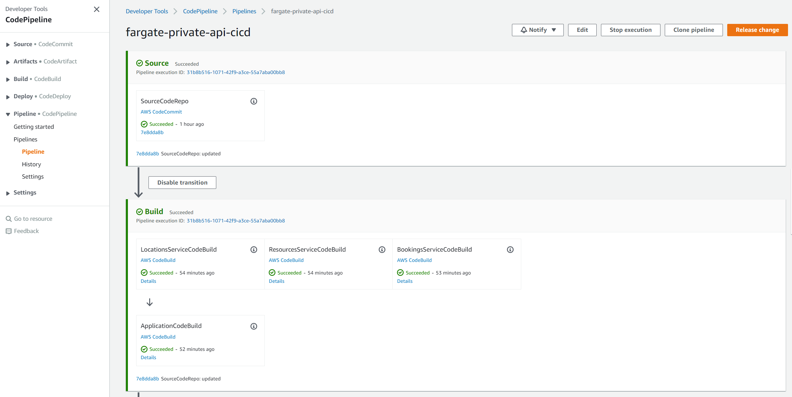

# javascript-private-ecs-nlb-sam
This is implementation of the backend API using Amazon API Gateway, Amazon Elastic Container Service (ECS), AWS Fargate, Network Load Balancer, CloudFormation, and SAM.

## Project structure
This project contains source code and supporting files for a serverless application that you can deploy with the CloudFormation command line interface (CLI) while using AWS Serverless Application Model (AWS SAM) transforms. It includes the following files and folders:

- `src/api` - Code for the application's containers
- `src/api/authorizer` - Lambda function used for authorization by API Gateway
- `src/api/bookings` - Application code for the Bookings Service
- `src/api/bookings/__tests__` - Unit tests for the Bookings Service
- `src/api/locations` - Application code for the Locations Service
- `src/api/locations/__tests__` - Unit tests for the Locations Service
- `src/api/resources` - Application code for the Resources Service
- `src/api/resources/__tests__` - Unit tests for the Resources Service
- `__tests__/integration` - Integration tests for the API. 
- `__tests__/testspec.yml` - A template that defines the API's test process used by the CI/CD pipeline (both unit and integration testing).
- `template.yaml` - A template that defines the application's AWS resources.
- `swagger.yaml` - Swagger (OpenAPI) API definition used to defined the API Gateway 
- `vpc.yaml` - A template that defines the application's VPC
- `cognito.yaml` - A template that defines the application's Cognito User Pool used for authentication
- `pipeline.yaml` - A template that defines the application's CI/CD pipeline.
- `buildspec.yml` - A template that defines the application's build process used by the CI/CD pipeline.

The application uses a Amazon Cognito stack for authentication/authorization and a VPC stack for ECS and NLB networking. These stacks are defined in their own templates and are run within the CI/CD pipeline. In many cases, infrastructure resources (such as VPC and Cognito User Pools) would be defined and deployed external to the application stack. In addition, all the services (Bookings, Locations, and Resources) are built and deployed within the same CI/CD pipeline. Similarly, in most cases, these services would each run in their own CI/CD pipeline. That being said, this project uses a single CI/CD pipeline  for demonstration purposes.

## Prerequisites
- [AWS CLI](https://docs.aws.amazon.com/cli/latest/userguide/cli-chap-getting-started.html): `aws --version` (Use 2.x)
- [Node.js](https://nodejs.org/en/download/): `node --version` (Use 14.x)
- [jq](https://stedolan.github.io/jq/): jq --version

## Deploying with CI/CD pipeline
You will use the CloudFormation CLI to deploy the stack defined within `pipeline.yaml`. This will deploy the required foundation which will allow you to make changes to your application and deploy them in a CI/CD fashion. 
The following resources will be created:
- CodeCommit repository for application code source control
- Elastic Container Registry repositories for housing the application's container images
- CodeBuild project for building and testing the application
- CodePipeline for orchestrating the CI/CD process

To create the CI/CD pipeline we will split out code for this set of examples from the serverless-samples repository into a separate directory and use it as a codebase for our pipeline. 

First, navigate to the root directory of the repository. To verify it run command *basename "$PWD"* - it should return serverless-samples as an output. Then run the following commands:

```bash
git subtree split -P fargate-private-api/javascript-private-nlb-ecs-sam -b fargate-private-api
mkdir ../fargate-private-api-cicd && cd ../fargate-private-api-cicd
git init -b main
git pull ../serverless-samples fargate-private-api
```

First we need to create the VPC, so that the CodeBuild instance for the integration testing in the pipeline can use the VPC properties which is required to invoke the private API

```bash
STACK_NAME=fargate-private-api-cicd
aws cloudformation deploy --stack-name $STACK_NAME-VPC-Testing --template-file ./vpc.yaml
```
To create the pipeline, you will deploy it with CloudFormation. Run the following command:

```bash
aws cloudformation deploy --stack-name $STACK_NAME --template-file ./pipeline.yaml --capabilities CAPABILITY_IAM
```

Once the stack is created, the pipeline will attempt to run and will fail at the SourceCodeRepo stage as there is no code in the AWS CodeCommit yet.

***NOTE:** If you change stack name, avoid stack names longer than 25 characters. In case you need longer stack names check comments in the pipeline.yaml and update accordingly.*

***Note:** You may need to set up AWS CodeCommit repository access for HTTPS users [using Git credentials](https://docs.aws.amazon.com/codecommit/latest/userguide/setting-up-gc.html?icmpid=docs_acc_console_connect_np) and [set up the AWS CLI Credential Helper](https://docs.aws.amazon.com/console/codecommit/connect-tc-alert-np).*

To view the CodeCommit URLs, run the following command:
```bash
aws cloudformation describe-stacks --stack-name $STACK_NAME | jq -r '.Stacks[0].Outputs[] | select(.OutputKey == "CodeCommitRepositoryHttpUrl" or .OutputKey == "CodeCommitRepositorySshUrl")'
```

Run the following command (with the desired URL (i.e. HTTPS, SSH) in place of `<CodeCommit_URL>`):

```bash
git remote add origin <CodeCommit_URL>
git push origin main
```


This will trigger a new deployment in CodePipeline. Navigate to the CodePipeline in AWS Management Console to see the process and status. You can also release changes manually by clicking the "Release change" button. For the proceeding commands to run successfully, the Production environment has to be deployed, which requires manual approval (via CodePipline in AWS Console) once the integration tests have successfully completed.



## Amazon Cognito setup
Amazon Cognito is automatically deployed with the application as part of the CI/CD pipeline. A distinct user pool is used for each of the Testing and Production environments.

As part of the integration tests within the CI/CD pipeline, user accounts are created (and deleted) automatically. If you'd like to call the API Endpoint manually (i.e. curl, Postman), then use the following steps to create a user and retrieve an ID Token:

- You can use either AWS Console or run CLI commands, provided below, to signup and confirm an user in Amazon Cognito.

- Navigate to the URL specified in the production stack template outputs as CognitoLoginURL and click link "Sign Up". After filling in new user registration form you should receive email with verification code, use it to confirm your account. 

- After this first step step your new user account will be able to access public data and create new bookings. To add locations and resources you will need to navigate to AWS Console, pick Amazon Cognito service, select User Pool instance that was created during this deployment, navigate to "Users and Groups", and add your user to administrative users group. 

- As an alternative to the AWS Console you can use AWS CLI to create and confirm user signup. Note: Make sure to replace <username> and <password> with values of your choosing.

```bash
    USER_POOL_ID=$(aws cloudformation describe-stacks --stack-name $STACK_NAME-Cognito-Production | jq -r '.Stacks[0].Outputs[] | select(.OutputKey == "UserPool") | .OutputValue')
    USER_POOL_CLIENT_ID=$(aws cloudformation describe-stacks --stack-name $STACK_NAME-Cognito-Production | jq -r '.Stacks[0].Outputs[] | select(.OutputKey == "UserPoolClient") | .OutputValue')

    aws cognito-idp sign-up --client-id $USER_POOL_CLIENT_ID --username <username> --password <password> --user-attributes Name="name",Value="<username>"

    aws cognito-idp admin-confirm-sign-up --user-pool-id $USER_POOL_ID --username <username> 

    aws cognito-idp admin-add-user-to-group --user-pool-id $USER_POOL_ID --username <username> --group-name apiAdmins
```

To authenticate with the Amazon Cognito User Pool and retrieve an Identity Token (aka ID Token), run the following command. Copy the `IdToken` value from the resulting output. API Gateway authorizes requests based on this token being present in the `Authorization` header.

```bash
aws cognito-idp initiate-auth --auth-flow USER_PASSWORD_AUTH --client-id $USER_POOL_CLIENT_ID --auth-parameters USERNAME=<username>,PASSWORD=<password>
```

## Calling the endpoint

To call the Private API endpoint, you will need a bastion instance in the production VPC and connect to them using SSH or AWS Systems Manager Session Manager (see [this article](https://docs.aws.amazon.com/AWSEC2/latest/UserGuide/session-manager.html) for details). 

To manually make calls to the API Endpoint, copy the `IdToken` value from the previous step and use it in place of <ID_TOKEN> for the following commands.

First, let's save the API Gateway endpoint URL to a variable:
```bash
API_ENDPOINT=$(aws cloudformation describe-stacks --stack-name $STACK_NAME-Production | jq -r '.Stacks[0].Outputs[] | select(.OutputKey == "APIEndpoint") | .OutputValue')
```

Now, let's add some data by creating a location:
```bash
curl -H "Authorization: Bearer <ID_TOKEN>" \
     -H "Content-Type: application/json" \
     -d '{"imageUrl": "https://api.example.com/venetian.jpg", "description": "Headquarters in New York", "name": "HQ"}' \
     -X PUT \
    $API_ENDPOINT/locations | jq
```

Lastly, let's fetch the newly-created location:
```bash
curl -H "Authorization: Bearer <ID_TOKEN>" $API_ENDPOINT/locations | jq
```

## Unit tests
Unit tests run within the CI/CD pipeline, but can also be run manually. They are defined in the `__tests__` folder within each service (i.e. `src/api/locations`).  To run all the unit tests for each service, run the following commands:

```bash
cd src/api/locations
npm install
npm run test:unit

cd ../bookings
npm install
npm run test:unit

cd ../locations
npm install
npm run test:unit
```

## Cleanup

To delete the sample application that you created, use the AWS CLI:

```bash
aws cloudformation delete-stack --stack-name $STACK_NAME-Testing
aws cloudformation delete-stack --stack-name $STACK_NAME-Production
aws cloudformation wait stack-delete-complete --stack-name $STACK_NAME-Testing
aws cloudformation wait stack-delete-complete --stack-name $STACK_NAME-Production

aws cloudformation delete-stack --stack-name $STACK_NAME-Cognito-Testing
aws cloudformation delete-stack --stack-name $STACK_NAME-Cognito-Production
aws cloudformation wait stack-delete-complete --stack-name $STACK_NAME-Cognito-Testing
aws cloudformation wait stack-delete-complete --stack-name $STACK_NAME-Cognito-Production
```

Before the CI/CD pipeline stack can be deleted, you must empty the build artifact S3 bucket via the AWS Management Console. To get the name of the bucket, run the following commands:

```bash
pipelineStackOutputs=$(aws cloudformation describe-stacks --stack-name $STACK_NAME | jq -r '.Stacks[0].Outputs')
echo "$pipelineStackOutputs" | jq -r '.[] | select(.OutputKey == "BuildArtifactS3Bucket") | .OutputValue'
```

Navigate to S3 within the AWS Management Console and search for the bucket. Once found, select the bucket and click the "Empty" button. Make sure to follow the prompts so that the bucket will be emptied.

Similarly, you also need to empty the ECR repositories that store the container images for the applications. Run the following commands to do so via the AWS CLI:

```bash
pipelineStackOutputs=$(aws cloudformation describe-stacks --stack-name $STACK_NAME | jq -r '.Stacks[0].Outputs')
bookingsRepositoryName=$(echo "$pipelineStackOutputs" | jq -r '.[] | select(.OutputKey == "BookingsServiceRepositoryName") | .OutputValue')
locationsRepositoryName=$(echo "$pipelineStackOutputs" | jq -r '.[] | select(.OutputKey == "LocationsServiceRepositoryName") | .OutputValue')
resourcesRepositoryName=$(echo "$pipelineStackOutputs" | jq -r '.[] | select(.OutputKey == "ResourcesServiceRepositoryName") | .OutputValue')

aws ecr delete-repository --repository-name $bookingsRepositoryName --force
aws ecr delete-repository --repository-name $locationsRepositoryName --force
aws ecr delete-repository --repository-name $resourcesRepositoryName --force
```
Before you delete the pipeline stack, save the name of the CloudFormation execution IAM role, to be deleted at end. Run the following command, and save the last part of OutputValue after "/":

```bash
aws cloudformation describe-stacks --stack-name $STACK_NAME | jq -r '.Stacks[0].Outputs[] | select(.OutputKey == "CloudformationIAMRole")'
```

Now, you can delete the pipeline stack. Run the following commands:

```bash
aws cloudformation delete-stack --stack-name $STACK_NAME
aws cloudformation wait stack-delete-complete --stack-name $STACK_NAME
```

Finally, delete the VPC, and the associated resources:

```bash
aws cloudformation delete-stack --stack-name $STACK_NAME-VPC-Testing
aws cloudformation delete-stack --stack-name $STACK_NAME-VPC-Production

aws cloudformation wait stack-delete-complete --stack-name $STACK_NAME-VPC-Testing
aws cloudformation wait stack-delete-complete --stack-name $STACK_NAME-VPC-Production
```

Now we need to delete the CloudFormation execution role. Go to the IAM console, select Roles under "Access management". Paste the CloudFormation execution role from the previous step in the search bar. Then delete the IAM role. 
