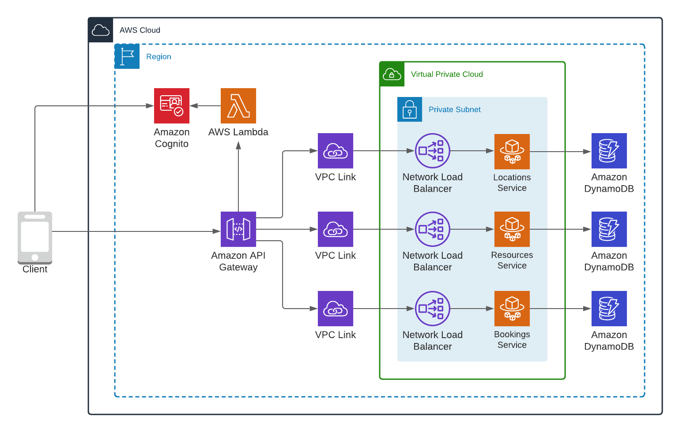
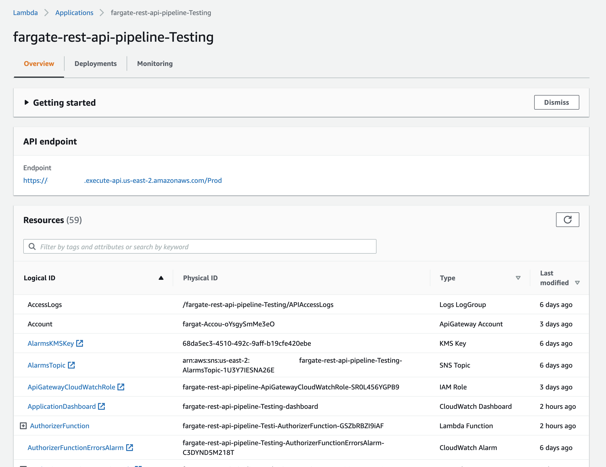
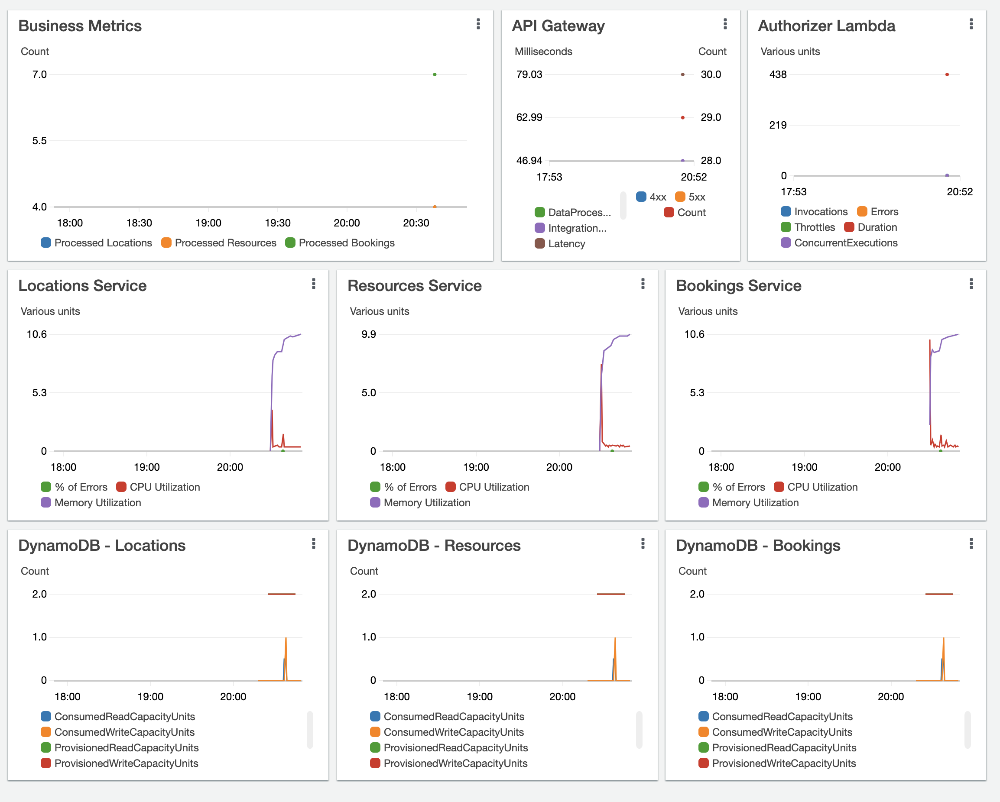

# fargate-rest-api

These REST API examples demonstrate end-to-end implementations of a simple application using a serverless approach that includes CI/CD pipelines, automated unit and integration testing, and workload observability. The examples include multiple implementations of the same application using a variety of development platform and infrastructure as a code approaches. The patterns here will benefit beginners as well as seasoned developers looking to improve their applications by automating routine tasks.

There are various blog posts and code examples for serverless APIs available, however, most of them do not go beyond the first steps of implementing business logic and access controls. These example dive deeper including: 

 - CI/CD pipelines containing automated unit and integration testing
 - manual approval steps before updates go live
 - automated alerts and dashboards for workload observability. 
 - API access logging as part of SAM templates
 - business specific metrics

Examples are (loosely) based on a [SpaceFinder project](https://github.com/amazon-archives/aws-serverless-auth-reference-app). The services used by this application include Amazon API Gateway, Amazon Cognito, AWS Lambda, Amazon ECS, AWS Fargate, and Amazon DynamoDB. The CI/CD pipelines use AWS CodePipeline, and AWS CodeBuild. 

## Architecture

The API uses Amazon API Gateway as a front door. Every new client is first required to use their credentials to authenticate with Amazon Cognito and retrieve an identity token. They must then pass this as a bearer token in the Authorization header with each subsequent request. The Lambda Authorizer inspects this token and generates an IAM policy that is returned back to API Gateway. 

The content of the IAM policy generated by the Lambda Authorizer depends on the user role and identity. All users have read access to the Locations and Resources associated with Locations. They also have read/write access their own Bookings. Administrative users have read/write access to all Locations, Resources, and Bookings. User status (regular vs. administrative) is defined by their membership in the API administrators group in Amazon Cognito User Pool. 

After authentication and authorization is complete, API Gateway forwards requests to Network Load Balancers (through a VPC Link) which distribute the requests to the ECS tasks, where the business logic resides. Data is persisted in DynamoDB tables, one table per API resource. 

## Components created

To see all those resources listed is navigating to the AWS Console, picking the Lambda service and checking out the Applications link on the left:

 ## Observability configurations
 Each example implements logging using CloudWatch Logs, emits custom metrics using [Embedded Metrics Format](https://docs.aws.amazon.com/AmazonCloudWatch/latest/monitoring/CloudWatch_Embedded_Metric_Format.html), configures CloudWatch alerts, and creates a CloudWatch dashboard. X-Ray distributed tracing is enabled whenever it is supported. Lambda functions bundle the X-Ray SDK for additional instrumentation. API Gateway access logging is enabled with a 30 day retention period. SAM templates override the default Lambda log stream to set the retention period to 7 days. 

 For better manageability and cost visibility examples use "Stack" tag whenever possible. You may need to activate them for use in AWS Cost Explorer, see [documentation](https://docs.aws.amazon.com/awsaccountbilling/latest/aboutv2/cost-alloc-tags.html) for more details.

 Check the CloudFormation outputs of your deployment to see the CloudWatch dashboard URL, references to the API Gateway access logs stream, and alarms topic in SNS. 

  To receive alerts you will need to create a subscription for the SNS topic. See [documentation](https://docs.aws.amazon.com/sns/latest/dg/sns-create-subscribe-endpoint-to-topic.html) for instructions.

The dashboards are operational immediately: 

## Testing  
Each example includes unit and integration tests that are run automatically by the CI/CD pipeline.

 ## Deployment of the sample application
 Each example is deployed via a CI/CD pipeline. As part of the pipeline, a code repository will be created to store the application code, as well as two environments - staging and production.  Each of the environments will have all necessary resources including their own shared VPC and Cognito stacks. The build stage will automatically perform all unit tests. Staging will run integration tests before stopping for a manual production deployment approval step. 

 *See individual example documentation for detailed instructions on how to create the CI/CD pipeline.*
 
 ## Examples
 Check these implementations of the example API for more details and resources to explore.
 - [javascript-rest-nlb-ecs-sam](./javascript-rest-nlb-ecs-sam) - this REST API implementation uses Node.js on Amazon ECS, AWS Fargate, Amazon API Gateway, Network Load Balancer, AWS SAM, AWS CloudFormation

