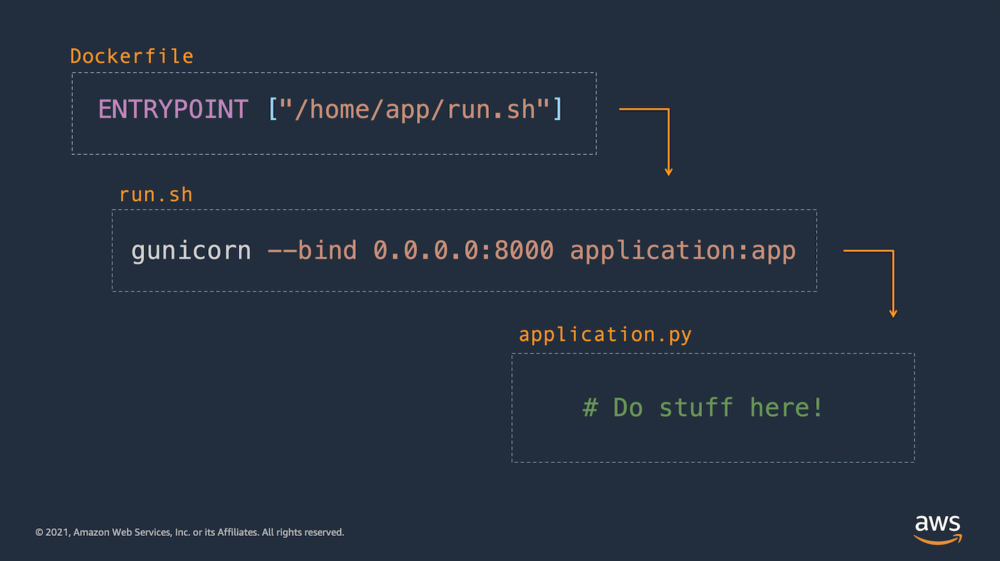

## Flask server packaged for ECS or other container service

This example app builds a very simple flask application packaged as a container image. Notice the [`/app/run.sh`](./app/run.sh) shell script that starts gunicorn and points it at the code contained in [`/app/application.py`](./app/application.py).



Follow the instructions below to build and run the application.

1. Build your container locally:
```
    docker build -t flask-app-container:latest .
```    

2. Run your container locally: 
```
    docker run -it -p 8000:8000 flask-app-container:latest
```

3. [View the Flask server](http://localhost:8000)!

[Move on to the next sample application](../2-flask-lambda-container/README.md)...
