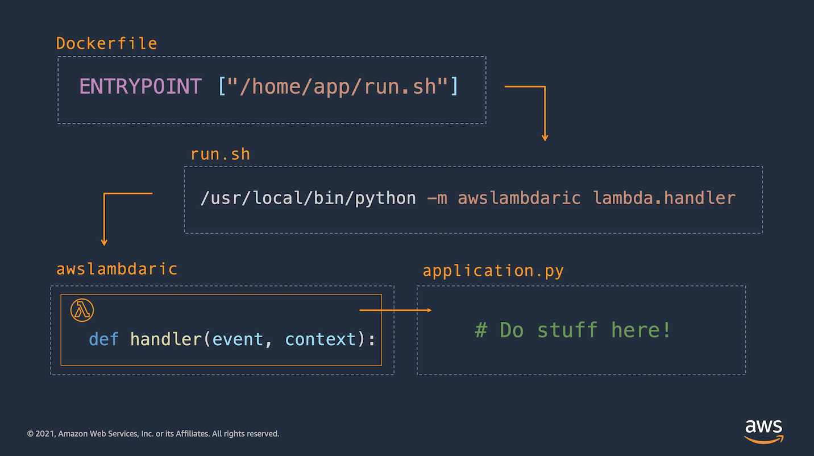

## Flask server packaged for AWS Lambda

This example app builds a simple flask application packaged to be run at AWS Lambda. Notice the [`/app/run.sh`](./app/run.sh) shell script which starts gunicorn as a daemon and then calls the [AWS Lambda Runtime Interface Client](https://github.com/aws/aws-lambda-python-runtime-interface-client) (RIC). The RIC enables the handler function to interact with the Lambda Runtime API during execution.



Follow the instructions below to build and run the application.

1. Build your container locally:
```
    docker build -t flask-lambda-container:latest .
```

2. Tag your container for deployment to ECR:
```
    docker tag flask-lambda-container:latest \
    <aws-account-id>.dkr.ecr.us-east-1.amazonaws.com/flask-lambda-container:latest
```

3. Login to ECR
```
    aws ecr get-login-password --region us-east-1 \
    | docker login --username AWS \
    --password-stdin <aws-account-id>.dkr.ecr.us-east-1.amazonaws.com
```

4. Create a repository at ECR

```
    aws ecr create-repository \
    --repository-name flask-lambda-container \
    --image-scanning-configuration scanOnPush=true \
    --region us-east-1
```

5. Push the container image to ECR
```
docker push <aws-account-id>.dkr.ecr.us-east-1.amazonaws.com/flask-lambda-container:latest
```

6. Create the Lambda function
   (note: you'll have to [create an execution role](https://docs.aws.amazon.com/lambda/latest/dg/lambda-intro-execution-role.html) first)
```
    aws lambda --region us-east-1 create-function \
    --function-name flask-lambda-container \
    --package-type Image \
    --role arn:aws:iam::<aws-account-id>:role/supernova-execution-role \
    --code ImageUri=<aws-account-id>.dkr.ecr.us-east-1.amazonaws.com/flask-lambda-container:latest
```

7. Invoke the Lambda function
```
    aws lambda --region us-east-1 invoke \
    --function-name flask-lambda-container \
    --invocation-type Event \
    --payload '{ "foo": "bar" }' \
    outfile.txt
```

[Move on to the next sample application](../3-flask-dual-deployment/README.md)...
