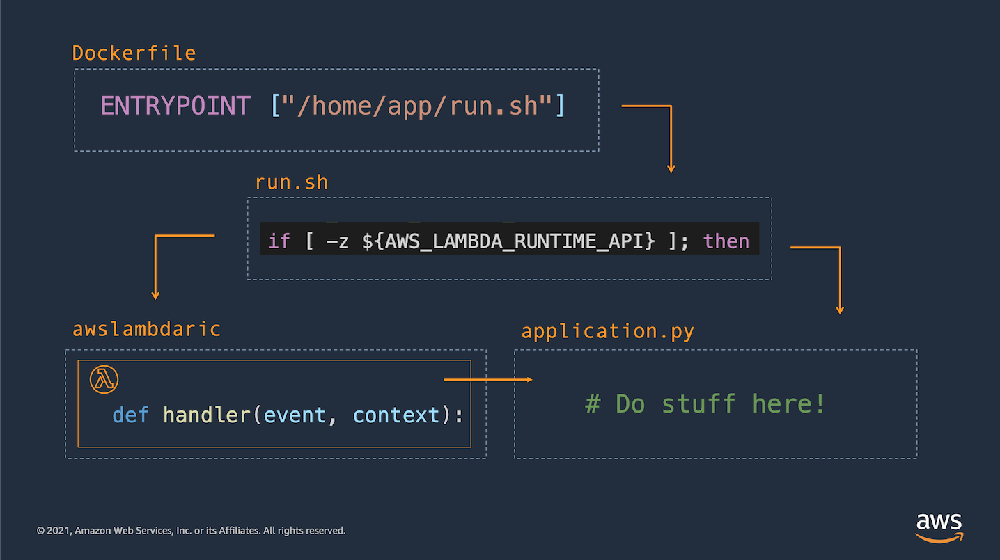

## Flask server packaged for dual deployment: AWS Lambda or ECS

This example app builds a simple flask application that will run successfully at AWS Lambda or another container registry service like ECS. Notice the [`/app/run.sh`](./app/run.sh) shell script which tests for the presence of a Lambda environment variable. If the variable is present the shell starts gunicorn as a daemon and then calls the [AWS Lambda Runtime Interface Client](https://github.com/aws/aws-lambda-python-runtime-interface-client) (RIC). Otherwise the shell runs gunicorn the same way as in [2-flask-lambda-container](./2-flask-lambda-container/README.md).



Follow the instructions below to build and run the application at AWS Lambda.

1. Build your container locally:
```
    docker build -t flask-dual-app:latest .
```

2. Tag your container for deployment to ECR:
```
    docker tag flask-dual-app:latest \
    <aws-account-id>.dkr.ecr.us-east-1.amazonaws.com/flask-dual-app:latest
```

3. Login to ECR
```
    aws ecr get-login-password --region us-east-1 \
    | docker login --username AWS \
    --password-stdin <aws-account-id>.dkr.ecr.us-east-1.amazonaws.com
```

4. Create a repository at ECR

```
    aws ecr create-repository \
    --repository-name flask-dual-app \
    --image-scanning-configuration scanOnPush=true \
    --region us-east-1
```

5. Push the container image to ECR
```
    docker push <aws-account-id>.dkr.ecr.us-east-1.amazonaws.com/flask-dual-app:latest
```

6. Create the Lambda function
   (note: you'll have to [create an execution role](https://docs.aws.amazon.com/lambda/latest/dg/lambda-intro-execution-role.html) first).
```
    aws lambda --region us-east-1 create-function \
    --function-name flask-dual-app \
    --package-type Image \
    --role arn:aws:iam::<aws-account-id>:role/supernova-execution-role \
    --code ImageUri=<aws-account-id>.dkr.ecr.us-east-1.amazonaws.com/flask-dual-app:latest
```

7. Invoke the Lambda function
```
    aws lambda --region us-east-1 invoke \
    --function-name flask-dual-app \
    --invocation-type Event \
    --payload '{ "foo": "bar" }' \
    outfile.txt
```
