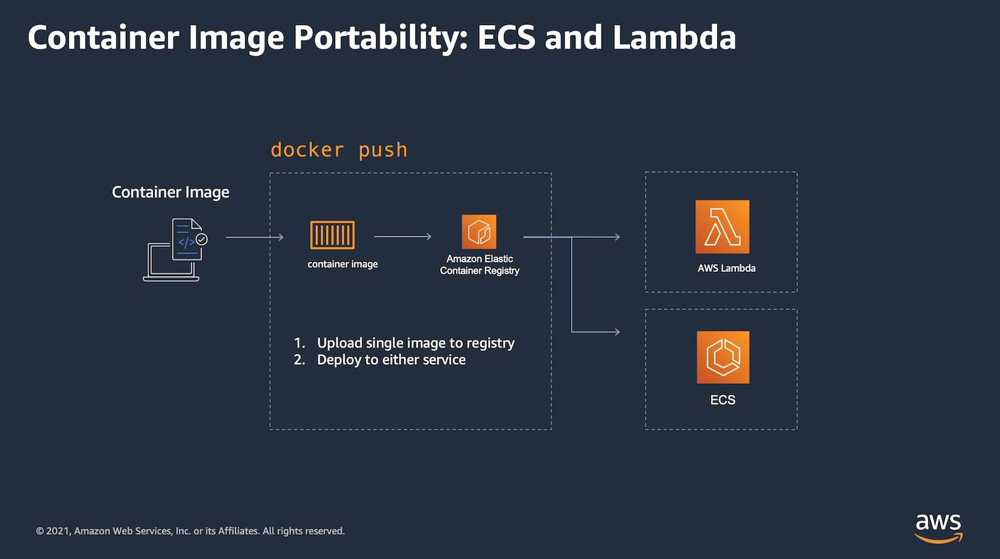

## AWS Lambda / ECS Dual Deploy Sample Application

### Purpose

This application demonstrates the steps necessary to build a container image that runs on both **AWS Lambda** and on another container service like **AWS Elastic Container Service** (ECS). 

To illustrate this possibility, this project contains three sample applications.

[1-flask-app-container](./1-flask-app-container/README.md) contains a simple Flask app that could be deployed to ECS.

[2-flask-lambda-container](./2-flask-lambda-container/README.md) contains a Flask app that could be deploy as a Lambda function.

[3-flask-dual-deployment](./3-flask-dual-deployment/README.md) contains a Flask app that may be successfully deployed and executed by both Lambda and ECS.
