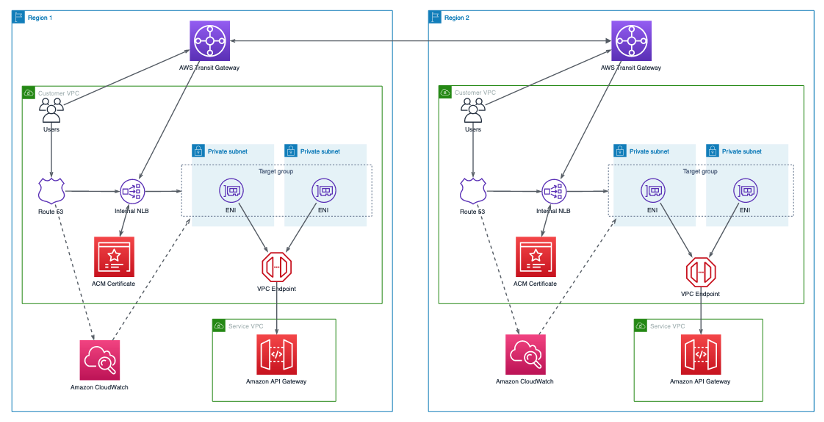
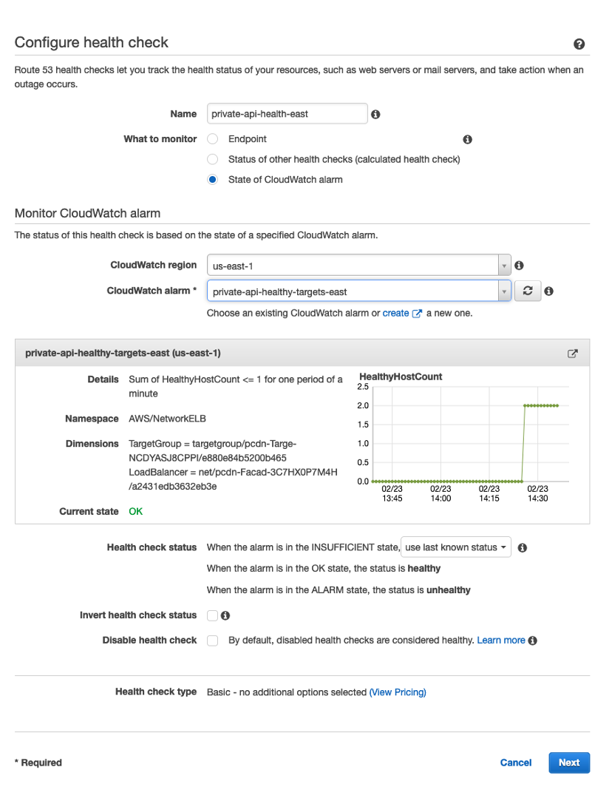
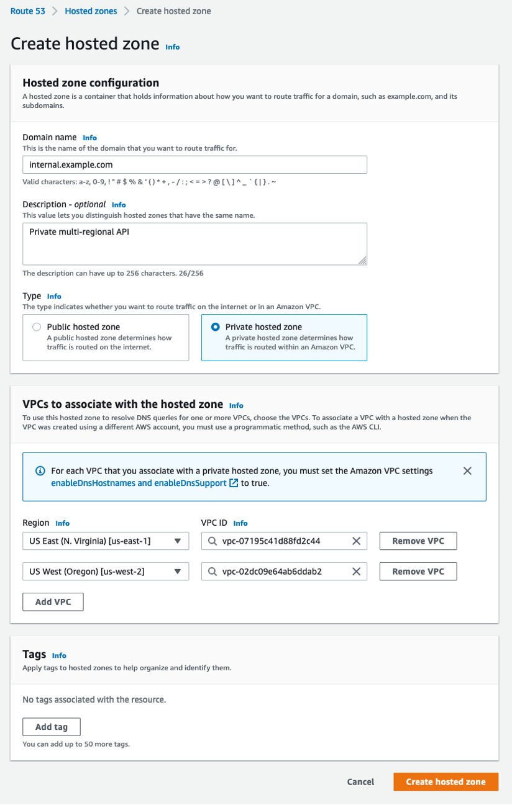
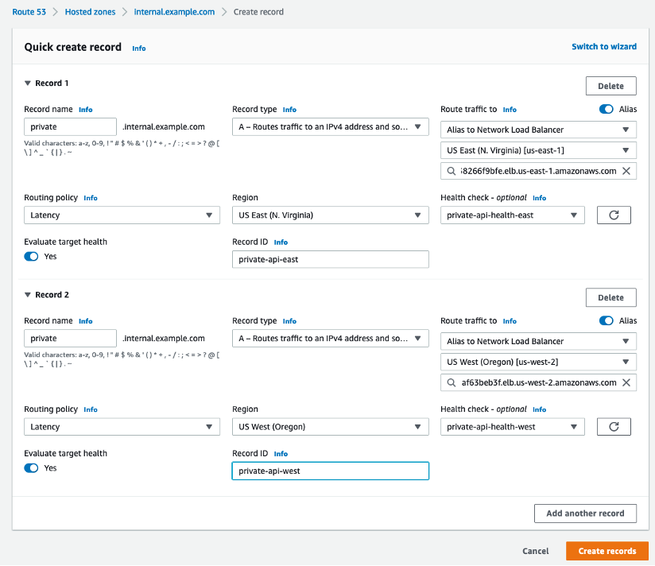
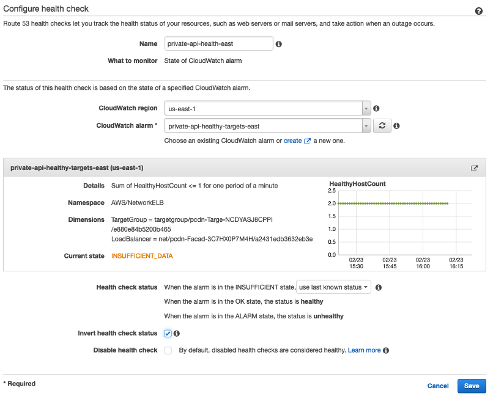

# Multi-regional Private API

This is a multi-regional implementation of a REST API that uses private Amazon API Gateway endpoints with custom domain names as described in [this sample](https://github.com/aws-samples/serverless-samples/tree/main/apigw-private-custom-domain-name).

## Overview

 This project deploys infrastructure through CloudFormation stacks in two AWS regions. It also provides instructions for manually configuring Amazon Route 53. 



This project deploys the following resources in each region:

 - API Gateway with a AWS Lambda function as integration target. 

 - Amazon Virtual Private Cloud (Amazon VPC) with two private subnets. 

 - AWS Transit Gateway used to establish connectivity between the two VPCs in different regions.

 - VPC Endpoint used to access API Gateway from the private subnets.

 - Elastic Network Interfaces (ENIs) are created in each private subnet by the VPC Endpoint.

 - Network Load Balancer with ENIs in its target group and TLS listener with ACM certificate; used as a facade for the API.

 - AWS Certificate Manager (ACM) that issues and manages certificates used by NLB TLS listener and API Gateway custom domain.

 - Route 53 with private hosted zones used for DNS resolution.

 - Amazon CloudWatch alarms used for Route 53 health checks.

## Prerequistes

What are they? AWS account, AWS cli, SAM, a valid domain under your management, access to administrative email registered to the domain, what else?  

## Create certificates

Both Network Load Balancers and API Gateways use certificates in the ACM. To create a certificate, use the following AWS CLI command below (you may also use code in this [sample repository](https://github.com/aws-samples/serverless-samples/tree/main/apigw-private-custom-domain-name) or see [this documentation](https://docs.aws.amazon.com/acm/latest/userguide/gs-acm-request-public.html) for more details).

```bash

aws acm request-certificate \
--domain-name private.internal.example.com \
--validation-method EMAIL \
--region us-east-1

```

Repeat this process in the us-west-2 region and note both certificate ARNs as you will need them later.

*Note: ACM certificates associated with Route 53 private hosted zones only support email verification, so create a certificate with a sub-domain. For more details, refer to the [documentation](https://docs.aws.amazon.com/acm/latest/userguide/email-validation.html) for email validation with ACM.*

## Create and configure infrastructure

API Gateway deployment assumes necessary infrastructure in place - VPCs, subnets, VPC Endpoints, and connectivity between resources in the two different regions. You may use existing infrastructure or follow steps in this section to deploy a new stack of resources in each of the regions.

Note that this setup uses AWS Serverless Application Model (SAM). Please check the [documentation](https://docs.aws.amazon.com/serverless-application-model/latest/developerguide/serverless-sam-cli-install.html), if you need to install it in your environment.

This implementation uses two VPCs that each contain two private subnets. Each VPC is in a different region. The VPC in the us-west-2 region uses IPv4 CIDR 10.2.0.0/16 and two subnets with IPv4 CIDR 10.2.1.0/24 and 10.2.2.0/24. The VPC in the us-east-1 region uses IPv4 CIDR 10.1.0.0/16 and two subnets with IPv4 CIDR 10.1.1.0/24 and 10.1.2.0/24. See the [documentation article](https://docs.aws.amazon.com/vpc/latest/userguide/VPC_Networking.html) for more information on how to create VPCs and subnets.

Client applications in one VPC will communicate with the resources deployed in another VPC in a different region. This implementation uses Transit Gateway with Inter-Region Peering (see [this demo](https://www.youtube.com/watch?v=cj1rQqLxXU8) for detailed peering walk-through). 

The implementation creates a VPC Endpoint to API Gateway in each VPC. The security group associated with the VPC Endpoint allows HTTPS traffic from the subnets in both VPCs (from CIDR 10.1.0.0/16 and 10.2.0.0/16). For more information on setting up VPC Endpoints see [this guide](https://docs.aws.amazon.com/apigateway/latest/developerguide/apigateway-private-apis.html#apigateway-private-api-create-interface-vpc-endpoint).

### Deploy infrastructure to the first region

- Navigate to the root folder of the repository and run the following commands to deploy stack in the us-east-1 region (accept default values):

```bash

cd infrastructure

sam build --template-file infrastructure.yaml

sam deploy --template-file infrastructure.yaml --guided \
--stack-name private-api-infrastructure \
--region us-east-1 \
--parameter-overrides ParameterKey=TransitGatewayForPeering,ParameterValue=""

```

Use the stack outputs to obtain the following configurations and copy them for future use: 

- VPC ID
- Subnet IDs
- Transit Gateway ID
- ENI IP addresses - to obtain these values run the command specified in the stack output **VPCEndpointIPCommand**

### Deploy infrastructure to the second region

Run the following command using the **Transit Gateway ID** value from the previous step as the parameter override to deploy a stack in the us-west-2 region (accept default values):

 ```bash

sam deploy --template-file infrastructure.yaml --guided \
--stack-name private-api-infrastructure \
--region us-west-2 \
--parameter-overrides ParameterKey=TransitGatewayForPeering,ParameterValue=<Transit Gateway ID from the previous step>

 ```

Use the stack outputs to obtain the following configurations and copy them for future use: 

- VPC ID 
- Subnet IDs 
- Transit Gateway Peering Attachment ID
- ENI IP addresses - to obtain these values run the command specified in the stack output **VPCEndpointIPCommand**

### Set up cross-region peering

- Run the command specified in the stack output **TransitGatewayPeeringAcceptanceCommand** to accept the Transit Gateway cross-region peering request

- Check that Transit Gateway peering attachment is in the “Available” state before proceeding further. You can do that by logging into the [AWS Management Console](https://console.aws.amazon.com/vpc/home?#TransitGatewayAttachments) or by using the AWS CLI command below and the stack output value of **TransitGatewayPeeringAttachment**.

``` bash

aws ec2 describe-transit-gateway-attachments --transit-gateway-attachment-ids <TransitGatewayPeeringAttachment value>

 ```

- Run the following commands using the stack output value of **TransitGatewayPeeringAttachment** in the parameter override to create Transit Gateway static routes for cross-regional traffic in both regions (accept default values):

 ```bash

sam build --template-file peering.yaml

sam deploy --template-file peering.yaml --guided \
--stack-name private-api-tgw-peering \
--region us-east-1 \
--parameter-overrides ParameterKey=TransitGatewayPeeringAttachmentID,ParameterValue=<Transit Gateway Peering Attachment ID>

sam deploy --template-file peering.yaml --guided \
--stack-name private-api-tgw-peering \
--region us-west-2 \
--parameter-overrides ParameterKey=TransitGatewayPeeringAttachmentID,ParameterValue=<Transit Gateway Peering Attachment ID>

 ```

You should now have VPCs in the two regions, with VPC Endpoints to API Gateway, interconnected using Transit Gateways with Inter-Region Peering. 

### Deploy API Gateway

_Note: If you followed the steps in the previous section to deploy the infrastructure, use the stacks’ output values to provide input parameters in the further steps. Make sure that stack outputs match the region where the API Gateway is being deployed. You may replace default empty parameter values in the template with actual ones or provide them during the deployment step._

**Inputs**

 - vpcId - ID of the VPC used by the private API

 - subnetIds - IDs of the two subnets (as a coma delimited list) in the VPC to be used by the NLB

 - vpcEndpointId - ID of the VPC Endpoint for the API Gateway service

 - vpcEndpointIps - two IP addresses (as a coma delimited list) of the Elastic Network Interfaces created by the VPC Endpoint

 - certificateArn - ARN of the certificate in ACM to be used by the NLB and API Gateway

 - domainName - Domain name for the private API, e.g. private.internal.example.com

 - apiStageName - API Gateway stage name (default “dev”)

To install API Gateway in both regions and set up private custom domains, run the following steps:

 - Navigate to the repository root directory with api.yaml

 - Execute the following command to deploy API stack in the us-east-1 region:

 ```bash

sam build --template-file api.yaml

sam deploy --template-file api.yaml --guided \
--stack-name private-api-gateway \
--region us-east-1

 ```

 - Repeat deployment in the us-west-2 region. Update parameters’ values in the template so they match the second region (or provide them as an input during the deployment step), and execute the following commands:

```bash

sam build --template-file api.yaml

sam deploy --template-file api.yaml --guided \
--stack-name private-api-gateway \
--region us-west-2

 ```

You should have the stacks with the API Gateway, Network Load Balancer and CloudWatch Alarms deployed to the two regions and ready for the next step.

## Configure Route 53

Once the infrastructure and the API stacks are in both regions, create health checks to use them in Route 53:

 - Navigate to Route 53 in the [AWS Management Console](https://console.aws.amazon.com/route53/v2/home#Dashboard) and use CloudWatch Alarms created in the previous step to create health checks (one per region):

 

 As an alternative to this simple health check, use the approach [documented here](https://aws.amazon.com/blogs/networking-and-content-delivery/performing-route-53-health-checks-on-private-resources-in-a-vpc-with-aws-lambda-and-amazon-cloudwatch/).

- Create a private Route 53 hosted zone (eg. internal.example.com) and associate it with the VPCs where the client applications that access the private APIs are:



- Create Route 53 private zone alias records, pointing to the NLBs in both regions/VPCs using the same name (e.g. private.internal.example.com) for both records. Use latency based routing policy and health checks created in the previous steps:



_Note: Check private hosted zone [routing considerations](https://docs.aws.amazon.com/Route53/latest/DeveloperGuide/hosted-zone-private-considerations.html#hosted-zone-private-considerations-routing-policies) and implement a routing approach that fits the use case and disaster recovery scenario._

## Validate

To validate this implementation, you will need a bastion instance in each of the VPCs and connect to them using SSH or AWS Systems Manager Session Manager (see [this article](https://docs.aws.amazon.com/AWSEC2/latest/UserGuide/session-manager.html) for details). 

- From both bastion instances (or from any other device that can route to the VPCs) execute the following command (use the domain name that matches your configuration):

```bash

dig +short private.internal.com

 ```

The response should contain the IP addresses of the Network Load Balancer in each VPC.

- After DNS resolution verification, execute the following command in each of the VPCs (use the domain name that matches your configuration):

``` bash

curl -s -XGET https://private.internal.example.com/demo

 ```

The response should include the event data as the Lambda function received it.

## Simulate an outage

To simulate an outage, navigate to Route 53 in the management console, pick a health check that corresponds to the region where you received the response from, and invert the health status:

 

After a few minutes, try the same DNS resolution and API response validation steps. This time you should see that all requests are routed to the remaining healthy API stack.

## Cleanup

To cleanup resources, follow the steps listed below:

- Navigate to the [AWS Management Console](https://console.aws.amazon.com/route53/v2/home#Dashboard) and delete Route 53 records, private hosted zone, and health checks created in the earlier steps

- Run the following commands to delete API, peering and infrastructure stacks in both regions:

``` bash

sam delete --stack-name private-api-gateway --region us-east-1

sam delete --stack-name private-api-gateway --region us-west-2

sam delete --stack-name private-api-tgw-peering --region us-east-1

sam delete --stack-name private-api-tgw-peering --region us-west-2

sam delete --stack-name private-api-infrastructure --region us-west-2

sam delete --stack-name private-api-infrastructure --region us-east-1

 ```

 _Note: If infrastructure stack deletion fails, try to delete peering attachment manually following steps in the [documentation](https://docs.aws.amazon.com/vpc/latest/tgw/tgw-peering.html#tgw-peering-delete) and retry the sam delete command._
