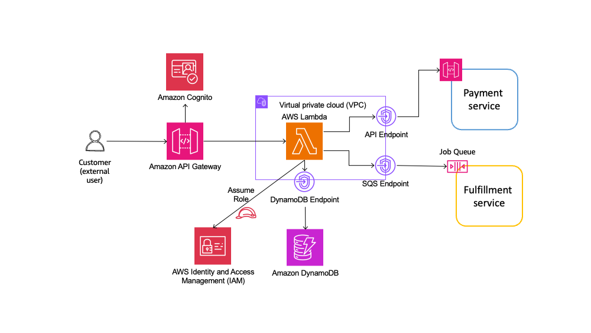
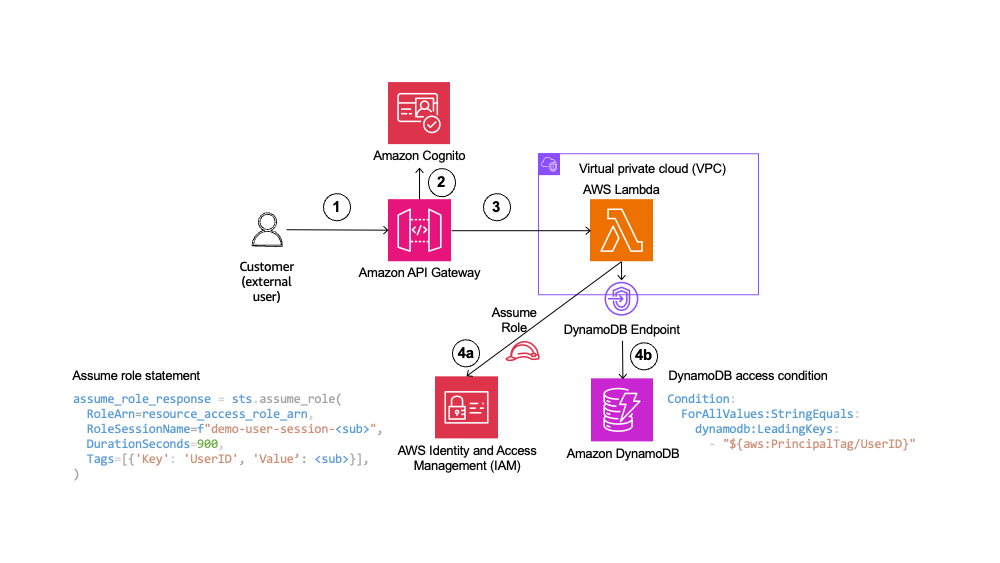

# Order service

The order service processes coffee orders. It is available over a public facing REST API Gateway. [Amazon Cognito](https://aws.amazon.com/pm/cognito) is used to authenticate users. The API allows placing and listing orders. Business logic is implemented in AWS Lambda. For this demo, the same Lambda function handles both API routes. 

>Note: Generally, Lambda is associated with VPC to provide  access to VPC based resources. In this case, we are using Amazon DynamoDB. VPC configuration is purely used to demonstrate configuration if choosing VPC based compute options such as containers or EC2.



This scenario demonstrates mitigation for the following OWASP risks.

|Risk|Description|Control|
| -- | --------- | ----- |
|API1:2023|Broken Object Level Authorization|Role based access control based on user id|
|API2:2023|Broken Authentication|Cognito authorizer|
|API5:2023|Broken Function Level Authorization|Role based access control based on custom claim|

## How it works

### Placing order

The diagram below depicts the flow for placing an order.


1. User authenticates with Cognito and uses the ID token as `Authorization` header for API Gateway. 
2. API Gateway uses a Cognito authorizer to validate the token and rejects the request if a valid token is not passed.
3. If token is valid, API Gateway invokes the Lambda function. It passes the subject, `sub`, in the token as claims field to  Lambda function.
4. The function invokes the payment service to process payment.
5. It then posts the order details to the fulfillment service queue.
6. There are 2 steps to persisting the order details in DynamoDB table. The function execution role does not have permissions to access DynamoDB table.
   6a. The function assumes a role with DynamoDB permissions and tags the session with UserId set to the unique Cognito identifier or `sub` for the authenticated user. 
   6b. The identifier, `sub`, is used as the partition key for DynamoDB while creating a record. Order date is used as the sort key. The combination of user id and order date uniquely identifies each record.

**Using Cognito as authorizer mitigates for API2:2023 - Broken Authentication.**

### Listing orders as user

The diagram below depicts the flow for listing orders as a user.



1. User authenticates with Cognito and uses the ID token as `Authorization` header for API Gateway. 
2. API Gateway uses a Cognito authorizer to validate the token and rejects the request if a valid token is not passed.
3. If token is valid, API Gateway invokes the Lambda function. It passes the subject, `sub`, in the token as claims field to  Lambda function.
4. There are 2 steps to retrieving the order details. The function execution role does not have permissions to access DynamoDB table.
   6a. The Lambda function assumes a role with DynamoDB permissions and tags the session with UserId set to the unique Cognito identifier or `sub` for the authenticated user. 
   6b. The identifier, `sub`, is used as the partition key for DynamoDB `query`. This ensures only orders placed by authenticated user are retrieved. 

**Using role based access control for DynamoDB records mitigates for API1:2023 - Broken Object Level Authorization.**

### Listing orders as admin

The diagram below depicts the flow for listing orders as admin. Admin user belongs to the Cognito group `Admins` and can list all orders. The Cognito group is available as a custom claim in the ID token.


1. User authenticates with Cognito and uses the ID token as `Authorization` header for API Gateway. 
2. API Gateway uses a Cognito authorizer to validate the token and rejects the request if a valid token is not passed.
3. If token is valid, API Gateway invokes the Lambda function. It passes the subject, `sub`, in the token as claims field to  Lambda function. In addition, it passes a `cognito:groups` claim.
4. There are 2 steps to retrieving the order details. The function execution role does not have permissions to access DynamoDB table.
   6a. The Lambda function assumes a role with DynamoDB permissions and tags the session with UserId set to the unique Cognito identifier or `sub` for the authenticated user. 
   6b. If `cognito:groups` claim is set to `Admins`, the function runs a `scan` on the table instead of `query`. This retrieves all orders in the table. 

> Note: Using scan on large tables is not performant. We have used scan for ease of demonstration. Refer to the [blog on effective data storage for DynamoDB](https://aws.amazon.com/blogs/database/effective-data-sorting-with-amazon-dynamodb/) for best practices.

**Using role based access control for DynamoDB records mitigates for API5:2023 - Broken Function Level Authorization.**

## Testing controls

### Prerequisites

You must deploy the stack and configure Cognito users as explained in the [README](../README.md) file in the root of this project.

### Mitigation for broken authentication

1. Invoke the Order service API with no `Authorization` header. This will fail with `401 Unauthorized` error. You can get the order service API endpoint from the terminal where you ran the deploy command. Alternately, run `sam list stack-outputs --stack-name <stack name>` to retrieve this.

```bash
curl https://<api id>.execute-api.<aws region>.amazonaws.com/Prod/listOrders
```

### Mitigation for broken object level authorization

2. Place a coffee order as an authenticated user. First, authenticate as Paulo to retrieve JWT tokens from Cognito. You need the Cognito user pool id and user pool client for this.

```bash
aws cognito-idp admin-initiate-auth \
  --user-pool-id <user pool id> \
  --client-id <client id> \
  --auth-flow ADMIN_NO_SRP_AUTH \
  --auth-parameters 'USERNAME=paulo,PASSWORD="<Paulos password>"'
```

Use the `IdToken` from the output of command above as the `Authorization` header while invoking the order service API.

```bash
curl -H "Content-Type: application/json" \
  -H "Authorization: < id token >" \
  -XPOST https://<api id>.execute-api.<aws region>.amazonaws.com/Prod/placeOrder \
  -d '{"order_id": "ORD-001", "item": "Americano", "amount": 5}'
```

You will get order details in response. You can also verify the order was saved in DynamoDB table from the console. You can get the order table name from the terminal where you ran the deploy command. Alternately, run `sam list stack-outputs --stack-name <stack name>` to retrieve this.

Next, place 2 coffee orders as Mary.

```bash
aws cognito-idp admin-initiate-auth \
  --user-pool-id <user pool id> \
  --client-id <client id> \
  --auth-flow ADMIN_NO_SRP_AUTH \
  --auth-parameters 'USERNAME=mary,PASSWORD="<Marys password>"'

curl -H "Content-Type: application/json" \
  -H "Authorization: < id token >" \
  -XPOST https://<api id>.execute-api.<aws region>.amazonaws.com/Prod/placeOrder \
  -d '{"order_id": "ORD-002", "item": "Oatmilk Latte", "amount": 7}'

curl -H "Content-Type: application/json" \
  -H "Authorization: < id token >" \
  -XPOST https://<api id>.execute-api.<aws region>.amazonaws.com/Prod/placeOrder \
  -d '{"order_id": "ORD-003", "item": "Cappuccino", "amount": 5}'
```

Again, you can verify entries in DynamoDB table.

3. Retrieve orders as user Paulo. The JWT tokens have an expiry of 60 minutes. If you run this command within 60 mins of executing step 2, you can use the same token. If not, rerun the `admin-initiate-auth` commands above to get new tokens.

```bash
curl -H "Content-Type: application/json" \
  -H "Authorization: < Paulo's id token >" \
  https://<api id>.execute-api.<aws region>.amazonaws.com/Prod/listOrders
```

The command above will only return Paulo's order.

```bash
curl -H "Content-Type: application/json" \
  -H "Authorization: < Mary's id token >" \
  https://<api id>.execute-api.<aws region>.amazonaws.com/Prod/listOrders
```

The command above will return both of Mary's orders.

### Mitigation for broken function level authorization

4. Retrieve orders as Admin user. First get the Id token as admin user. Then use the Id token to retrieve orders.

```bash
aws cognito-idp admin-initiate-auth \
  --user-pool-id <user pool id> \
  --client-id <client id> \
  --auth-flow ADMIN_NO_SRP_AUTH \
  --auth-parameters 'USERNAME=admin,PASSWORD="<Admin password>"'

curl -H "Content-Type: application/json" \
  -H "Authorization: < Admin's id token >" \
  https://<api id>.execute-api.<aws region>.amazonaws.com/Prod/listOrders
```

The command above will retrieve both Paulo's and Mary's orders.
