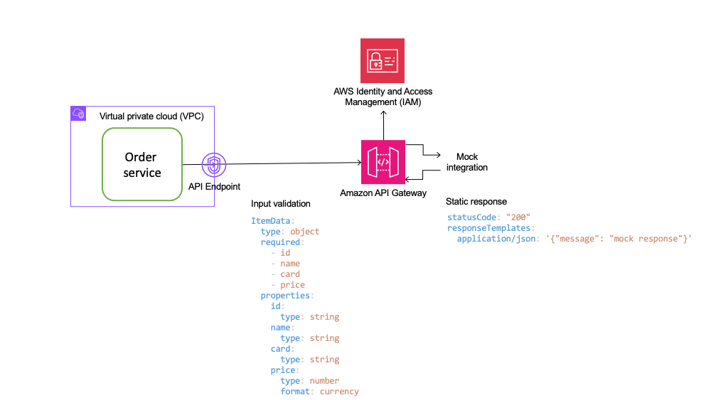

# Payment service

The payment service processes coffee payments. It is exposed using a private REST API Gateway. [AWS IAM](https://aws.amazon.com/iam) is used to authenticate other services, in this case, also hosted on AWS. For this demo, we have mocked the API integration, so there is no compute or database involved.



This scenario demonstrates mitigation for the following OWASP risks.

|Risk|Description|Control|
| -- | --------- | ----- |
|API1:2023|Broken Object Level Authorization|Role based access control based on IAM permissions|
|API2:2023|Broken Authentication|IAM|
|API3:2023|Broken API Object Property Level Authorization|API Gateway Input validation|

## How it works

### Making a payment

This API has only one resource, `makePayment`, that accepts a `POST` request with a body that matches the input schema shown in diagram above. The API is locked with AWS IAM and requires AWS credentials to invoke the API resource and method. **This mitigates for broken authentication risk**.

IAM allows fine-grained permissions by selectively providing `execute-api` permission to resources and also scoping to specific resources and methods on API. Also, as this is a private API, it is only accessible over the VPC endpoint specified in its resource policy. **This mitigates for broken object level authorization risk**.

API Gateway validates the payload for the POST request. **This mitigates partially for broken object property level authorization**

## Testing controls

### Prerequisites

1. You must deploy the stack as explained in the [README](../README.md) file in the root of this project.
2. Launch an EC2 instance to access private payments API.
   To test this control, launch the latest Amazon Linux `t4g.nano` EC2 instance in one of the subnets you used for deployment. Use the same security group as the Order service function. For this demo, we are using the same security group for VPC endpoint as well as Lambda function. The name starts with `reinforce-aps332-demo-PaymentServiceStack-`. The inbound rule allows all traffic from the same security group. This simplifies testing. In a real world scenario, services will have separate security groups and you must configure rules to allow traffic between them.
   
   Use an IAM instance profile with AWS Systems Manager (SSM) access for the EC2 instance. Review [steps on AWS documentation](https://docs.aws.amazon.com/systems-manager/latest/userguide/systems-manager-setting-up-ec2.html) to configure this. The latest Amazon Linux images come pre-installed with the SSM agent and the AWS CLI.

    Connect to the EC2 instance using session manager. Install pip and [awscurl](https://github.com/okigan/awscurl) using commands below. Since our API is locked with IAM authentication, we need to sign requests with Sigv4. `awscurl` makes this easy.

    ```bash
    sudo su - ec2-user
    sudo yum -y install python-pip
    pip install awscurl
    ```

### Mitigation for broken authentication
1. You need the Payment API endpoint and API Gateway VPC endpoint DNS name for this test. You can get both from the terminal where you ran the deploy command. Alternately, run `sam list stack-outputs --stack-name <stack name>` to retrieve this. In order to access a private API Gateway, you must access the VPC endpoint DNS and pass the API Gateway DNS as host header.

```bash
curl -H "Host: <api id>.execute-api.<region>.amazonaws.com" \
  -X POST https://<Vpc endpoint>.execute-api.<region>.vpce.amazonaws.com/Prod/makePayment \
  -d '{"id": "ABC123", "name": "Jane Doe", "card": "HASH1234", "price": 5.99}'
```

The request above will fail with `{"message":"Missing Authentication Token"}`.

2. Rerun using `awscurl` and AWS credentials obtained from instance metadata. Retrieve AWS credentials using command below for instance metadata service (IMDS) v2. See [docs](https://docs.aws.amazon.com/AWSEC2/latest/UserGuide/instancedata-data-retrieval.html) for more details.

```bash
TOKEN=`curl -X PUT "http://169.254.169.254/latest/api/token" -H "X-aws-ec2-metadata-token-ttl-seconds: 21600"` \
&& curl -H "X-aws-ec2-metadata-token: $TOKEN" http://169.254.169.254/latest/meta-data/iam/security-credentials/<name of instance role>
```

You should see the response below.

```json
{

  "Code" : "Success",
  "LastUpdated" : "2024-06-04T00:34:51Z",
  "Type" : "AWS-HMAC",
  "AccessKeyId" : "<redacted>",
  "SecretAccessKey" : "<redacted>",
  "Token" : "<redacted>",
  "Expiration" : "2024-06-04T06:37:09Z"
}
```

Now, use the command below to access the API.

```bash
awscurl --service execute-api \
  --region <region> \
  -H "Host: <api id>.execute-api.<region>.amazonaws.com" \
  -X POST https://<Vpc endpoint>.execute-api.<region>.vpce.amazonaws.com/Prod/makePayment \
  -d '{"id": "ABC123", "name": "Jane Doe", "card": "HASH1234", "price": 5.99}' \
  --access_key <AccessKeyId above> \
  --secret_key <SecretAccessKey above> \
  --security_token <Token above>
```

You should get `{"message": "mock response"}`. 

When using API Gateway resource policy and IAM authentication, the request is allowed even if caller does not have an explicit allow for the API and is in the same AWS account. Review [docs](https://docs.aws.amazon.com/apigateway/latest/developerguide/apigateway-authorization-flow.html#apigateway-authorization-flow-iam) for details.

3. Attach a new inline policy to the EC2 instance role that explicitly denies `execute-api:Invoke` action.

```json
{
    "Version": "2012-10-17",
    "Statement": [
        {
            "Sid": "DenyApiInvoke",
            "Effect": "Deny",
            "Action": "execute-api:Invoke",
            "Resource": "*"
        }
    ]
}
```

Rerun the same `awscurl` command above. You will now see the message below.

```bash
{"Message":"User: arn:aws:sts::<account>:assumed-role/<instance IAM role>/i-xxxxx is not authorized to perform: execute-api:Invoke on resource: arn:aws:execute-api:<region>:********xxxx:<Api id>/Prod/POST/makePayment with an explicit deny"}
```

### Mitigation for broken object level authorization

4. For this demo, we have left the VPC endpoint policy pretty broadly scoped to allow all access from the VPC. You can update the principal to specific IAM roles, such as the Order service role, for more fine grained access. Security groups provide an additional layer of access control at networking level.

### Mitigation for broken object property level authorization

1. One way to mitigate for this risk is application level checks for inputs. This sample shows how API Gateway input validation using schema can prevent adding or modifying payload requests. Remove the API deny policy from the EC2 instance role first.

Try changing the payload for awscurl request to add or remove fields or changing datatype. For example, try the awscurl command with payloads below. In the first one, `id` has been replaced with `payment_id`. 

```bash
{"payment_id": "ABC123", "name": "Jane Doe", "card": "HASH1234", "price": 5.99}
```

In the one below, price has been changed to string datatype.

```bash
{"id": "ABC123", "name": "Jane Doe", "card": "HASH1234", "price": "5.99"}
```

In both case, you will see `{"message": "Invalid request body"}`.
