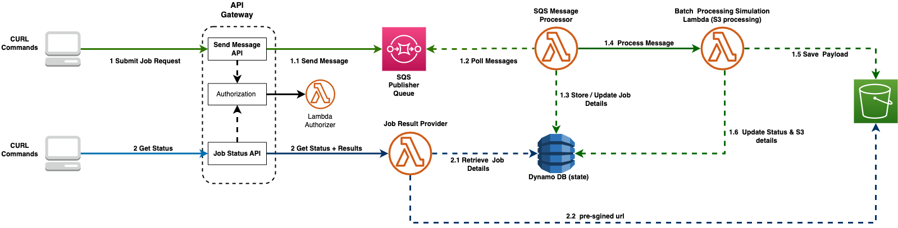
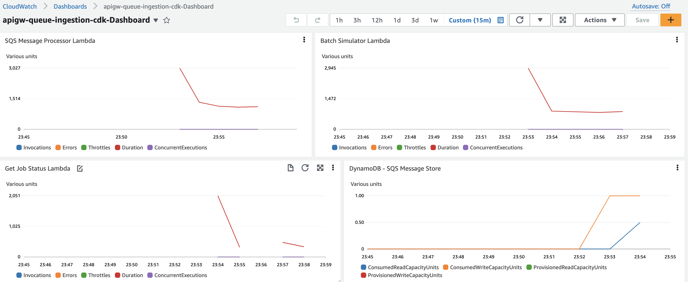

# API Gateway SQS Queue based Ingestion.

This example demonstrates API Gateway and Amazon SQS integration capabilities. However rather than just focusing on technical aspects, we have used a common use case of triggering long-running batch processes with very minimal input.
<br>
In this use case, any client applications will call an API using Amazon API Gateway to submit a new job request, these job requests are buffered in Amazon SQS queue. AWS Lambda will process these requests by triggering business logic and then use Amazon DynamoDB to keep track of each request. Also, client applications can get status of each submitted job request using  a Job Status API endpoint. <br>
<br>
In this particular example, an AWS Lambda function that generates  random weather data payload and stores it in an Amazon S3 bucket is used to simulate business logic. <br>
This business logic simulation can easily be replaced with real-world business logic using AWS services like AWS Batch, AWS Step Functions, Amazon ECS, AWS Fargate, etc. <br>
<br>
A reference application is created to showcase the implementation of this use case using a serverless approach that includes CI/CD pipelines, automated unit and integration testing, and workload observability. <br>
This example includes multiple implementations of the same application using a variety of development platforms and infrastructure as a Code approaches.<br>
<br>

## Architecture



The flow of the process in this implementation is as follows:

1. Amazon API Gateway Endpoint (/submit-job) is integrated with Amazon SQS Queue, client applications will use this endpoint to submit a new job request.

2. Once requests are submitted via API call, these requests will be stored in an Amazon SQS Queue to avoid message loss.
3. Lambda function will process each job request from Queue, using following actions.

   - Add a tracking entry into Amazon DynamoDB table.
   - Trigger Batch process, in this example invoke another Batch Simulator Lambda Function.
   - Once the batch process is finished, update the status of job requests in the Amazon DynamoDB table.

4. Lambda function that simulates business logic for batch process by randomly generating weather data and storing the payload into S3 bucket.

5. Client applications can get the status of a specific job request via Amazon API Gateway Endpoint( /job-status/{job-id} ) with a specific Job Id.<br>
   This endpoint provides latest status of Job request, the status of job checked in DynamoDB Table and for job with `Completed` status it provides a pre-signed url to the job output payload i.e. randomly generated weather data.

## Components Created

These examples create following resources in your AWS account:<br>

<li>Amazon API Gateway endpoint which allows submit requests to start new jobs and integrates with SQS Queue. <br>
<li>Amazon SQS Queue to store incoming job requests.<br>
<li>Amazon API Gateway endpoint which provides status of job.<br>
<li>Lambda function used as a Lambda Authorizer for Amazon API Gateway.<br>
<li>Lambda function to process messages from SQS queue.<br>
<li>Lambda function to process get Job Status API requests coming to API Gateway and provide status of each Job Request and link to Job output payload.<br>
<li>Lambda function that simulates business logic processing for job, this needs to be replaced by business logic specific to your usecase.<br>
<li>Amazon DynamoDB tables to store details of job requests and status of job.<br>
<li>Amazon S3 bucket to store output of job process.<br>
<li>AWS Identity and Access Management (IAM) Roles for Lambda functions, with appropriate permissions to access Amazon S3 buckets, Amazon SQS queues, and Amazon DynamoDB Table. <br>
<li>Amazon API Gateway access logs stream in CloudWatch Logs.<br>
<li>Amazon SNS topic for the alarms.<br>
<li>Errors alarms for all Lambda functions.<br>
<li>CloudWatch Dashboard with API Gateway, Lambda, and DynamoDB metrics preconfigured.<br>

## Setup and Deployment

### Prerequisites

Below are key tools needed for deploying this application.

- Python 3.x
- [SAM CLI](https://docs.aws.amazon.com/serverless-application-model/latest/developerguide/install-sam-cli.html)
- [AWS CLI](https://aws.amazon.com/cli/)
- Docker : You can refer to this [installation guide](https://docs.docker.com/get-docker/)

### Python projects

This project is set up like a standard Python project. You may need to manually create a virtualenv.

<details>
<summary><strong>Expand for detail on how to do this.</strong></summary><p>

```bash
python3 -m venv .venv
```

After the init process completes and the virtualenv is created, you can use the following
step to activate your virtualenv.

```bash
source .venv/bin/activate
```

Once the virtualenv is activated, you can install the required dependencies for CDK and API implementation.

```bash
python3 -m pip install --upgrade pip
pip install -U wheel setuptools
```

Install Docker. You can refer to this [installation guide](https://docs.docker.com/get-docker/)

</p></details></br>

Deploy using:

- [Python and CDK](python-cdk/README.md) OR
- [Python and SAM](python-sam/README.md)

## Observability configurations

Each example implements logging using Amazon CloudWatch Logs, emits custom metrics using Embedded Metrics Format, configures Amazon CloudWatch alerts, and creates an Amazon CloudWatch dashboard. Amazon X-Ray distributed tracing is enabled whenever it is supported. Lambda functions bundle the Amazon X-Ray SDK for additional instrumentation. Amazon API Gateway access logging is enabled with a 30 day retention period.

Check the AWS CloudFormation outputs of your deployment to see the Amazon CloudWatch dashboard URL, references to the Amazon API Gateway access logs stream, and alarms topics in Amazon SNS.

The dashboard is operational immediately:

