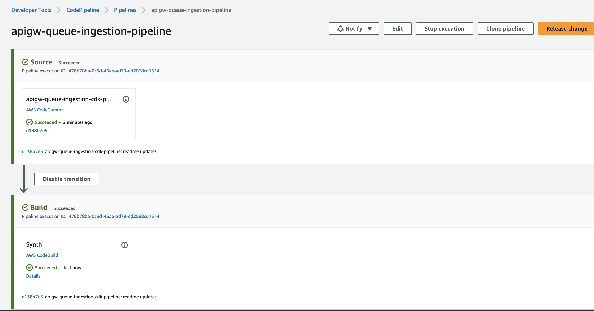

# Python-AWS Cloud Development Kit (AWS CDK)

This is an implementation of the Queue-based ingestion with Amazon API Gateway using Python and AWS Cloud Development Kit (CDK).

## Prerequisites

Make sure you have AWS CDK installed and bootstrapped before proceeding with the following steps. For more information on setting up AWS CDK, see [documentation](https://docs.aws.amazon.com/cdk/latest/guide/getting_started.html)

**Install Docker** You can refer to this [installation guide](https://docs.docker.com/get-docker/)

**AWS CDK Bootstrap**
If the AWS CDK and its prerequisites have been installed in a Python environment, the next step is to bootstrap each AWS region and account where any AWS CDK stack will be deployed. This is a process that only needs to occur once per region per account, so every additional region requires bootstrapping of both accounts using`cdk bootstrap` command.
Use the `cdk bootstrap` command to bootstrap one or more AWS environments. In its basic form, this command bootstraps one or more specified AWS environments.

```bash
cdk bootstrap aws://ACCOUNT-NUMBER-1/REGION-1
```

You can follow this reference for more information and guidance: [CDK bootstrap](https://docs.aws.amazon.com/cdk/v2/guide/bootstrapping.html)

## Project structure

This project contains source code and supporting files for a serverless application that you can deploy with the AWS CDK command-line interface (CLI). It includes the following files and folders:

- `src\api` - Code for the application's AWS Lambda functions and AWS Lambda Authorizer.
- `events` - Invocation events that you can use to invoke the function.
- `tests/unit` - Unit tests for the application code.
- `tests/integration` - Integration tests for the API.
- `lib` - AWS CDK application modules directory.
- `app.py` - AWS CDK application 'main' (entry point)
- `cdk.json` - configuration file for AWS CDK.
- `setup.py` - defines the Python package.
- `requirements.txt` - Python requirements file for the AWS CDK application.

## AWS CDK Python Project Setup

If virtualenv is needed, please create and activate it. You can find instructions in the [Setup and Deployment](./../README.md#setup-and-deployment) section. Once virtualenv is activated, you can install the required dependencies for the AWS CDK and API implementation.<br>
**Note:** Please verify that current directory is <repository path>/serverless-samples/queue-based-ingestion/python-cdk

```
pip install -r requirements.txt
pip install -r ./src/api/requirements.txt
```

**Note**: Please ensure that the Docker application is running. <br>

At this point, you can now synthesize the AWS CloudFormation template for this code.

**Note**: The value of the variable `API_STACK_NAME` inside `app.py` is used to create an Amazon Simple Storage Service (Amazon S3) Bucket with the same name. So update `API_STACK_NAME` inside `app.py` with a unique stack name.

After updating the value, commit the changes to the local git repo using the below commands. This step is only needed if you are planning to deploy the CICD pipeline for this example.

```bash
git add app.py

git commit -m "update stack name"
```

Please do not push this change to the remote origin repo, so do not run the `git push` command.

```bash
cdk synth
```

The AWS `cdk synth` command executes your app, which causes the resources defined in it to be translated into an AWS CloudFormation template. The displayed output of `cdk synth` is a YAML-format template. Following, you can see the beginning of our app's output. The template is also saved in the `cdk.out` directory in JSON format.

## Amazon Cognito Setup

This example uses AWS CDK stack that deploys Amazon Cognito resources. The stack will be deployed automatically if you use a CI/CD pipeline. To deploy it manually, you can use the following command:

**Note:** Please verify that current directory is <repository path>/serverless-samples/queue-based-ingestion/python-cdk

```bash
cdk deploy <your stack-name>-cognito
```

After the stack is created manually, you will need to create a user account for authentication/authorization. Deployment by a CI/CD pipeline will perform these steps for you automatically.

- You need to create and confirm user signups. You can use AWS Console to complete this process.

- As an alternative to the AWS Management Console, you can use AWS CLI to create and confirm user signup:
  - Note down UserPoolClient Id from output of AWS CDK deploy command and use that value in below commands.

```bash
   aws cognito-idp sign-up --client-id <cognito user pool application client id> --username <username> --password <password> --user-attributes Name="name",Value="<username>"

   aws cognito-idp admin-confirm-sign-up --user-pool-id <user pool id> --username <username>

```

While using command line or third-party tools such as Postman to test APIs, you will need to provide Identity Token in the request "Authorization" header. You can authenticate with Amazon Cognito User Pool using AWS CLI and use IdToken value present in the command's output:

```bash
aws cognito-idp initiate-auth --auth-flow USER_PASSWORD_AUTH --client-id <cognito user pool application client id> --auth-parameters USERNAME=<username>,PASSWORD=<password>
```

## Manually Deploy The Sample Application

**Note:**: Before deploying application manually, first time you will need to deploy shared Amazon Cognito stack, see the previous section for details.

To build and deploy your application for the first time, run the following in your shell:

```bash
cdk deploy <your stack-name>
```

This command will package and deploy your application to the AWS

The Amazon API Gateway endpoint API will be displayed in the outputs when the deployment is complete.

**Note:**: The value of variable `API_STACK_NAME` inside `app.py` is used to create an Amazon Simple Storage Service (Amazon S3) Bucket with the same name, so if a duplicate bucket name error is observed during `cdk deploy`, then please update the API_STACK_NAME variable with a unique stack name and run `cdk synth` and `cdk deploy` commands again.

## Unit Tests

Unit tests are defined in the `tests\unit` folder in this project. Use `pip` to install the `./tests/requirements.txt` and run unit tests.

```bash
pip install -r ./tests/requirements.txt
python -m pytest tests/unit -v
```

## Testing

To test the end-to-end flow of application, use the following steps:

1. To test any of the APIs created via command line or third-party tools such as Postman, you will need to provide a Token (IdToken) in the "Authorization" header. You can authenticate with Amazon Cognito User Pool using AWS CLI and use `IdToken` value present in the command's output (it is available in the stack outputs as well):

```bash
    aws cognito-idp initiate-auth --auth-flow USER_PASSWORD_AUTH --client-id <cognito user pool application client id> --auth-parameters USERNAME=<username>,PASSWORD=<password>
```

2. Submit a new Job Request via API call using /submit-job-request endpoint. This API call sends a message to the Amazon Simple Queue Service (Amazon SQS) queue and triggers a job process. For the API call, you need to use the IdToken generated in the previous step.<br>
   Below is a sample `curl` command. In HTTP request provide a payload specific to job process, this payload will be published to Amazon SQS queue.

```bash
curl --location --request POST 'https://<API Gateway Sender API Endpoint>/submit-job-request'  -H 'Content-Type: application/json' --data-raw '< Batch process JSON Payload>' -H 'Authorization:<IdToken>'
```

3. Once the message is published to Amazon SQS via Amazon API Gateway endpoint, SendMessageResponse payload will be provided as part of the HTTP response. Note down the `MessageId` attribute from response.<br>
   Sample SendMessageResponse payload

```bash
<?xml version="1.0" encoding="UTF-8"?>
<SendMessageResponse xmlns="http://queue.amazonaws.com/doc/2012-11-05/">
   <SendMessageResult>
      <MessageId>696093f8-1129-448f-849c-6e9f40e5b441</MessageId>
      <MD5OfMessageBody>1781569b4b9b7a0fbf6d8cb1cc459124</MD5OfMessageBody>
   </SendMessageResult>
   <ResponseMetadata>
      <RequestId>e08e055b-7af5-5b42-98ea-5fccfef82ae6</RequestId>
   </ResponseMetadata>
</SendMessageResponse>
```

4. Use the /job-status endpoint to check the status of a Job Request. Provide `MessageId` captured from above step as an URL path parameter and provide a cognito `IdToken` for authorization purpose.

```bash
curl --location 'https://<API Gateway Sender API Endpoint>/job-status/<messageId>' -H 'Content-Type: application/json' -H 'Authorization:<IdToken>'
```

5. Job Status API will have a JSON response with a pre-signed URL for Amazon S3 bucket to download the payload generated by Job process. The presigned URL will be populated as part of `jobProcessedPayload` attribute. <br>
   Below is sample response from job-status API

```bash
{"jobStatus": "complete",
"jobId": "696093f8-1129-448f-849c-6e9f40e5b441",
"jobProcessedPayload": "<Presigned URL link to payload object in S3 bucket>"}
```

6. Use curl command to download the job payload via the pre-signed URL (`jobProcessedPayload`).

```bash
curl '<presigned URL>' -o batch-payload-output.txt
```

## Deploy CI/CD pipeline for the application

To create the pipeline, you will need to run the following command:

```bash
cdk deploy <your stack-name>-cicd
```

The pipeline will attempt to run and will fail at the SourceCodeRepo stage as there is no code in the AWS CodeCommit yet.

**Note:** Please verify that current directory is <repository path>/serverless-samples/queue-based-ingestion/python-cdk

To verify it, run the command basename `pwd` - it should return python-cdk as an end of the directory path.

**Note:** You may need to set up AWS CodeCommit repository access for HTTPS users [using Git credentials](https://docs.aws.amazon.com/codecommit/latest/userguide/setting-up-gc.html?icmpid=docs_acc_console_connect_np) and [set up the AWS CLI Credential Helper](https://docs.aws.amazon.com/console/codecommit/connect-tc-alert-np).

```bash
git remote rename origin upstream
git remote add origin <URL to AWS CodeCommit repository>
git push origin main
git remote rename upstream origin
```

Navigate to the AWS CodePipeline in AWS Management Console and release this change if needed by clicking "Release change" button.



Note that the same Amazon Cognito stack is used in both testing and production deployment stages, the same user credentials can be used for testing and API access.

## Cleanup

To delete the sample application that you created, use the AWS CLI:

**Note:** : For all below commands, use the stack name you have provided in the variable `API_STACK_NAME` inside the `app.py` file.

Before deleting the stack, ensure that the Amazon S3 bucket created to store the output of the job process is empty. You can get the bucket name from the AWS CloudFormation stack output or resources section.

Below is a command that will list all resources for the stack, look for `job-payload-output-bucket*` in the resource's `PhysicalResourceId` section.

```bash
aws cloudformation list-stack-resources --stack-name <your stack-name>-cicd
```

Then open the AWS Management Console, navigate to the Amazon S3 bucket, and empty it.

```bash
cdk destroy <your stack-name>
cdk destroy <your stack-name>-cognito

```

If you created a CI/CD pipeline, you will need to delete it as well, including all testing and deployment stacks created by the pipeline. Please note that actual stack names may differ in your case, depending on the pipeline stack name you used.

CI/CD pipeline stack deletion may fail if the build artifact Amazon S3 bucket is not empty. In such a case, get the bucket name from the AWS CloudFormation CI/CD pipeline stack output or resources section.
Then open the AWS Management Console, navigate to the Amazon S3 bucket with build artifacts, and empty it.

Below is a command that will list all resources for the stack, look for `pipelineartifactsbucket*` in the resource's `PhysicalResourceId` section.

```bash
aws cloudformation list-stack-resources --stack-name <your stack-name>
```

In the above output of the list-stack-resources' command, look for `job-payload-output-bucket*-cicd-int-test-app`, which is an Amazon S3 bucket created to store the output of the job process during integration testing.
Then open the AWS Management Console, navigate to the Amazon S3 bucket with the above naming convention, and empty it.

```bash
cdk destroy <your stack-name>-cicd/<your stack-name>-cicd-deploy/app
cdk destroy <your stack-name>-cicd/<your stack-name>-cicd-deploy/Cognito
cdk destroy <your stack-name>-cicd/<your stack-name>-cicd-int-test/app
cdk destroy <your stack-name>-cicd/<your stack-name>-cicd-int-test/Cognito
cdk destroy <your stack-name>-cicd

```
