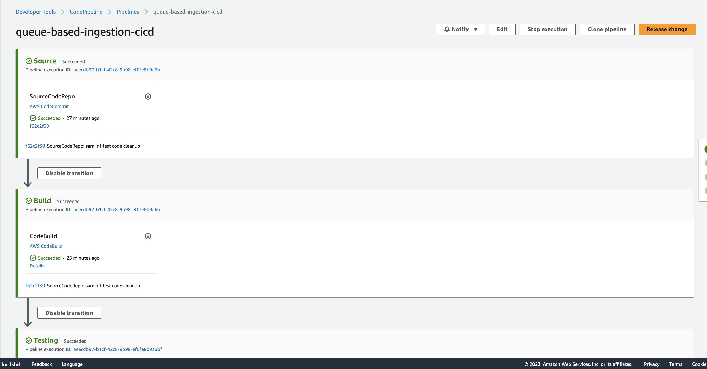

# Python-AWS Serverless Application Model (AWS SAM)

This is implementation of the Queue-based ingestion with Amazon API Gateway using Python and AWS Serverless Application Model (AWS SAM).

## Project Structure

This project contains source code and supporting files for a serverless application that you can deploy with the AWS Serverless Application Model (AWS SAM) command-line interface (CLI). It includes the following files and folders:

- `src\api` - Code for the application's AWS Lambda functions and AWS Lambda Authorizer.
- `events` - Invocation events that you can use to invoke the function.
- `tests/unit` - Unit tests for the application code.
- `tests/integration` - Integration tests for the API.
- `template.yaml` - A template that defines the application's AWS resources.
- `env.json` - A file with environment variables' values for local invocation.
- `pipeline.yaml` - A template that defines the application's CI/CD pipeline.
- `buildspec.yml` - A template that defines the application's build process.
- `tests/testspec.yml` - A template that defines the API's test process (both unit and integration testing).

The application uses a shared Amazon Cognito stack for authentication/authorization. You will need to create this stack and update `template.yaml` parameters section with the stack name. See the next section for details.

## Amazon Cognito Setup

This example uses a shared stack that deploys Amazon Cognito resources. The shared stack will be deployed automatically if you use a CI/CD pipeline. See [README.md](../shared/README.md) in the shared resources directory for the stack manual deployment instructions. After manual deployment finishes, update your AWS SAM template file `template.yaml` parameter CognitoStackName with the shared Cognito stack name.

After the stack is created manually, you will need to create a user account for authentication/authorization. Deployment by a CI/CD pipeline will perform the following steps for you automatically:

- Navigate to the URL specified in the shared stack template's output as CognitoLoginURL and click link "Sign Up". After filling in the new user registration form, you should receive an email with verification code, use it to confirm your account.

- As an alternative to the AWS Management Console, you can use AWS CLI to create and confirm user signup:

```bash
    aws cognito-idp sign-up --client-id <cognito user pool application client id> --username <username> --password <password> --user-attributes Name="name",Value="<username>"

    aws cognito-idp admin-confirm-sign-up --user-pool-id <user pool id (not application client id)> --username <username>

```

While using command line or third-party tools such as Postman to test APIs, you will need to provide Identity Token in the request "Authorization" header. You can authenticate with Amazon Cognito User Pool using AWS CLI (this command is also available in AWS SAM template outputs) and use IdToken value present in the output of the command:

```bash
aws cognito-idp initiate-auth --auth-flow USER_PASSWORD_AUTH --client-id <cognito user pool application client id> --auth-parameters USERNAME=<username>,PASSWORD=<password>
```

## Manually Deploy The Sample Application

**Note:** Before deploying application manually first time, you will need to deploy a shared Amazon Cognito stack. See the previous section for details.

Please ensure that the Docker is running.
To build and deploy your application for the first time, run the following in your shell:

```bash
cd python-sam
pip install -r requirements.txt
sam build --use-container
sam deploy --guided
```

The first command will build the source of your application. The second command will package and deploy your application to AWS, with a series of prompts:

- **Stack Name**: The name of the stack to deploy to AWS CloudFormation. This should be unique to your account and region, and a good starting point would be something matching your project name. We will use `queue-based-ingestion`. <br>
  **Note:** This stack name is used to define Amazon Simple Storage Service (Amazon S3) Bucket name, so please use unqiue stack name. If you observe duplicate Amazon S3 Bucket name error then provide unique `Stack Name` during `sam deploy` command.

- **AWS Region**: The AWS region you want to deploy your app to.
- **Parameter CognitoStackName**: The shared Amazon Cognito stack name
- **Confirm changes before deploy**: If set to yes, any change sets will be shown to you before execution for manual review. If set to no, the AWS SAM CLI will automatically deploy application changes.
- **Allow SAM CLI IAM role creation**: Many AWS SAM templates, including this example, create AWS Identity and Access Management (IAM) roles required for the AWS Lambda function(s) included to access AWS services. By default, these are scoped down to minimum required permissions. To deploy an AWS CloudFormation stack that creates or modifies AWS IAM roles, the `CAPABILITY_IAM` value for `capabilities` must be provided. If permission isn't provided through this prompt, to deploy this example, you must explicitly pass `--capabilities CAPABILITY_IAM` to the `sam deploy` command.
- **Save arguments to samconfig.toml**: If set to yes, your choices will be saved to a configuration file inside the project, so that in the future you can just re-run `sam deploy` without parameters to deploy changes to your application.

The Amazon API Gateway endpoint API will be displayed in the outputs when the deployment is complete.

At this point, you can test the application.

## Unit Tests

Unit tests are defined in the `tests\unit` folder in this project. Use `pip` to install `./tests/requirements.txt` and run unit tests.

```bash
pip install -r ./tests/requirements.txt
python -m pytest tests/unit -v

```

## Testing

To test the end-to-end flow of application, use below steps:

1. To test any of the APIs created via command line or third-party tools such as Postman , you will need to provide a Token (IdToken) in the "Authorization" header. You can authenticate with Amazon Cognito User Pool using AWS CLI and use `IdToken` value present in the command's output (it is available in the stack outputs as well):

```bash
   aws cognito-idp initiate-auth --auth-flow USER_PASSWORD_AUTH --client-id <cognito user pool application client id> --auth-parameters USERNAME=<username>,PASSWORD=<password>
```

2. Submit a new Job Request via API call using /submit-job-request endpoint. This API call sends a message to Amazon Simple Queue Service (Amazon SQS) queue and triggers a job process. For the API call, you need to use the IdToken generated in the previous step.<br>
   Below is a sample `curl` command. In HTTP request, you provide a payload specific to the job process. This payload will be published to Amazon SQS queue.

```bash
   curl --location --request POST 'https://<API Gateway Sender API Endpoint>/submit-job-request'  -H 'Content-Type: application/json' --data-raw '< Batch process JSON Payload>' -H 'Authorization:<IdToken>'

    e.g.
   curl --location --request POST 'https://<API Gateway Sender API Endpoint>/submit-job-request'  -H 'Content-Type: application/json' --data-raw '{"testMessagePaylaod":"paylaod123"}' -H 'Authorization:<IdToken>'
```

3. Once the message is published to Amazon SQS via Amazon API Gateway endpoint, SendMessageResponse payload will be provided as part of the HTTP response. Note down the `MessageId` attribute from response.<br>
   Sample SendMessageResponse payload

```bash
<?xml version="1.0" encoding="UTF-8"?>
<SendMessageResponse xmlns="http://queue.amazonaws.com/doc/2012-11-05/">
   <SendMessageResult>
      <MessageId>696093f8-1129-448f-849c-6e9f40e5b441</MessageId>
      <MD5OfMessageBody>1781569b4b9b7a0fbf6d8cb1cc459124</MD5OfMessageBody>
   </SendMessageResult>
   <ResponseMetadata>
      <RequestId>e08e055b-7af5-5b42-98ea-5fccfef82ae6</RequestId>
   </ResponseMetadata>
</SendMessageResponse>
```

4. Use the /job-status endpoint to check the status of a Job Request. Provide `MessageId` captured from above step as an URL path parameter and provide a cognito `IdToken` for authorization purpose.

```bash
curl --location 'https://<API Gateway Sender API Endpoint>/job-status/<messageId>' -H 'Content-Type: application/json' -H 'Authorization:<IdToken>'

```

5. Job Status API will have a JSON response with a pre-signed URL for Amazon S3 bucket to download the payload generated by Job process. The presigned URL will be populated as part of `jobProcessedPayload` attribute. <br>
   Below is sample response from job-status API

```bash
{"jobStatus": "complete",
"jobId": "696093f8-1129-448f-849c-6e9f40e5b441",
"jobProcessedPayload": "<Presigned URL link to payload object in S3 bucket>"}
```

6. Use curl command to download the job payload via the pre-signed URL (`jobProcessedPayload`).

```bash
curl '<presigned URL>' -o batch-payload-output.txt
```

## Deploy CI/CD pipeline for the application

To create the CI/CD pipeline, we will split our code for this set of examples from the serverless-samples repository into a separate directory and use it as a codebase for our pipeline.

First, navigate to the root directory of the repository (serverless-samples). To verify run command basename `pwd` - it should return serverless-samples as an output.

```bash
cd ../..
pwd
```

Then run the following commands:

```bash
git subtree split -P queue-based-ingestion -b queue-based-ingestion
mkdir ../queue-based-ingestion-cicd && cd ../queue-based-ingestion-cicd
git init -b main
git pull ../serverless-samples queue-based-ingestion
cd python-sam
```

To create the pipeline, you will need to run the following command:

```bash
aws cloudformation create-stack --stack-name queue-based-ingestion-cicd --template-body file://pipeline.yaml --capabilities CAPABILITY_IAM

```

The pipeline will attempt to run and will fail at the SourceCodeRepo stage as there is no code in the AWS CodeCommit yet.

**Note:** You may need to set up AWS CodeCommit repository access for HTTPS users [using Git credentials](https://docs.aws.amazon.com/codecommit/latest/userguide/setting-up-gc.html?icmpid=docs_acc_console_connect_np) and [set up the AWS CLI Credential Helper](https://docs.aws.amazon.com/console/codecommit/connect-tc-alert-np).

Once you have access to the code repository, navigate to python-sam folder, and, if you changed stack name, make sure that Parameters section of template.yaml is updated with the output values from the shared Cognito stack, and push code base to CodeCommit to start automated deployments.
You can find URL to AWS CodeCommit Repository in the output section of the CloudFormation stack deployed above.

```bash
git remote add origin <URL to AWS CodeCommit repository>
git push origin main
```

Navigate to the AWS CodePipeline in AWS Management Console and release this change if needed by clicking "Release change" button.



Note that the same Amazon Cognito stack is used in both testing and production deployment stages, the same user credentials can be used for testing and API access.

## Cleanup

To delete the sample application that you created, use the AWS CLI:

**Note:** :All below command examples refer to `stack-name` as `queue-based-ingestion`, please use appropriate stack you have provided earlier during `sam deploy` command.

Before deleting the stack, ensure that the Amazon S3 bucket created to store the output of the job process is empty. You can get the bucket name from the AWS CloudFormation stack output or resources section, then open the AWS Management Console, navigate to the Amazon S3 bucket, and empty it.

```bash
aws cloudformation delete-stack --stack-name queue-based-ingestion
```

If you created CI/CD pipeline, you will need to delete it as well, including all testing and deployment stacks created by the pipeline. Please note that actual stack names may differ n your case, depending on the pipeline stack name you used.

CI/CD pipeline stack deletion may fail if build artifact Amazon S3 bucket is not empty. In such case get bucket name from AWS CloudFormation CI/CD pipeline stack output or resources section.
Then open AWS Management Console, navigate to Amazon S3 bucket with build artifacts and empty it.

```bash
aws cloudformation list-stack-resources --stack-name queue-based-ingestion-cicd-testing
```

After that, delete all stacks created by the CI/CD pipeline and pipeline itself:

```bash
aws cloudformation delete-stack --stack-name queue-based-ingestion-cicd-testing
aws cloudformation delete-stack --stack-name queue-based-ingestion-cicd-Cognito-testing
aws cloudformation delete-stack --stack-name queue-based-ingestion-cicd-deployment
aws cloudformation delete-stack --stack-name queue-based-ingestion-cicd-Cognito-deployment
aws cloudformation delete-stack --stack-name queue-based-ingestion-cicd
```
