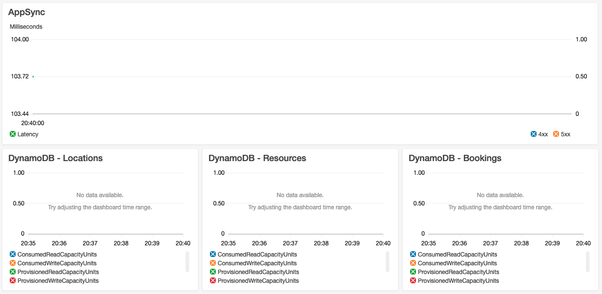

# serverless-graphql-api

These GraphQL API examples show end-to-end implementations of a simple application using a serverless approach that includes CI/CD pipelines, automated testing, and workload observability. They implement same API as in the [set of REST API samples](../serverless-rest-api/) and follow the same approach to CI/CD, observability, etc.

The examples include multiple implementations of the same application using a variety of development platforms and infrastructure as a code approaches. The patterns here will benefit beginners and seasoned developers looking to improve their applications by automating routine tasks.

There are various blog posts and code examples for serverless GraphQL APIs available. However, most of them do not go beyond the first steps of implementing business logic and access controls. These examples dive deeper, including: 

 - CI/CD pipelines containing automated testing
 - manual approval steps before updates go live
 - automated alerts and dashboards for workload observability
 - AWS AppSync logging and AWS X-Ray support

## Architecture

The API uses AWS AppSync as a front door. Every new client is first required to use their credentials to authenticate with Amazon Cognito and retrieve an identity token. They must then pass this as a bearer token in the Authorization header with each subsequent request. The AWS AppSync inspects this token and allows or denies the query or mutation specified in the client request. 

Access to the data depends on the user's role and identity. All users have read access to the Locations and Resources associated with Locations. They also have read/write access to their own Bookings. Administrative users have read/write access to all Locations, Resources, and Bookings. User status (regular vs. administrative) is defined by their membership in the API administrators’ group in Cognito User Pool. 

AWS AppSync uses Amazon DynamoDB Resolvers to implement application business logic. Data is persisted in DynamoDB tables, one table per API resource. 

## Components created

These examples create the following resources in your AWS account:
 - AWS AppSync endpoint that serves all API requests
 - DynamoDB tables to store data 
 - AWS AppSync logs stream in Amazon CloudWatch Logs
 - Amazon SNS topic for the alarms
 - AWS AppSync 5XX errors alarm 
 - Throttling alarms for all DynamoDB tables
 - CloudWatch Dashboard with AWS AppSync and DynamoDB metrics pre-configured

 ## Observability configurations
 Each example implements logging using CloudWatch Logs, configures CloudWatch alerts, and creates a CloudWatch dashboard. X-Ray distributed tracing is enabled whenever it is supported. AWS AppSync logging is enabled and AWS Serverless Application Model (AWS SAM)templates override the default log stream to set the retention period to 7 days. 

 For better manageability and cost visibility examples, use "Stack" tag whenever possible. You may need to activate them for use in AWS Cost Explorer, see [documentation](https://docs.aws.amazon.com/awsaccountbilling/latest/aboutv2/cost-alloc-tags.html) for more details.

 Check the AWS CloudFormation outputs of your deployment to see the CloudWatch dashboard URL, references to the AWS AppSync logs stream, and alarms topic in SNS. 

  To receive alerts, you will need to create a subscription for the SNS topic. See [documentation](https://docs.aws.amazon.com/sns/latest/dg/sns-create-subscribe-endpoint-to-topic.html) for instructions.

The dashboards are operational immediately:

## Testing  
Each example includes integration tests that are run automatically by the CI/CD pipeline. See the documentation of a particular example for the instructions on how to run tests manually.

 ## Deployment of the sample application
 Each example provides two ways to deploy resources - manual and CI/CD pipeline driven. 
 
 If you choose to deploy components manually, you will need to deploy a shared Cognito stack. Don't forget to update parameter values in templates or code accordingly if you used a shared stack name different from the one used in documentation.

 When you choose to use a CI/CD pipeline to deploy resources, you will create a code repository and two environments - staging and production. Each of the environments will have all necessary resources, including their own shared Cognito stacks. The build stage will automatically perform all unit tests. Staging will run integration tests before stopping for a manual production deployment approval step. 

 *See individual example documentation for detailed instructions on how to deploy the example manually or create a CI/CD pipeline.*
 
 ## Examples
 Check these implementations of the example API for more details and resources to explore.
 - [javascript-appsync-sam](./javascript-appsync-sam) - this GraphQL API implementation uses Node.js, AWS AppSync, AWS SAM, CloudFormation
 - [python-appsync-sam](./python-appsync-sam) - this GraphQL API implementation uses Python, AWS AppSync, AWS SAM, CloudFormation
 - [shared](./shared) - resources shared across the projects, such as Cognito stack. 

