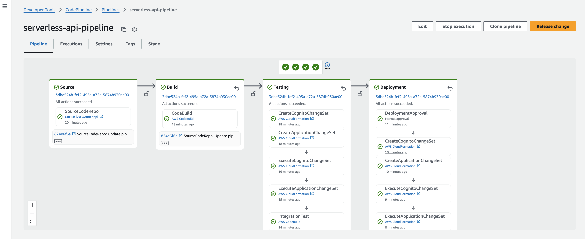

# javascript-http-sam
This is implementation of the backend API using AWS API Gateway HTTP endpoint, Node.js and AWS SAM. 

## Project structure
This project contains source code and supporting files for a serverless application that you can deploy with the AWS Serverless Application Model (AWS SAM) command line interface (CLI). It includes the following files and folders:

- `src\api` - Code for the application's Lambda functions and Lambda Authorizer.
- `events` - Invocation events that you can use to invoke the function.
- `__tests__/unit` - Unit tests for the application code. 
- `__tests__/integration` - Integration tests for the API. 
- `__tests__/testspec.yml` - A template that defines the API's test process used by the CI/CD pipeline (both unit and integration testing).
- `template.yaml` - A template that defines the application's AWS resources.
- `env.json` - A file with environment variables' values for local invocation.
- `pipeline.yaml` - A template that defines the application's CI/CD pipeline.
- `buildspec.yml` - A template that defines the application's build process used by the CI/CD pipeline.

The application uses shared Amazon Cognito stack for authentication/authorization. You will need to create this stack and update `template.yaml` parameters section with the stack name. See next section for details


## Amazon Cognito setup
This example uses shared stack that deploys Amazon Cognito resources, it will be deployed automatically if you use CI/CD pipeline. 

See [README.md](../shared/README.md) in shared resources directory for the stack manual deployment instructions. After manual deployment is finished make sure to update your SAM template file `template.yaml` parameter CognitoStackName with the shared Cognito stack name. 

After stack is created manually you will need to create user account for authentication/authorization (CI/CD pipeline will perform those steps for you automatically):

- Navigate to URL specified in the shared stack template outputs as CognitoLoginURL and click link "Sign Up". After filling in new user registration form you should receive email with verification code, use it to confirm your account. 

- After this first step step your new user account will be able to access public data and create new bookings. To add locations and resources you will need to navigate to AWS Console, pick Amazon Cognito service, select User Pool instance that was created during this deployment, navigate to "Users and Groups", and add your user to administrative users group. 

- As an alternative to the AWS Console you can use AWS CLI to create and confirm user signup:
```bash
    aws cognito-idp sign-up --client-id <cognito user pool application client id> --username <username> --password <password> --user-attributes Name="name",Value="<username>"
    aws cognito-idp admin-confirm-sign-up --user-pool-id <cognito user pool id> --username <username> 
```

While using command line or third party tools such as Postman to test APIs, you will need to provide Identity Token in the request "Authorization" header. You can authenticate with Amazon Cognito User Pool using AWS CLI (this command is also available in SAM template outputs) and use IdToken value present in the output of the command:

```bash
aws cognito-idp initiate-auth --auth-flow USER_PASSWORD_AUTH --client-id <cognito user pool application client id> --auth-parameters USERNAME=<username>,PASSWORD=<password>
```

## Manually deploy the sample application
***Note:** Before deploying application manually first time you will need to deploy shared Cognito stack, see previous section for details.*

To build and deploy your application for the first time, run the following in your shell:

```bash
npm install
sam build --use-container
sam deploy --guided
```

The first command will dependencies of your application. The second command will build the source of your application. The third command will package and deploy your application to AWS, with a series of prompts:

* **Stack Name**: The name of the stack to deploy to CloudFormation. This should be unique to your account and region, and a good starting point would be something matching your project name.
* **AWS Region**: The AWS region you want to deploy your app to.
* **Parameter CognitoStackName**: The shared Cognito stack name 
* **Confirm changes before deploy**: If set to yes, any change sets will be shown to you before execution for manual review. If set to no, the AWS SAM CLI will automatically deploy application changes.
* **Allow SAM CLI IAM role creation**: Many AWS SAM templates, including this example, create AWS IAM roles required for the AWS Lambda function(s) included to access AWS services. By default, these are scoped down to minimum required permissions. To deploy an AWS CloudFormation stack which creates or modifies IAM roles, the `CAPABILITY_IAM` value for `capabilities` must be provided. If permission isn't provided through this prompt, to deploy this example you must explicitly pass `--capabilities CAPABILITY_IAM` to the `sam deploy` command.
* **Save arguments to samconfig.toml**: If set to yes, your choices will be saved to a configuration file inside the project, so that in the future you can just re-run `sam deploy` without parameters to deploy changes to your application.

The API Gateway endpoint API will be displayed in the outputs when the deployment is complete.

## Use the AWS SAM CLI to build and test locally

Build your application by using the `sam build` command.

```bash
my-application$ sam build --use-container
```

The AWS SAM CLI installs dependencies that are defined in `package.json`, creates a deployment package, and saves it in the `.aws-sam/build` folder.

Test a single function by invoking it directly with a test event. An event is a JSON document that represents the input that the function receives from the event source. Test events are included in the `events` folder in this project.

***Note:** Before invoking function locally update environment variable file  env.json to pass correct DynamoDB table names. For more details see https://docs.aws.amazon.com/serverless-application-model/latest/developerguide/serverless-sam-cli-using-invoke.html#serverless-sam-cli-using-invoke-environment-file*

Run functions locally and invoke them with the `sam local invoke` command. 

```bash
my-application$ sam local invoke LocationsFunction --event events/event-put-location.json --env-vars env.json
my-application$ sam local invoke LocationsFunction --event events/event-get-all-locations.json --env-vars env.json
```

The AWS SAM CLI can also emulate your application's API. Use the `sam local start-api` command to run the API locally on port 3000.

```bash
my-application$ sam local start-api --env-vars env.json
my-application$ curl http://localhost:3000/locations
```
## Fetch, tail, and filter Lambda function logs
To simplify troubleshooting, the AWS SAM CLI has a command called `sam logs`. `sam logs` lets you fetch logs that are generated by your Lambda function from the command line. In addition to printing the logs on the terminal, this command has several nifty features to help you quickly find the bug.

***NOTE:** This command works for all Lambda functions, not just the ones you deploy using AWS SAM.*

```bash
my-application$ sam logs -n LocationsFunction --stack-name sam-app --tail
```

***NOTE:** This uses the logical name of the function within the stack. This is the correct name to use when searching logs inside an AWS Lambda function within a CloudFormation stack, even if the deployed function name varies due to CloudFormation's unique resource name generation.*

You can find more information and examples about filtering Lambda function logs in the [AWS SAM CLI documentation](https://docs.aws.amazon.com/serverless-application-model/latest/developerguide/serverless-sam-cli-logging.html).

## Unit tests
Unit tests are defined in the `__tests__\unit` folder in this project. Use `npm` to install the [Jest test framework](https://jestjs.io/) and run unit tests.

```bash
my-application$ npm install
my-application$ npm run test:unit
```
## Deploy CI/CD pipeline for the application
To create the CI/CD pipeline we will split out code for this set of examples from the serverless-samples repository into a separate directory and use it as a codebase for our pipeline. 

First, navigate to the root directory of the repository. To verify it run command *basename "$PWD"* - it should return serverless-samples as an output. Then run the following commands:

```bash
git subtree split -P serverless-rest-api -b serverless-rest-api
mkdir ../serverless-rest-api-cicd && cd ../serverless-rest-api-cicd
git init -b main
git pull ../serverless-samples serverless-rest-api
cd javascript-http-sam
```

To create the pipeline you will need to run the following command:

```bash
aws cloudformation create-stack --stack-name serverless-api-pipeline --template-body file://pipeline.yaml --capabilities CAPABILITY_IAM
```
The pipeline will attempt to run and will fail at the SourceCodeRepo stage as there is no code in the AWS CodeCommit yet.

***NOTE:** If you change stack name, avoid stack names longer than 25 characters. IUn case you need longer stack names check comments in the pipeline.yaml and update accordingly.*

***Note:** You may need to set up AWS CodeCommit repository access for HTTPS users [using Git credentials](https://docs.aws.amazon.com/codecommit/latest/userguide/setting-up-gc.html?icmpid=docs_acc_console_connect_np) and [set up the AWS CLI Credential Helper](https://docs.aws.amazon.com/console/codecommit/connect-tc-alert-np).*

Once you have access to the code repository, navigate to python-sam folder, and, if you changed stack name, make sure that Parameters section of template.yaml is updated with the output values from the shared Cognito stack, and push code base to CodeCommit to start automated deployments:

```bash
git remote add origin <URL to AWS CodeCommit repository>
git push origin main
```

Navigate to the CodePipeline in AWS Management Console and release this change if needed by clicking "Release change" button.



Note that same Amazon Cognito stack is used in both testing and production deployment stages, same user credentials can be used for testing and API access.

## Cleanup

To delete the sample application that you created, use the AWS CLI:

```bash
aws cloudformation delete-stack --stack-name serverless-api
```

If you created CI/CD pipeline you will need to delete it as well, including all testing and deployment stacks created by the pipeline. Please note that actual stack names may differ n your case, depending on the pipeline stack name you used.

CI/CD pipeline stack deletion may fail if build artifact S3 bucket is not empty. In such case get bucket name using following command and looking for BuildArtifactsBucket resource's PhysicalResourceId:

```bash
aws cloudformation list-stack-resources --stack-name serverless-api-pipeline
```

Then open AWS Management Console, navigate to S3 bucket with build artifacts and empty it.

After that delete all stacks created by the CI/CD pipeline and pipeline itself:


```bash
aws cloudformation delete-stack --stack-name serverless-api-pipeline-Testing
aws cloudformation delete-stack --stack-name serverless-api-pipeline-Cognito-Testing
aws cloudformation delete-stack --stack-name serverless-api-pipeline-Deployment
aws cloudformation delete-stack --stack-name serverless-api-pipeline-Cognito-Deployment
aws cloudformation delete-stack --stack-name serverless-api-pipeline
```
