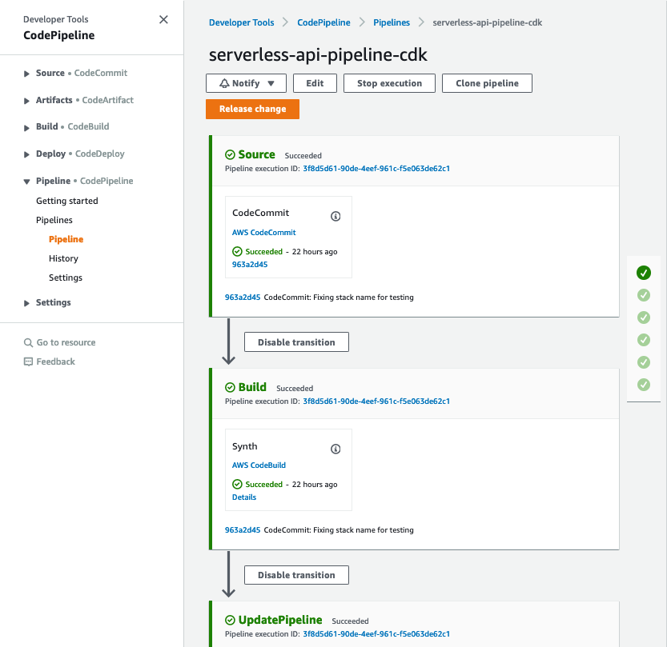

# python-http-cdk
This is implementation of the backend API using Python and AWS CDK. 

***Note:** Make sure you have AWS CDK installed and bootstrapped before proceeding with the following steps. For more information on setting up CDK see [documentation](https://docs.aws.amazon.com/cdk/latest/guide/getting_started.html)*

## Project structure
This project contains source code and supporting files for a serverless application that you can deploy with the AWS CDK command line interface (CLI). It includes the following files and folders:

- `src\api` - Code for the application's Lambda functions and Lambda Authorizer.
- `events` - Invocation events that you can use to invoke the function.
- `tests/unit` - Unit tests for the application code. 
- `tests/integration` - Integration tests for the API.
- `lib` - CDK application modules directory
- `app.py` - CDK application 'main' (entry point)
- `cdk.json` - configuration file for CDK 
- `setup.py` - defines the Python package
- `requirements.txt` - Python requirements file for the CDK application


## CDK Python project setup
This CDK project is set up like a standard Python project.  
You may need manually create a virtualenv:

```
$ python3 -m venv .venv
```

After the init process completes and the virtualenv is created, you can use the following
step to activate your virtualenv.

```
$ source .venv/bin/activate
```

Once the virtualenv is activated, you can install the required dependencies for CDK and API implementation.

```
$ python3 -m pip install --upgrade pip
$ pip install -U wheel setuptools
$ pip install -r requirements.txt
$ pip install -r ./src/api/requirements.txt
```

At this point you can now synthesize the CloudFormation template for this code.

```
$ cdk synth
```


The application uses Amazon Cognito stack for authentication/authorization. You will need to create this stack and pass the stack name to cdk deploy command:

```bash
cdk deploy apigw-samples-cdk-cognito
```

After Amazon Cognito stack is deployed it is time to deploy application itself:

```bash
cdk deploy apigw-samples-cdk
```


### Useful commands

 * `cdk ls`          list all stacks in the app
 * `cdk synth`       emits the synthesized CloudFormation template
 * `cdk deploy`      deploy this stack to your default AWS account/region
 * `cdk diff`        compare deployed stack with current state
 * `cdk docs`        open CDK documentation

## Amazon Cognito setup
This example uses CDK stack that deploys Amazon Cognito resources. The stack will be deployed automatically if you use CI/CD pipeline. To deploy it manually you can use following command:

```bash
cdk deploy apigw-samples-cdk-cognito
```

After stack is created manually you will need to create user account for authentication/authorization. Deployment by CI/CD pipeline will perform these steps for you automatically. 

- Navigate to URL specified in the shared stack template outputs as CognitoLoginURL and click link "Sign Up". After filling in new user registration form you should receive email with verification code, use it to confirm your account. 

- After this first step step your new user account will be able to access public data and create new bookings. To add locations and resources you will need to navigate to AWS Console, pick Amazon Cognito service, select User Pool instance that was created during this deployment, navigate to "Users and Groups", and add your user to administrative users group. 

- As an alternative to the AWS Console you can use AWS CLI to create and confirm user signup:
```bash
    aws cognito-idp sign-up --client-id <cognito user pool application client id> --username <username> --password <password> --user-attributes Name="name",Value="<username>"
    aws cognito-idp admin-confirm-sign-up --user-pool-id <cognito user pool id> --username <username> 
```

While using command line or third party tools such as Postman to test APIs, you will need to provide Identity Token in the request "Authorization" header. You can authenticate with Amazon Cognito User Pool using AWS CLI (this command is also available in SAM template outputs) and use IdToken value present in the output of the command:

```bash
aws cognito-idp initiate-auth --auth-flow USER_PASSWORD_AUTH --client-id <cognito user pool application client id> --auth-parameters USERNAME=<username>,PASSWORD=<password>
```

## Manually deploy the sample application
***Note:** Before deploying application manually first time you will need to deploy shared Cognito stack, see previous section for details.*

To build and deploy your application for the first time, run the following in your shell:

```bash
cdk deploy apigw-samples-cdk
```

This command will package and deploy your application to AWS

The API Gateway endpoint API will be displayed in the outputs when the deployment is complete.

## Unit tests
Unit tests are defined in the `tests\unit` folder in this project. Use `pip` to install the `./tests/requirements.txt` and run unit tests.

```bash
my-application$ pip install -r ./tests/requirements.txt
my-application$ python -m pytest tests/unit -v
```
## Deploy CI/CD pipeline for the application
To create the pipeline you will need to run the following command:

```bash
cdk deploy apigw-samples-cdk-pipeline
```
The pipeline will attempt to run and will fail at the SourceCodeRepo stage as there is no code in the AWS CodeCommit yet.

***Note:** You may need to set up AWS CodeCommit repository access for HTTPS users [using Git credentials](https://docs.aws.amazon.com/codecommit/latest/userguide/setting-up-gc.html?icmpid=docs_acc_console_connect_np) and [set up the AWS CLI Credential Helper](https://docs.aws.amazon.com/console/codecommit/connect-tc-alert-np).*

Once you have access to the code repository, navigate to python-sam folder, make sure that Parameters section of template.yaml is updated with the output values from the shared Cognito stack, and push code base to CodeCommit to start automated deployments:

```bash
git remote rename origin upstream
git remote add origin <URL to AWS CodeCommit repository>
git push origin main
```

Navigate to the CodePipeline in AWS Management Console and release this change if needed by clicking "Release change" button.



Note that same Amazon Cognito stack is used in both testing and production deployment stages, same user credentials can be used for testing and API access.

## Cleanup

To delete the sample application that you created, use the AWS CLI:

```bash
cdk destroy apigw-samples-cdk
cdk destroy apigw-samples-cdk-cognito

```

If you created CI/CD pipeline you will need to delete it as well, including all testing and deployment stacks created by the pipeline. Please note that actual stack names may differ in your case, depending on the pipeline stack name you used.

```bash
cdk destroy apigw-samples-cdk-pipeline/serverless-api-pipeline-cdk-Deployment/Api
cdk destroy apigw-samples-cdk-pipeline/serverless-api-pipeline-cdk-Deployment/Cognito
cdk destroy apigw-samples-cdk-pipeline/serverless-api-pipeline-cdk-Testing/Api
cdk destroy apigw-samples-cdk-pipeline/serverless-api-pipeline-cdk-Testing/Cognito
cdk destroy apigw-samples-cdk-pipeline
```
