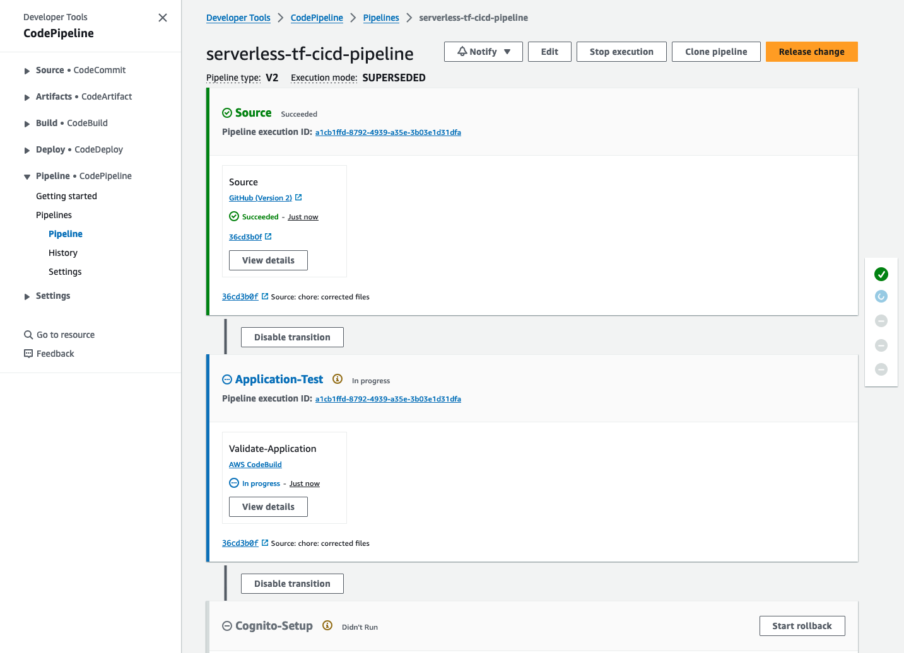

# python-rest-terraform
This is implementation of the backend REST API using Python and Terraform. 

## Project structure
This project contains source code and supporting files for a serverless application that you can deploy with the Terraform. It includes the following files and folders:

- `application/src/api` - Code for the application's Lambda functions and Lambda Authorizer.
- `application/src/api/openapi.tftpl` - API definition Template in OpenAPI 3.0.
- `application/events` - Invocation events that you can use to invoke the function.
- `application/tests/unit` - Unit tests for the application code. 
- `application/tests/integration` - Integration tests for the API. 
- `application/rest-api.tf` - A Terraform code that defines the application's AWS resources.
- `application/data.tf` - A Terraform code which fetches required data from AWS environment needed for resouce deployment.
- `application/variables.tf` - An input defination of the Terraform code for Application
- `application/outputs.tf` - An output defination of the Terraform code for Application
- `application/provider.tf` - A Terraform provider to define the infrastructure provider (AWS) for Application
- `application/dashboard.rtftpl` - Dashboard defination template for AWS CloudWatch
- `application/tests/testspec.yml` - A template that defines the API's test process (both unit and integration testing).
- `cicd.yaml` - A Terraform code which defines application's CI/CD pipeline.
- `templates/buildspec.ymls` - A template that defines the application's build process.
- `variables.tf` - An input defination of the Terraform code for CICD
- `outputs.tf` - An output defination of the Terraform code for CICD
- `provider.tf` - A Terraform provider to define the infrastructure provider (AWS) for CICD
- `terraform.tfvars` - A Terraform variables file for setting up CICD pipeline

This example uses partial API Gateway [definition](./src/api/openapi.tftpl) in [OpenAPI v3.0.1](https://github.com/OAI/OpenAPI-Specification/blob/main/versions/3.0.1.md). Note that logging and tracing settings are done using Terraform.
See [documentation](https://registry.terraform.io/providers/hashicorp/aws/latest/docs/resources/api_gateway_rest_api) for more details on how to use OpenAPI to define your APIs.


The application uses shared Amazon Cognito stack for authentication/authorization. You will need to create this stack and update `application/variables.tf` defaults section with the stack name. See next section for details

The application utilizes API Gateway [Usage Plans](https://docs.aws.amazon.com/apigateway/latest/developerguide/api-gateway-api-usage-plans.html). You may need to generate API keys using CLI or AWS Console. See manual deployment instructions section of this document for more details.

## Amazon Cognito setup
This example uses shared stack that deploys Amazon Cognito resources. The shared stack will be deployed automatically if you use CI/CD pipeline. See [README.md](../shared/README.md) in shared resources directory for the stack manual deployment instructions. After manual deployment is finished make sure to update your terraform application variable file `application/variables.tf` variable `cognito_stack_name` with the shared Cognito stack name in default value. 

After stack is created manually you will need to create user account for authentication/authorization. Deployment by CI/CD pipeline will perform following steps for you automatically. 

- Navigate to URL specified in the shared stack template outputs as CognitoLoginURL and click link "Sign Up". After filling in new user registration form you should receive email with verification code, use it to confirm your account. 

- After this first step step your new user account will be able to access public data and create new bookings. To add locations and resources you will need to navigate to AWS Console, pick Amazon Cognito service, select User Pool instance that was created during this deployment, navigate to "Users and Groups", and add your user to administrative users group. 

- As an alternative to the AWS Console you can use AWS CLI to create and confirm user signup:
```bash
aws cognito-idp sign-up --client-id <cognito user pool application client id> --username <username> --password <password> --user-attributes Name="name",Value="<username>"
aws cognito-idp admin-confirm-sign-up --user-pool-id <cognito user pool id> --username <username> 
```

While using command line or third party tools such as Postman to test APIs, you will need to provide Identity Token in the request "Authorization" header. You can authenticate with Amazon Cognito User Pool using AWS CLI and use IdToken value present in the output of the command:

```bash
aws cognito-idp initiate-auth --auth-flow USER_PASSWORD_AUTH --client-id <cognito user pool application client id> --auth-parameters USERNAME=<username>,PASSWORD=<password>
```

## Manually deploy the sample application
***Note:** Before deploying application manually first time you will need to deploy shared Cognito stack, see previous section for details.*
***Note:** This method of deployment is prefrable when you want to make changes to this sample application and develope your application using this template.*

This project is set up like a standard Python project.  
You may need manually create a virtualenv:

```
cd serverless-samples/serverless-rest-api/python-rest-terraform/application
python3 -m venv .venv
```

After the init process completes and the virtualenv is created, you can use the following
step to activate your virtualenv.

```
source .venv/bin/activate
```

Once the virtualenv is activated, you can install the required dependencies for CDK and API implementation.

```
python3 -m pip install --upgrade pip
pip install -U wheel setuptools
pip install -r ./src/lambda_layer/requirements.txt
pip install -r ./tests/requirements.txt
```

If you want to change default variables, Modify the `default` value of following variables in `applications/variables.tf`.

* **serverless_application_name**: The name of the terraform application resources to deploy. This should be unique to your account and region, and a good starting point would be something matching your project name.
* **cognito_stack_name**: The shared Cognito stack name. ***If you changed Cognito stack name, make sure to update here***


Comment `terraform` block (line 14 to 16) from `applications/provider.tf` to configure local terraform backend. Run the following in your shell to deploy the infrastructure manually:

```bash
terraform init
terraform apply
```

The first command will download the required providers and terraform modules. The second command will ask for variable inputs and display the number of resources being deployed:

* **Do you want to perform these actions**: If set to yes, terraform plan displayed above will be executed. If set to no, terraform will automatically cancel changes.

The API Gateway endpoint API and ID will be displayed in the outputs when the deployment is complete.

## Use the AWS SAM CLI to build and test locally

Comment line 15 to 17 from `applications/provider.tf` to configure local terraform backend. Build your application by using the `sam build` command. 

```bash
sam build
```

The AWS SAM CLI installs dependencies that are defined in `requirements.txt`, creates a deployment package, and saves it in the `.aws-sam/build` folder. AWS SAM CLI also uses Lambda Layers configured in your terraform defination automatically. 

Test a single function by invoking it directly with a test event. An event is a JSON document that represents the input that the function receives from the event source. Test events are included in the `events` folder in this project.

Run functions locally and invoke them with the `sam local invoke` command. 

```bash
sam local invoke 'module.lambda_functions["locations"].aws_lambda_function.this[0]' --event events/event-get-location-by-id.json
sam local invoke 'module.lambda_functions["locations"].aws_lambda_function.this[0]' --event events/event-get-all-locations.json
```

### Usage plans

This application utilizes API Gateway [Usage Plans](https://docs.aws.amazon.com/apigateway/latest/developerguide/api-gateway-api-usage-plans.html). Usage plan references (Basic and Enterprise) will be displayed in the outputs when the deployment is complete. 

You will need to generate API keys and associate them with usage plan using AWS CLI or [AWS Management Console](https://docs.aws.amazon.com/apigateway/latest/developerguide/api-gateway-setup-api-key-with-console.html#api-gateway-usage-plan-create-apikey). API key value generated will need to be included as X-API-Key header in your requests.


To generate new API key using AWS CLI you can use following command (note the key ID and value in the output):

```bash
aws apigateway create-api-key --name 'Development API Key' --enabled 
```

After API key is created you will need to add it to the appropriate usage plan:

```bash
aws apigateway create-usage-plan-key --usage-plan-id '<Usage plan ID from the stack outputs>' --key-type "API_KEY" --key-id '<API key ID from the previous command>'
```

## Unit tests
Unit tests are defined in the `application\tests\unit` folder in this project. Use `pip` to install the ./application/tests/requirements.txt and run unit tests.

```bash
pip install -r ./tests/requirements.txt
python -m pytest tests/unit -v
```

## Deploy CI/CD pipeline for the application
To create the CI/CD pipeline we will split out code for this set of examples from the serverless-samples repository into a separate directory and use it as a codebase for our pipeline. 

We will use GitHub to host our application code, Follow the below steps to create a GitHub Repository. 

1. Go to github.com and create a free account if you don't have one already.
1. Once logged in, click on the "new" icon at the top left to create new repository.
1. Enter a name for your repository `serverless-app-demo-aws` and an optional description. 
1. Select the "Private" option for the repository visibility.
1. Un-check "Add a README file" and click on "Create repository".

Now, Follow the steps mentioned here for connecting your AWS Account to your GitHub Account using: [Create a connection](https://docs.aws.amazon.com/dtconsole/latest/userguide/connections-create-github.html#connections-create-github-console). Make sure to use connection name `github-connection-serverless`.

To create a separate codebase, navigate to the root directory of the repository. To verify it run command *basename "$PWD"* - it should return serverless-samples as an output. Then run the following commands:

```bash
git subtree split -P serverless-rest-api -b serverless-rest-api
mkdir ../serverless-rest-api-cicd && cd ../serverless-rest-api-cicd
git init -b main
git pull ../serverless-samples serverless-rest-api
cd python-rest-terraform
```

To deploy the cicd pipeline infrastructure, Update the variables in `terraform.tfvars` in newly created `serverless-rest-api-cicd` repository based on your requirement. Make sure to change the `source_repo_name` as per your GitHub Repository owner.

Update remote backend configuration as required, by default it will take it as local-backend. 

To create the pipeline you will need to run the following commands:

```bash
terraform init
terraform apply --auto-approve
```

To triggger automated deployment, push the codebase to your GitHub repository using following commands.

```bash
git remote add origin <URL to GitHub repository>
git push origin main
```



Note that same Amazon Cognito stack is used in both testing and production deployment stages, same user credentials can be used for testing and API access.

## Cleanup

To delete the sample application that you created manually, use the below commands:

```bash
cd serverless-samples/serverless-rest-api/python-rest-terraform/application
terraform destroy
```

If you created CI/CD pipeline you will need to delete it as well, including all testing and deployment infrastructure created by the pipeline. You can destroy the infrastructure created by pipeline by Manual approval of Destroy stage as shown below image.  


Once the serverless application infrastructre is removed, you can remove CI/CD pipeline resources. Run below commands:

```bash
cd serverless-rest-api-cicd/python-rest-terraform/
terraform destroy --auto-approve
```

CICD stack deletion may fail if build artifact S3 bucket is not empty. In such case get bucket name from the error message, open AWS Management Console, navigate to S3 bucket with build artifacts and empty it. 

Re-run below command to remove s3 bucket after emptying it. 

```bash
terraform destroy --auto-approve
```
