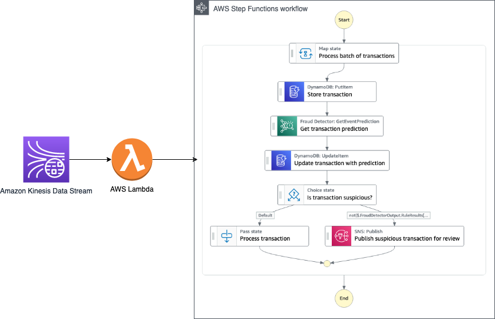
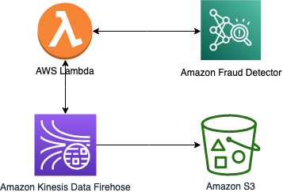
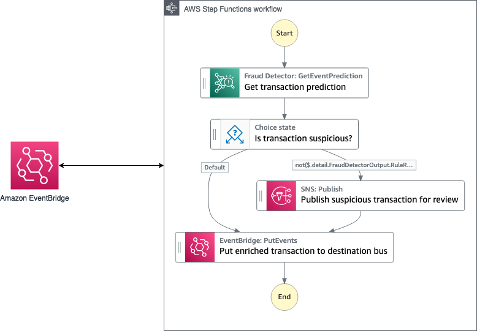

# Real-time transaction fraud detection/prevention using Serverless and Amazon Fraud Detector

This example demonstrates a serverless approach to detecting online transaction fraud in near real-time. It shows how detection can be plugged into various data streaming and event-driven architectures. This application may be used to prevent fraud, to alert about fraud, or to flag a fraudulent transaction for additional review.

This sample implements three architectures:
 - [Streaming data inspection and fraud detection/prevention](#streaming-data-inspection-and-fraud-detectionprevention) - using Amazon Kinesis Data Stream, AWS Lambda, AWS Step Functions, and Amazon Fraud Detector
 - [Streaming data enrichment for fraud detection/prevention](#streaming-data-enrichment) - using Kinesis Data Firehose, Lambda, and Amazon Fraud Detector
 - [Event data inspection and fraud detection/prevention](#event-data-inspection) - using Amazon EventBridge, Step Functions, and Amazon Fraud Detector

## Streaming data inspection and fraud detection/prevention

### Overview
This architecture uses Lambda, Step Functions, and Amazon Fraud Detector to enable real-time inspection and fraud detection/prevention of Kinesis Data Streams data. The same architecture would apply using Amazon Managed Streaming for Apache Kafka (Amazon MSK) as a data streaming service. This pattern can be useful for real-time fraud detection, notification, and prevention. Example use cases for this could be payment-processing or high volume account creation.



The flow of events for this application is: 

1. Kinesis Data Streams ingests financial transactions. The data source could be a system that generates these transactions - for example, e-commerce or banking. 
2. The Lambda function receives the transactions in batches.
3. The Lambda function starts a Step Functions workflow execution for each batch. 
    - The workflow performs the following steps for each transaction in the batch: 
        * It persists the transaction in an Amazon DynamoDB table. 
        * It calls the Amazon Fraud Detector API using GetEventPrediction action.
            - The API returns either “approve”, “block”, or “investigate”. 
        * It updates transaction in the DynamoDB table with the fraud prediction results
        * Based on the results:
            - It sends a notification using Amazon Simple Notification Service (SNS) if the result is “block” or “investigate”.
            - It sends the transaction for further processing if the result is “approve”.

This approach allows you to react to potentially fraudulent transactions in real-time while persisting the data in storage for further processing. In an actual implementation, you may replace the notification step for additional review with an action that is specific to your business process. For example, you may inspect the transaction using a fraud detection model, or perform a manual review.

### Deployment
1. Your Amazon Fraud Detector model and detector should be pre-built based on past data. Follow [this blog post](https://aws.amazon.com/blogs/machine-learning/detect-online-transaction-fraud-with-new-amazon-fraud-detector-features/) for more detailed instructions. The post links to a sample dataset to help you get started.
2. Clone this repo, navigate to the directory streaming-serverless-fraud-detection
3. Run the following commands:
```bash
cd kinesis-data-stream-detection
sam build
sam deploy --guided --stack-name kinesis-data-stream-fraud-detection
```

### Try it out
To try this solution, you need to send data to the Kinesis Data Stream. You can use [Amazon Kinesis Data Generator](https://github.com/awslabs/amazon-kinesis-data-generator) for that. Follow the directions to deploy this generator. Once you have deployed it and logged in, select the Kinesis Data Stream that matches the one in the Outputs section of your deployed fraud detection sample stack. You can also use the following command to get stack details (check the Outputs for the stream name):

```bash
aws cloudformation describe-stacks --stack-name kinesis-data-stream-fraud-detection
```

You can use the following template to generate transaction records:

```code=json
    {
        "transaction_id":"{{random.number({"min":10000, "max":100000})}}",
        "transaction_timestamp":"{{date.now("YYYY-MM-DDTHH:mm:ss")}}Z",
        "customer_email": "{{random.arrayElement(["admin@example.com","user@example.com","employee@example.com","customer@example.com"])}}",
        "order_price": "{{random.number({"min":10, "max":1000})}}",
        "product_category": "{{random.arrayElement(["kitchen","garden","groceries","leisure"])}}",
        "ip_address": "{{internet.ip}}",
        "card_bin": "{{random.number(
            {
                "min":1,
                "max":99999
            }
        )}}"
    }
```
**Note:** 
*Keep in mind Amazon Fraud Detector quotas for your account and use appropriate batch sizes (for example, send 10 records at a time).* 

Stop record generation after you send a few batches to the Kinesis Data Stream. You can check the Step Functions execution logs by following the link in the stack outputs. Note that only errors are logged and that execution data is not included. 

### Cleaning Up
To avoid incurring further charges, run the following command to cleanup:
```bash
sam delete --stack-name kinesis-data-stream-fraud-detection 
```

## Streaming data enrichment for fraud detection/prevention

### Overview
This architecture uses Lambda to enable real-time Amazon Kinesis Data Firehose data enrichment using Amazon Fraud Detector and [Kinesis Data Firehose data transformation](https://docs.aws.amazon.com/firehose/latest/dev/data-transformation.html). This sample does not implement fraud detection/prevention steps. Instead, you deliver enriched data to an Amazon S3 bucket. Downstream services can consume the data and use the fraud detection results to act accordingly.



Note, that you could use [Amazon EventBridge Pipes](https://docs.aws.amazon.com/eventbridge/latest/userguide/eb-pipes.html#pipes-enrichment) with a Lambda enrichment step to achieve a similar result.

The event flow for this application is: 

1. Kinesis Data Firehose ingests financial transactions. The data source could be a system that generates these transactions - for example, e-commerce or banking. 
2. A Lambda function receives the transactions in batches and enriches them.
    - For each transaction in the batch: 
        * The function calls the Amazon Fraud Detector API using the GetEventPrediction action.
        * The API returns either “approve”, “block” or “investigate”.
        * The function updates the transaction data by adding fraud detection results.
3. The Lambda function returns the batch with the updated transactions to the Kinesis Data Firehose.
4. Kinesis Data Firehose delivers data to the destination, in this case, the Amazon S3 bucket.

As a result, we have data in the Amazon S3 bucket that includes not only original data but also the Amazon Fraud Detector response as a metadata for each of the transactions. You can use this metadata in your data analytics solutions, machine learning model training tasks, or visualizations/dashboards that consume transaction data.

### Deployment
1. Your Amazon Fraud Detector model and detector should be pre-built based on past data. Follow [this blog post](https://aws.amazon.com/blogs/machine-learning/detect-online-transaction-fraud-with-new-amazon-fraud-detector-features/) for more detailed instructions. The post links to a sample dataset to help you get started.
2. Clone this repo, navigate to the directory streaming-serverless-fraud-detection
3. Run the following commands:
```bash
cd kinesis-firehose-inline-enrichment
sam build
sam deploy --guided --stack-name kinesis-firehose-data-enrichment
```

### Try it out
To try this solution, you need to send data to the Kinesis Data Firehose. You can use [Amazon Kinesis Data Generator](https://github.com/awslabs/amazon-kinesis-data-generator) for that. After you deploy the Data Generator and log in, select the Kinesis Data Stream that matches the one in the Outputs section of your deployed data enrichment sample stack. You can also use the following command to get your stack Output:

```bash
aws cloudformation describe-stacks --stack-name kinesis-firehose-data-enrichment
```

You can use the following template for transaction record generation:

```code=json
    {
        "transaction_id":"{{random.number({"min":10000, "max":100000})}}",
        "transaction_timestamp":"{{date.now("YYYY-MM-DDTHH:mm:ss")}}Z",
        "customer_email": "{{random.arrayElement(["admin@example.com","user@example.com","employee@example.com","customer@example.com"])}}",
        "order_price": "{{random.number({"min":10, "max":1000})}}",
        "product_category": "{{random.arrayElement(["kitchen","garden","groceries","leisure"])}}",
        "ip_address": "{{internet.ip}}",
        "card_bin": "{{random.number(
            {
                "min":1,
                "max":99999
            }
        )}}"
    }
```
**Note:** 
*Keep in mind Amazon Fraud Detector quotas for your account and use appropriate batch sizes (for example, send 10 records at a time).* 

Stop record generation after you send a few batches to the Kinesis Data Firehose. Wait for a couple of minutes and check transactions destination bucket (find the name of the bucket in the stack outputs). 


### Cleaning Up
To avoid incurring further charges when you do not need this process anymore, run the following command:
```bash
sam delete --stack-name kinesis-firehose-data-enrichment 
```


## Event data inspection and fraud detection/prevention

### Overview
This application uses Step Functions and Amazon Fraud Detector to enable real-time inspection and fraud detection/prevention of Amazon EventBridge events. The application receives raw event data from a source event bus and runs a workflow that performs fraud detection. It enriches the data with the detection results and publishes the enriched data to a destination event bus. Event consumers may then examine the fraud detection metadata by subscribing to the destination bus. Event consumers may then decide how to handle the data.

For example, in an event driven e-commerce application, a consumer may choose to not process an order if a transaction is predicted to be fraudulent, or the order may be flagged for further review.

This architecture pattern can be useful for detecting and preventing fraud in new account creation or during account profile changes (like changing customer addresses, phone numbers, or credit cards on file).



Note, that you could implement an alternate architecture using [Amazon EventBridge Pipes](https://docs.aws.amazon.com/eventbridge/latest/userguide/eb-pipes.html) with an [enrichment step](https://docs.aws.amazon.com/eventbridge/latest/userguide/eb-pipes.html#pipes-enrichment) that runs a Lambda function to achieve a similar result.

The event flow for this application is: 

1. The source EventBridge event bus receives transaction data. The data source could be a system that generates these transactions - for example, e-commerce, banking, etc. 
2. An EventBridge rule starts a Step Functions workflow execution.
3. The Step Functions workflow receives the transaction and processes it. 
    - It calls the Amazon Fraud Detector API using the `GetEventPrediction` action
        * The API returns either “approve”, “block” or “investigate”.
    - It enriches the transaction data by adding fraud detection results.
4. If the fraud prediction result is “block” or “investigate” it sends a notification using Amazon Simple Notification Service (Amazon SNS) for further investigation.
5. The Step Functions workflow publishes the updated transaction to the destination EventBridge with the enriched transaction data.

Similar to the Kinesis Data Firehose data enrichment, this architecture does not prevent fraudulent data from reaching the next step. Instead, it adds fraud detection metadata to the original event and sends notifications about potentially fraudulent transactions. Consumers of the enriched data can decide whether to use the fraud detection metadata in their decisions. You may also decide to change the Step Functions workflow so it does not publish suspicious transactions to the destination bus but instead route them to a separate event bus to be consumed by a separate “suspicious transactions” processing application.

### Deployment
1. Your Amazon Fraud Detector model and detector should be pre-built based on past data. Follow [this blog post](https://aws.amazon.com/blogs/machine-learning/detect-online-transaction-fraud-with-new-amazon-fraud-detector-features/) for more detailed instructions. The post links to a sample dataset to help you get started.
2. Clone this repo, navigate to the `streaming-serverless-fraud-detection` directory.
3. Run the following commands:
```bash
cd eventbridge-event-detection
sam build
sam deploy --guided --stack-name eventbridge-event-fraud-detection
```

### Try it out

To try this solution, you need to publish events to the EventBridge. You can use [AWS CLI](https://awscli.amazonaws.com/v2/documentation/api/latest/reference/events/put-events.html) or AWS Management Console EventBridge section for that. 


The following AWS CLI command will publish the event to the EventBridge bus (change the event bus name and details as needed):

```bash
aws events put-events --entries '[{"EventBusName": "<EventBridge bus name here>", "Source": "com.example.transactions", "DetailType": "Transaction", "Detail": "{\n \"transaction_id\" : \"132467890123\", \"transaction_timestamp\" : \"2022-01-01T12:00:00Z\", \"customer_email\": \"customer@example.com\", \"order_price\": \"199.99\", \"product_category\": \"leisure\", \"ip_address\": \"127.0.0.1\", \"card_bin\": \"999999\" \n}"}]'

```

You can check the Step Functions execution logs following the link in the stack outputs. Note that only errors are logged and that execution data is not included. 

You will need to specify the bus where you will publish events. Use the one in the Outputs section of your deployed fraud detection sample stack. You can use the following command to get stack details (check Outputs for the bus name):

```bash
aws cloudformation describe-stacks --stack-name eventbridge-event-fraud-detection
```

### Cleaning Up
To avoid incurring further charges when you do not need this process anymore, run the following command:
```bash
sam delete --stack-name eventbridge-event-fraud-detection 
```
